# Conditional Validation Rules

<cite>
**Referenced Files in This Document**
- [RequiredIfRule.php](file://src/Rules/RequiredIfRule.php)
- [RequiredUnlessRule.php](file://src/Rules/RequiredUnlessRule.php)
- [RequiredWithRule.php](file://src/Rules/RequiredWithRule.php)
- [MissingIfRule.php](file://src/Rules/MissingIfRule.php)
- [MissingUnlessRule.php](file://src/Rules/MissingUnlessRule.php)
- [MissingWithRule.php](file://src/Rules/MissingWithRule.php)
- [PresentRule.php](file://src/Rules/PresentRule.php)
- [MissingRule.php](file://src/Rules/MissingRule.php)
- [ConditionalRule.php](file://src/Rules/ConditionalRule.php)
- [RequiredRule.php](file://src/Rules/RequiredRule.php)
- [RuleInterface.php](file://src/Rules/RuleInterface.php)
- [RuleId.php](file://src/Rules/RuleId.php)
- [ValidationContext.php](file://src/Execution/ValidationContext.php)
- [RuleRegistry.php](file://src/Rules/RuleRegistry.php)
</cite>

## Table of Contents
1. [Introduction](#introduction)
2. [Project Structure](#project-structure)
3. [Core Components](#core-components)
4. [Architecture Overview](#architecture-overview)
5. [Detailed Component Analysis](#detailed-component-analysis)
6. [Dependency Analysis](#dependency-analysis)
7. [Performance Considerations](#performance-considerations)
8. [Troubleshooting Guide](#troubleshooting-guide)
9. [Conclusion](#conclusion)

## Introduction
This document explains conditional validation rules in the vi/validation library. It focuses on:
- Conditional required rules: required_if, required_unless, required_with
- Conditional presence rules: present_if (conceptual), missing_if
- Context-dependent validation patterns
- Rule dependency chains and evaluation order
- Practical examples for forms, business rules, and user-driven scenarios
- Performance implications and optimization strategies for complex conditional logic

## Project Structure
The conditional validation logic is implemented as individual rule classes that adhere to a shared interface and operate within a shared validation context. Rule registration enables mapping human-friendly rule names to their implementations.

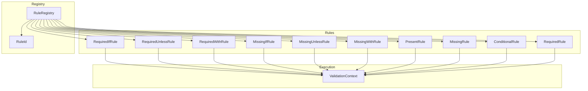

**Diagram sources**
- [RequiredIfRule.php](file://src/Rules/RequiredIfRule.php#L1-L67)
- [RequiredUnlessRule.php](file://src/Rules/RequiredUnlessRule.php#L1-L66)
- [RequiredWithRule.php](file://src/Rules/RequiredWithRule.php#L1-L70)
- [MissingIfRule.php](file://src/Rules/MissingIfRule.php#L1-L42)
- [MissingUnlessRule.php](file://src/Rules/MissingUnlessRule.php#L1-L42)
- [MissingWithRule.php](file://src/Rules/MissingWithRule.php#L1-L46)
- [PresentRule.php](file://src/Rules/PresentRule.php#L1-L40)
- [MissingRule.php](file://src/Rules/MissingRule.php#L1-L21)
- [ConditionalRule.php](file://src/Rules/ConditionalRule.php#L1-L70)
- [RequiredRule.php](file://src/Rules/RequiredRule.php#L1-L29)
- [ValidationContext.php](file://src/Execution/ValidationContext.php#L1-L98)
- [RuleRegistry.php](file://src/Rules/RuleRegistry.php#L1-L302)
- [RuleId.php](file://src/Rules/RuleId.php#L1-L114)

**Section sources**
- [RuleRegistry.php](file://src/Rules/RuleRegistry.php#L195-L300)
- [RuleId.php](file://src/Rules/RuleId.php#L9-L114)

## Core Components
- RuleInterface defines the contract for all rules: a validate method that receives the current field value, field name, and a ValidationContext, returning either null (pass) or an error descriptor.
- ValidationContext exposes helpers to read other fields’ values, check presence, and access the entire dataset.
- RuleId enumerates built-in rule identifiers, including conditional required and presence rules.
- RuleRegistry maps rule names and aliases to concrete classes and resolves instances.

Key conditional rules:
- required_if: requires the field if another field equals any of a given set of values.
- required_unless: requires the field unless another field equals any of a given set of values.
- required_with: requires the field if any of a given set of other fields is present.
- missing_if: forbids the field from being present when another field equals a given value.
- missing_unless: forbids the field from being present unless another field equals a given value.
- missing_with: forbids the field from being present when any of a given set of other fields is present.
- present: requires the field to be present in the input data (conceptually the “presence” counterpart to missing_*).
- conditional: wraps a set of rules and evaluates them only when a condition is met (supports callable or boolean conditions).

**Section sources**
- [RuleInterface.php](file://src/Rules/RuleInterface.php#L9-L16)
- [ValidationContext.php](file://src/Execution/ValidationContext.php#L43-L83)
- [RuleId.php](file://src/Rules/RuleId.php#L93-L112)
- [RuleRegistry.php](file://src/Rules/RuleRegistry.php#L180-L190)

## Architecture Overview
Conditional rules rely on ValidationContext to inspect other fields and decide whether to enforce validation. The RuleRegistry centralizes rule discovery and instantiation.

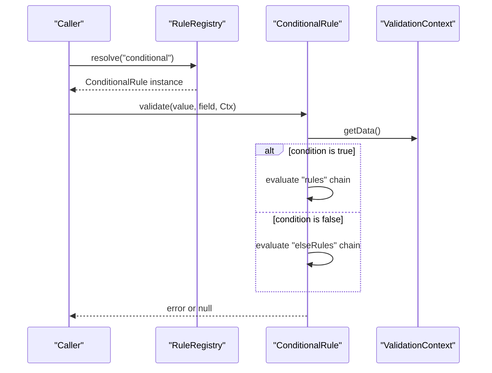

**Diagram sources**
- [ConditionalRule.php](file://src/Rules/ConditionalRule.php#L36-L52)
- [ValidationContext.php](file://src/Execution/ValidationContext.php#L80-L88)
- [RuleRegistry.php](file://src/Rules/RuleRegistry.php#L180-L190)

## Detailed Component Analysis

### Conditional Required Rules

#### required_if
- Purpose: Require the current field if another field’s value is in a specified list.
- Evaluation logic:
  - Read the other field via ValidationContext.
  - If the other field’s value is not among the allowed values, skip requirement.
  - Otherwise, apply emptiness checks; if empty, report a required error.
- Complexity: O(k) to check membership against the allowed values list k.

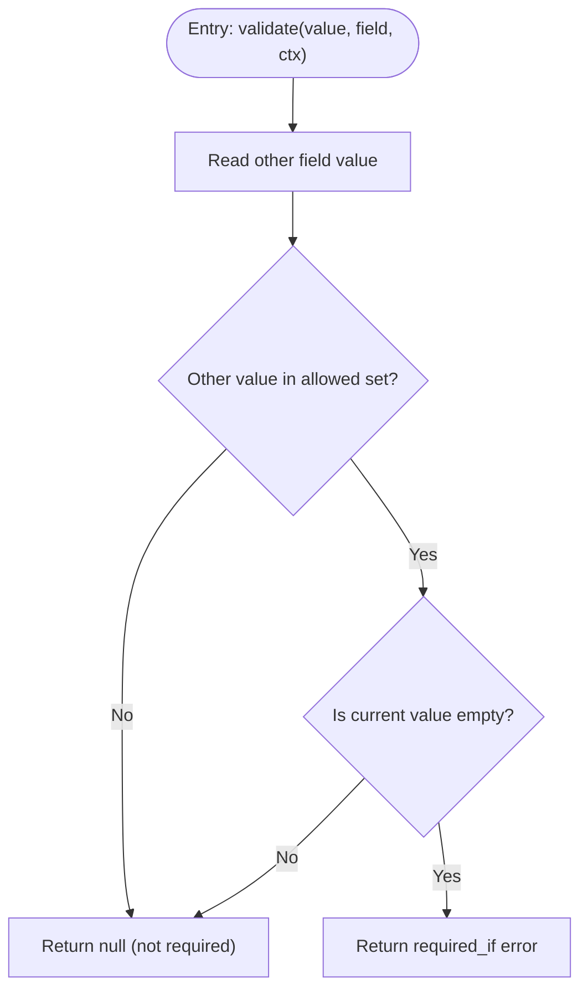

**Diagram sources**
- [RequiredIfRule.php](file://src/Rules/RequiredIfRule.php#L26-L48)

**Section sources**
- [RequiredIfRule.php](file://src/Rules/RequiredIfRule.php#L26-L65)

#### required_unless
- Purpose: Require the current field unless another field’s value is in a specified list.
- Evaluation logic:
  - Read the other field.
  - If the other field’s value is in the allowed set, skip requirement.
  - Otherwise, apply emptiness checks; if empty, report a required error.
- Complexity: O(k) to check membership.

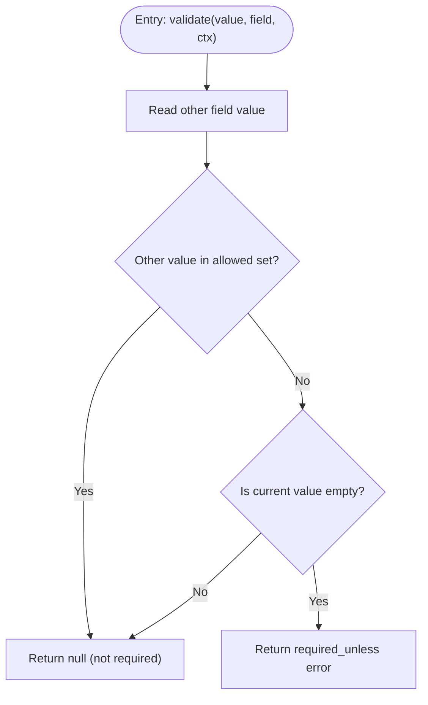

**Diagram sources**
- [RequiredUnlessRule.php](file://src/Rules/RequiredUnlessRule.php#L26-L47)

**Section sources**
- [RequiredUnlessRule.php](file://src/Rules/RequiredUnlessRule.php#L26-L64)

#### required_with
- Purpose: Require the current field if any of a set of other fields is present.
- Evaluation logic:
  - Iterate the other fields and check presence via ValidationContext.
  - If none are present, skip requirement.
  - Otherwise, apply emptiness checks; if empty, report a required error.
- Complexity: O(m) for m other fields checked.

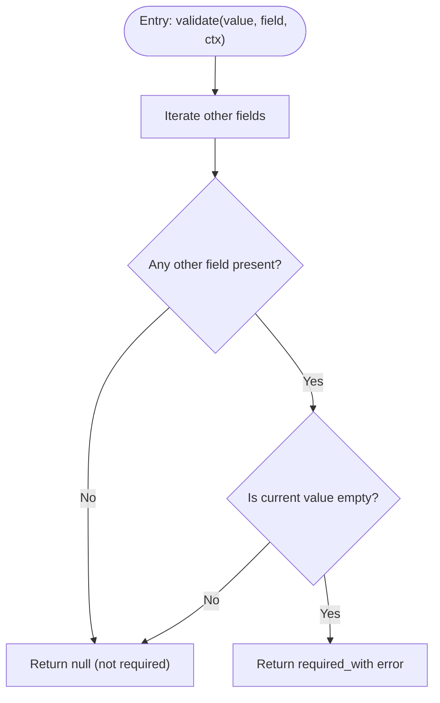

**Diagram sources**
- [RequiredWithRule.php](file://src/Rules/RequiredWithRule.php#L23-L51)

**Section sources**
- [RequiredWithRule.php](file://src/Rules/RequiredWithRule.php#L23-L68)

### Conditional Presence Rules

#### present
- Purpose: The field must be present in the input data (can be empty).
- Evaluation logic:
  - For simple keys, check array key existence.
  - For nested keys using dot notation, navigate into arrays and verify nested presence.
- Complexity: O(1) average for simple keys; O(1) for one-level nested split.

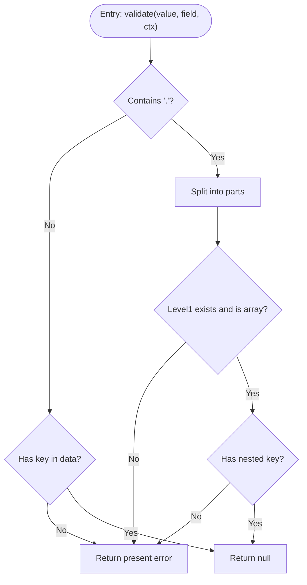

**Diagram sources**
- [PresentRule.php](file://src/Rules/PresentRule.php#L15-L38)

**Section sources**
- [PresentRule.php](file://src/Rules/PresentRule.php#L15-L38)

#### missing_if
- Purpose: The field must not be present if another field equals a given value.
- Evaluation logic:
  - Read the other field.
  - If the other field does not equal the target value, allow presence.
  - If the other field equals the target value and the field is present, report a missing_if error.
- Complexity: O(1).

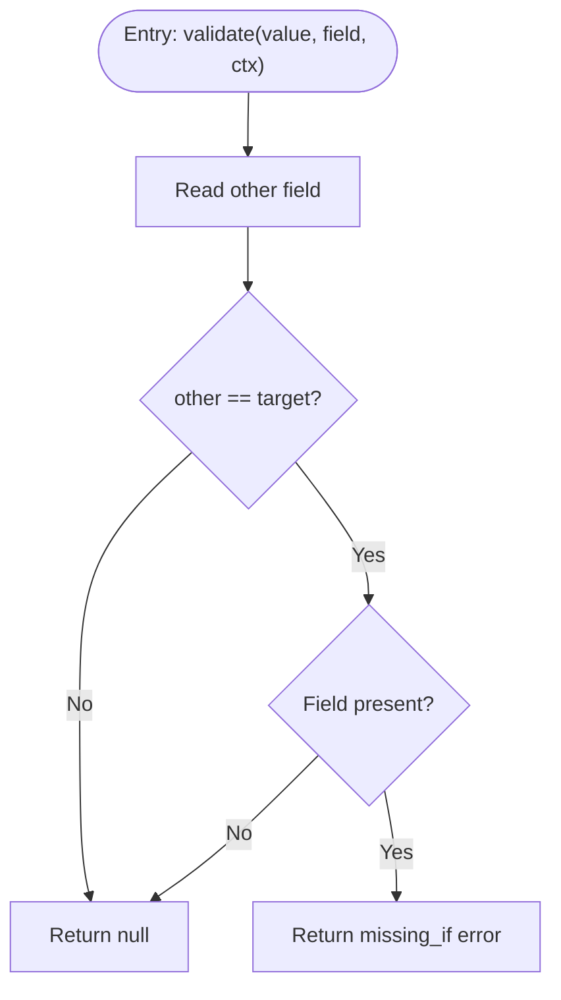

**Diagram sources**
- [MissingIfRule.php](file://src/Rules/MissingIfRule.php#L21-L40)

**Section sources**
- [MissingIfRule.php](file://src/Rules/MissingIfRule.php#L21-L40)

#### missing_unless
- Purpose: The field must not be present unless another field equals a given value.
- Evaluation logic:
  - Read the other field.
  - If the other field equals the target value, allow presence.
  - Otherwise, if the field is present, report a missing_unless error.
- Complexity: O(1).

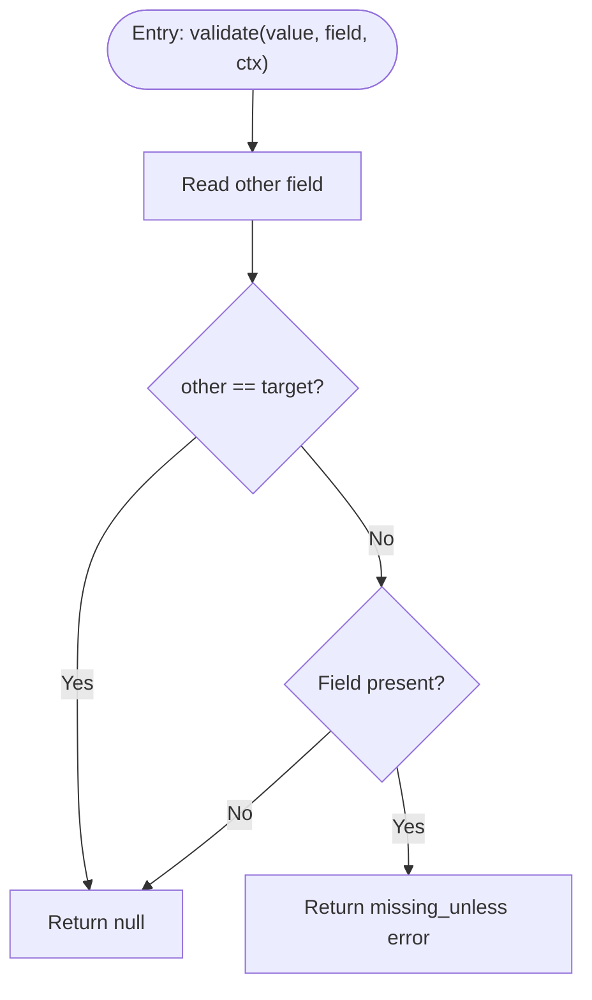

**Diagram sources**
- [MissingUnlessRule.php](file://src/Rules/MissingUnlessRule.php#L21-L40)

**Section sources**
- [MissingUnlessRule.php](file://src/Rules/MissingUnlessRule.php#L21-L40)

#### missing_with
- Purpose: The field must not be present if any of a set of other fields is present.
- Evaluation logic:
  - Check presence of any other field.
  - If none are present, allow presence.
  - If any is present and the field is also present, report a missing_with error.
- Complexity: O(m) for m other fields.

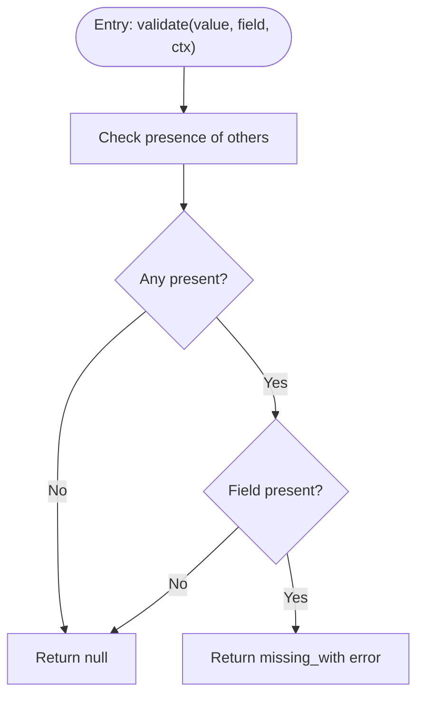

**Diagram sources**
- [MissingWithRule.php](file://src/Rules/MissingWithRule.php#L20-L44)

**Section sources**
- [MissingWithRule.php](file://src/Rules/MissingWithRule.php#L20-L44)

### Context-Dependent Validation Patterns

#### conditional
- Purpose: Wrap a set of rules and evaluate them only when a condition is met. Supports a boolean condition or a callable that receives the data and context.
- Evaluation logic:
  - Evaluate the condition against the current data and context.
  - Choose the active rule chain (rules or elseRules).
  - Run each rule in the active chain until the first error.
- Complexity: O(n) for n rules evaluated in the chosen branch.

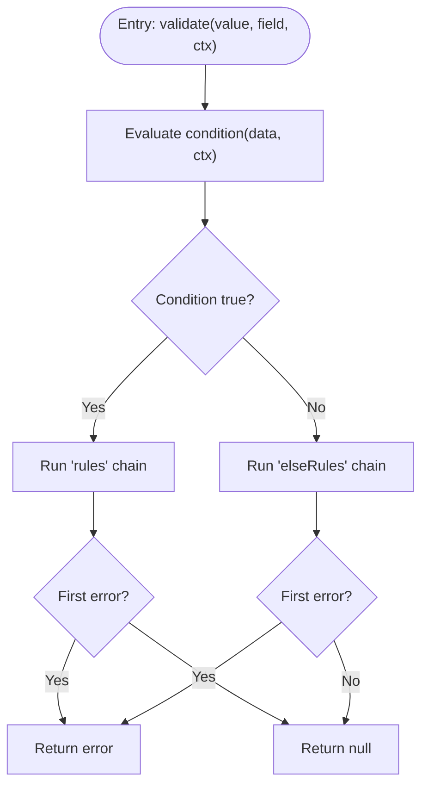

**Diagram sources**
- [ConditionalRule.php](file://src/Rules/ConditionalRule.php#L36-L52)

**Section sources**
- [ConditionalRule.php](file://src/Rules/ConditionalRule.php#L36-L68)

### Rule Dependency Chains and Evaluation Order
- RuleInterface mandates a single validate method per rule. Chains are formed by composing multiple rules on the same field.
- Evaluation order is typically left-to-right across the chain; the first error short-circuits further evaluation in that chain.
- ConditionalRule selects a sub-chain (rules or elseRules) based on its condition and then evaluates that chain in order.

Practical ordering tips:
- Place inexpensive checks early (e.g., emptiness) to fail fast.
- Place expensive checks later (e.g., database lookups) or guard them with conditional rules to avoid unnecessary work.

**Section sources**
- [RuleInterface.php](file://src/Rules/RuleInterface.php#L11-L14)
- [ConditionalRule.php](file://src/Rules/ConditionalRule.php#L44-L49)

### Practical Examples

- Form validation with conditional fields
  - Example: If “payment_method” equals “credit_card”, then “card_number” is required; otherwise optional.
  - Implementation: Use required_if(payment_method, ["credit_card"]).
  - Related rules: required_if, required_unless, required_with.

- Business rule-based validation
  - Example: If “status” equals “approved”, then “approver_name” must be present; otherwise disallowed.
  - Implementation: Use required_if(status, ["approved"]) and missing_if(status, ["approved"]).
  - Related rules: required_if, missing_if.

- User-driven validation scenarios
  - Example: If “newsletter” is checked, then “email” is required; otherwise optional.
  - Implementation: Use required_with(newsletter).
  - Related rules: required_with, present, missing_with.

- Nested and cross-field conditions
  - Example: If “shipping.address.country” equals “CA”, then “shipping.province” is required.
  - Implementation: Use required_if(shipping.address.country, ["CA"]) with dot notation support in ValidationContext.

Note: These examples describe intended usage patterns; refer to the rule implementations for precise behavior.

**Section sources**
- [RequiredIfRule.php](file://src/Rules/RequiredIfRule.php#L26-L48)
- [RequiredUnlessRule.php](file://src/Rules/RequiredUnlessRule.php#L26-L47)
- [RequiredWithRule.php](file://src/Rules/RequiredWithRule.php#L23-L51)
- [MissingIfRule.php](file://src/Rules/MissingIfRule.php#L21-L40)
- [MissingUnlessRule.php](file://src/Rules/MissingUnlessRule.php#L21-L40)
- [MissingWithRule.php](file://src/Rules/MissingWithRule.php#L20-L44)
- [PresentRule.php](file://src/Rules/PresentRule.php#L15-L38)
- [ValidationContext.php](file://src/Execution/ValidationContext.php#L43-L73)

## Dependency Analysis
- RuleRegistry.registerBuiltInRules wires all built-in rules, including conditional ones, enabling resolution by name or alias.
- RuleId enumerates canonical names and aliases for all rules.
- ConditionalRule depends on ValidationContext to evaluate conditions and to run sub-chains.
- ValidationContext.getValue and hasValue provide the primitives for cross-field logic.

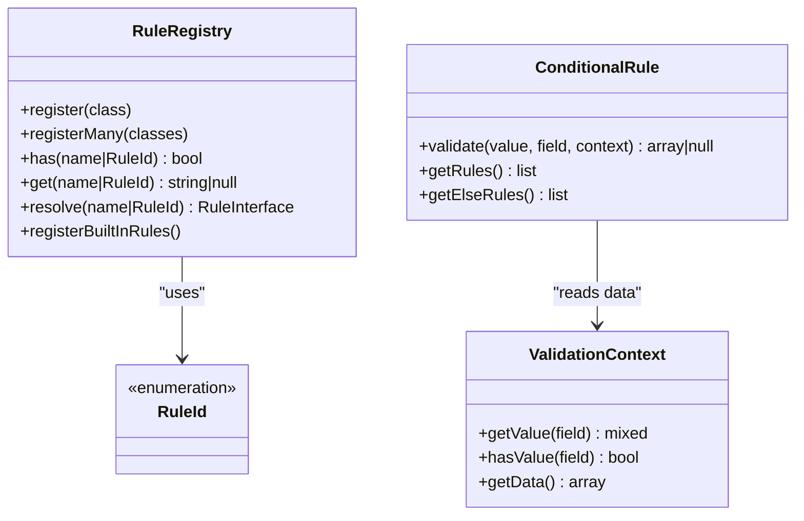

**Diagram sources**
- [RuleRegistry.php](file://src/Rules/RuleRegistry.php#L195-L300)
- [RuleId.php](file://src/Rules/RuleId.php#L10-L114)
- [ConditionalRule.php](file://src/Rules/ConditionalRule.php#L36-L52)
- [ValidationContext.php](file://src/Execution/ValidationContext.php#L43-L83)

**Section sources**
- [RuleRegistry.php](file://src/Rules/RuleRegistry.php#L195-L300)
- [RuleId.php](file://src/Rules/RuleId.php#L10-L114)
- [ConditionalRule.php](file://src/Rules/ConditionalRule.php#L36-L52)
- [ValidationContext.php](file://src/Execution/ValidationContext.php#L43-L83)

## Performance Considerations
- Cross-field reads
  - required_if, required_unless, required_with, missing_if, missing_unless, missing_with all read other fields via ValidationContext. Prefer keeping the number of cross-field reads minimal by grouping related validations.
- Membership checks
  - required_if and required_unless perform in-array membership checks against a small allowed-values list; keep the list concise.
- Presence checks
  - required_with and missing_with iterate over a small set of other fields; avoid large sets of dependent fields.
- ConditionalRule branching
  - Evaluating the condition once per field is O(1); however, the cost scales with the number of rules in the selected branch.
- Early termination
  - Rules short-circuit on the first error; place inexpensive rules first to reduce total work.
- Nested field access
  - PresentRule splits dot notation and accesses nested arrays; keep nesting shallow for predictable performance.

Optimization strategies:
- Reduce rule count per field by consolidating related checks.
- Use conditional to defer heavy checks until necessary.
- Normalize input shapes to minimize deep nested lookups.
- Cache expensive computations (e.g., database lookups) at the application level when reused across fields.

[No sources needed since this section provides general guidance]

## Troubleshooting Guide
Common issues and resolutions:
- Unexpected pass/fail with required_if/required_unless
  - Verify the other field’s value type and the allowed values list. Ensure the comparison uses strict equality semantics.
  - Confirm the field name is correct and supports dot notation for nested access.
- required_with triggers unexpectedly
  - Check whether any of the specified other fields are considered present in the payload. Presence is determined by ValidationContext.hasValue.
- missing_if/mising_unless/mising_with false positives
  - Ensure the target value for missing_if/missing_unless matches the other field’s value type.
  - For missing_with, confirm that at least one of the other fields is truly present.
- conditional rule not evaluating
  - If using a callable condition, ensure it returns a boolean for the given data and context.
  - Verify that the chosen branch (rules vs elseRules) aligns with expectations.

**Section sources**
- [RequiredIfRule.php](file://src/Rules/RequiredIfRule.php#L26-L48)
- [RequiredUnlessRule.php](file://src/Rules/RequiredUnlessRule.php#L26-L47)
- [RequiredWithRule.php](file://src/Rules/RequiredWithRule.php#L23-L51)
- [MissingIfRule.php](file://src/Rules/MissingIfRule.php#L21-L40)
- [MissingUnlessRule.php](file://src/Rules/MissingUnlessRule.php#L21-L40)
- [MissingWithRule.php](file://src/Rules/MissingWithRule.php#L20-L44)
- [ConditionalRule.php](file://src/Rules/ConditionalRule.php#L36-L52)
- [ValidationContext.php](file://src/Execution/ValidationContext.php#L43-L73)

## Conclusion
Conditional validation in vi/validation is centered around lightweight, composable rules that read from a shared ValidationContext. By leveraging required_if, required_unless, required_with, missing_if, missing_unless, missing_with, present, and conditional, you can express complex, context-dependent validation policies. Keep rule chains efficient, order checks strategically, and use conditional to defer expensive logic until necessary.

[No sources needed since this section summarizes without analyzing specific files]