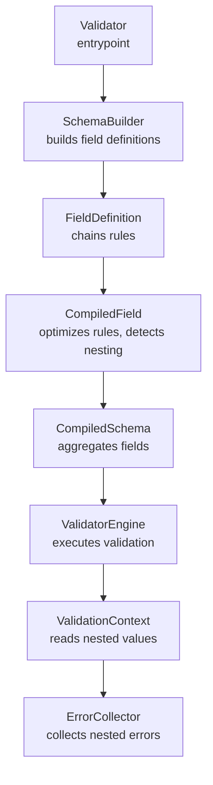
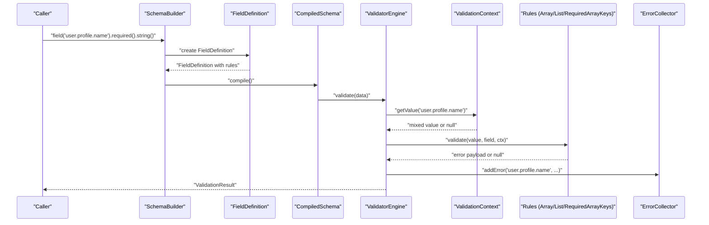
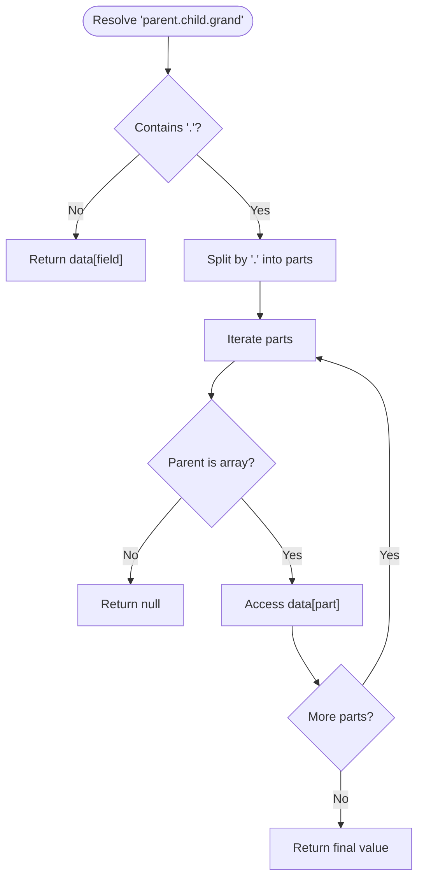
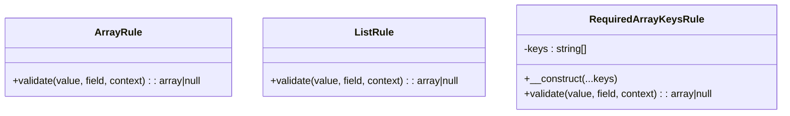
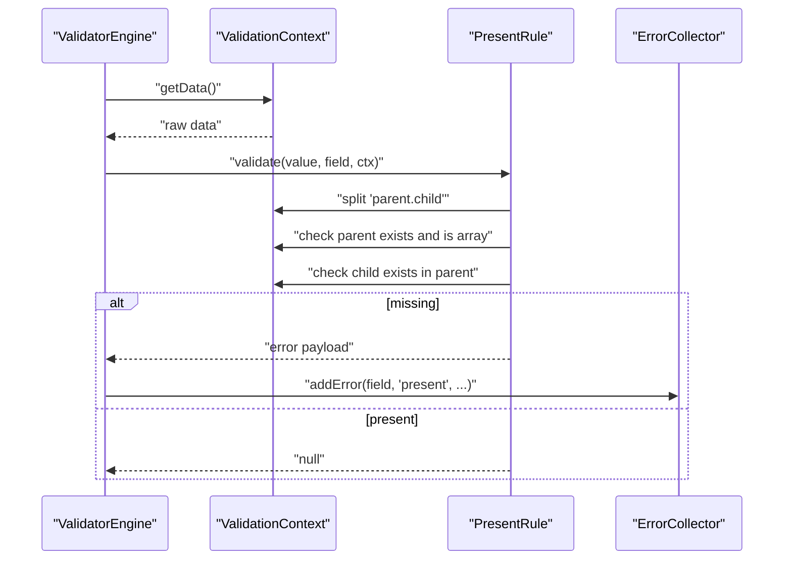
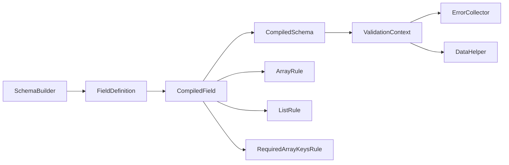

# Nested Fields and Arrays

<cite>
**Referenced Files in This Document**
- [FieldDefinition.php](file://src/Schema/FieldDefinition.php)
- [SchemaBuilder.php](file://src/Schema/SchemaBuilder.php)
- [CompiledField.php](file://src/Execution/CompiledField.php)
- [CompiledSchema.php](file://src/Execution/CompiledSchema.php)
- [ValidationContext.php](file://src/Execution/ValidationContext.php)
- [DataHelper.php](file://src/Execution/DataHelper.php)
- [ArrayRule.php](file://src/Rules/ArrayRule.php)
- [ListRule.php](file://src/Rules/ListRule.php)
- [RequiredArrayKeysRule.php](file://src/Rules/RequiredArrayKeysRule.php)
- [PresentRule.php](file://src/Rules/PresentRule.php)
- [ErrorCollector.php](file://src/Execution/ErrorCollector.php)
- [Validator.php](file://src/Validator.php)
- [ValidatorTest.php](file://tests/Unit/ValidatorTest.php)
</cite>

## Table of Contents
1. [Introduction](#introduction)
2. [Project Structure](#project-structure)
3. [Core Components](#core-components)
4. [Architecture Overview](#architecture-overview)
5. [Detailed Component Analysis](#detailed-component-analysis)
6. [Dependency Analysis](#dependency-analysis)
7. [Performance Considerations](#performance-considerations)
8. [Troubleshooting Guide](#troubleshooting-guide)
9. [Conclusion](#conclusion)

## Introduction
This document explains how nested field definitions and arrays are modeled and validated in the vi/validation library. It covers:
- Dot notation syntax for nested object fields
- Array and list field definitions
- Recursive and cross-field validation patterns
- Multi-level nested objects, arrays of objects, and mixed structures
- Validation context for nested fields and error reporting
- Performance considerations for deeply nested schemas
- Practical use cases such as form data with nested sections and API response validation

## Project Structure
The validation pipeline centers around a fluent schema builder that compiles to a compiled schema and executes validation against runtime data. Nested fields are represented using dot notation and resolved during validation.

**Diagram sources**
- [Validator.php](file://src/Validator.php#L9-L15)
- [SchemaBuilder.php](file://src/Schema/SchemaBuilder.php#L9-L35)
- [FieldDefinition.php](file://src/Schema/FieldDefinition.php#L9-L657)
- [CompiledField.php](file://src/Execution/CompiledField.php#L10-L176)
- [CompiledSchema.php](file://src/Execution/CompiledSchema.php#L9-L67)
- [ValidationContext.php](file://src/Execution/ValidationContext.php#L7-L97)
- [ErrorCollector.php](file://src/Execution/ErrorCollector.php#L7-L50)

**Section sources**
- [Validator.php](file://src/Validator.php#L9-L15)
- [SchemaBuilder.php](file://src/Schema/SchemaBuilder.php#L9-L35)

## Core Components
- SchemaBuilder: Creates field definitions and compiles them into a CompiledSchema.
- FieldDefinition: Fluent rule builder for a single field (supports dot notation).
- CompiledField: Encapsulates a field’s rules, detects nesting, and resolves values.
- CompiledSchema: Holds compiled fields and orchestrates validation.
- ValidationContext: Provides safe nested value access and error reporting.
- DataHelper: Utility for dot notation traversal.
- Array/List/RequiredArrayKeys rules: Core primitives for array/list validation and required keys.

**Section sources**
- [FieldDefinition.php](file://src/Schema/FieldDefinition.php#L9-L657)
- [SchemaBuilder.php](file://src/Schema/SchemaBuilder.php#L9-L35)
- [CompiledField.php](file://src/Execution/CompiledField.php#L10-L176)
- [CompiledSchema.php](file://src/Execution/CompiledSchema.php#L9-L67)
- [ValidationContext.php](file://src/Execution/ValidationContext.php#L7-L97)
- [DataHelper.php](file://src/Execution/DataHelper.php#L10-L31)
- [ArrayRule.php](file://src/Rules/ArrayRule.php#L9-L24)
- [ListRule.php](file://src/Rules/ListRule.php#L9-L24)
- [RequiredArrayKeysRule.php](file://src/Rules/RequiredArrayKeysRule.php#L9-L34)

## Architecture Overview
The validator compiles a human-readable schema into an optimized execution model. During validation, CompiledField detects nested fields and delegates value retrieval to ValidationContext, which supports dot notation. Errors are collected per field, preserving nested paths.

**Diagram sources**
- [SchemaBuilder.php](file://src/Schema/SchemaBuilder.php#L14-L34)
- [FieldDefinition.php](file://src/Schema/FieldDefinition.php#L24-L28)
- [CompiledSchema.php](file://src/Execution/CompiledSchema.php#L59-L66)
- [CompiledField.php](file://src/Execution/CompiledField.php#L163-L175)
- [ValidationContext.php](file://src/Execution/ValidationContext.php#L43-L58)
- [ArrayRule.php](file://src/Rules/ArrayRule.php#L12-L23)
- [ListRule.php](file://src/Rules/ListRule.php#L12-L23)
- [RequiredArrayKeysRule.php](file://src/Rules/RequiredArrayKeysRule.php#L20-L33)
- [ErrorCollector.php](file://src/Execution/ErrorCollector.php#L17-L25)

## Detailed Component Analysis

### Dot Notation and Nested Field Resolution
- FieldDefinition supports dot notation in field names (e.g., user.profile.name). CompiledField detects nesting and splits into parent and child segments.
- ValidationContext.getValue resolves nested values using dot notation and guards against non-array parents.
- DataHelper.get provides a reusable utility for dot notation traversal.

**Diagram sources**
- [CompiledField.php](file://src/Execution/CompiledField.php#L33-L38)
- [CompiledField.php](file://src/Execution/CompiledField.php#L163-L175)
- [ValidationContext.php](file://src/Execution/ValidationContext.php#L43-L58)
- [DataHelper.php](file://src/Execution/DataHelper.php#L15-L30)

**Section sources**
- [CompiledField.php](file://src/Execution/CompiledField.php#L33-L38)
- [CompiledField.php](file://src/Execution/CompiledField.php#L163-L175)
- [ValidationContext.php](file://src/Execution/ValidationContext.php#L43-L58)
- [DataHelper.php](file://src/Execution/DataHelper.php#L15-L30)

### Array and List Field Definitions
- ArrayRule ensures a field is an array or null.
- ListRule ensures a field is a numerically indexed array or null.
- RequiredArrayKeysRule ensures presence of specified keys in an array.

**Diagram sources**
- [ArrayRule.php](file://src/Rules/ArrayRule.php#L9-L24)
- [ListRule.php](file://src/Rules/ListRule.php#L9-L24)
- [RequiredArrayKeysRule.php](file://src/Rules/RequiredArrayKeysRule.php#L9-L34)

**Section sources**
- [ArrayRule.php](file://src/Rules/ArrayRule.php#L12-L23)
- [ListRule.php](file://src/Rules/ListRule.php#L12-L23)
- [RequiredArrayKeysRule.php](file://src/Rules/RequiredArrayKeysRule.php#L20-L33)

### Cross-Field and Presence Validation in Nested Context
- PresentRule checks nested presence using dot notation and validates parent-child relationships.
- CompiledField.getValue uses the same dot notation to extract nested values for rule evaluation.

**Diagram sources**
- [PresentRule.php](file://src/Rules/PresentRule.php#L15-L38)
- [ValidationContext.php](file://src/Execution/ValidationContext.php#L43-L73)
- [CompiledField.php](file://src/Execution/CompiledField.php#L163-L175)
- [ErrorCollector.php](file://src/Execution/ErrorCollector.php#L17-L25)

**Section sources**
- [PresentRule.php](file://src/Rules/PresentRule.php#L15-L38)
- [CompiledField.php](file://src/Execution/CompiledField.php#L163-L175)

### Mixed Nested Structures and Examples
Common scenarios supported by the schema:
- Multi-level nested objects: user.profile.settings.theme
- Arrays of scalars: tags.*
- Arrays of objects: items.*.name
- Mixed nested structures: user.orders.*.items.*.product.sku

These are expressed using dot notation in FieldDefinition and validated via CompiledField.getValue and ValidationContext.getValue. Tests demonstrate nested object validation and error reporting.

**Section sources**
- [ValidatorTest.php](file://tests/Unit/ValidatorTest.php#L51-L87)
- [CompiledField.php](file://src/Execution/CompiledField.php#L163-L175)
- [ValidationContext.php](file://src/Execution/ValidationContext.php#L43-L58)

## Dependency Analysis
The following diagram shows key dependencies among components involved in nested field and array validation.

**Diagram sources**
- [SchemaBuilder.php](file://src/Schema/SchemaBuilder.php#L14-L34)
- [FieldDefinition.php](file://src/Schema/FieldDefinition.php#L640-L651)
- [CompiledField.php](file://src/Execution/CompiledField.php#L115-L118)
- [CompiledSchema.php](file://src/Execution/CompiledSchema.php#L27-L36)
- [ValidationContext.php](file://src/Execution/ValidationContext.php#L43-L58)
- [ErrorCollector.php](file://src/Execution/ErrorCollector.php#L17-L25)
- [ArrayRule.php](file://src/Rules/ArrayRule.php#L9-L24)
- [ListRule.php](file://src/Rules/ListRule.php#L9-L24)
- [RequiredArrayKeysRule.php](file://src/Rules/RequiredArrayKeysRule.php#L9-L34)
- [DataHelper.php](file://src/Execution/DataHelper.php#L15-L30)

**Section sources**
- [SchemaBuilder.php](file://src/Schema/SchemaBuilder.php#L14-L34)
- [FieldDefinition.php](file://src/Schema/FieldDefinition.php#L640-L651)
- [CompiledField.php](file://src/Execution/CompiledField.php#L115-L118)
- [CompiledSchema.php](file://src/Execution/CompiledSchema.php#L27-L36)
- [ValidationContext.php](file://src/Execution/ValidationContext.php#L43-L58)
- [ErrorCollector.php](file://src/Execution/ErrorCollector.php#L17-L25)
- [ArrayRule.php](file://src/Rules/ArrayRule.php#L9-L24)
- [ListRule.php](file://src/Rules/ListRule.php#L9-L24)
- [RequiredArrayKeysRule.php](file://src/Rules/RequiredArrayKeysRule.php#L9-L34)
- [DataHelper.php](file://src/Execution/DataHelper.php#L15-L30)

## Performance Considerations
- Nesting detection and dot notation parsing occur in CompiledField and ValidationContext. Keep dot notation paths concise to avoid deep traversal overhead.
- CompiledField deduplicates and reorders rules to optimize early exits (e.g., bail, required, nullable). This reduces unnecessary rule evaluations for nested fields.
- Prefer array/list rules judiciously; redundant array checks can add overhead.
- For large datasets, leverage batch validation capabilities exposed by the schema validator to process multiple records efficiently.

[No sources needed since this section provides general guidance]

## Troubleshooting Guide
- Nested field not found: Verify the dot notation path and ensure intermediate parents are arrays. ValidationContext.getValue returns null if any parent segment is missing or not an array.
- Error reporting: Errors are keyed by the original field name (including dot notation). Inspect ValidationResult.errors() to locate issues in nested structures.
- Presence validation: PresentRule enforces nested presence semantics. Confirm parent-child existence using dot notation.
- Array/list validation: Use ArrayRule for generic arrays and ListRule for numerically indexed arrays. RequiredArrayKeysRule helps enforce required keys in associative arrays.

**Section sources**
- [ValidationContext.php](file://src/Execution/ValidationContext.php#L43-L58)
- [ErrorCollector.php](file://src/Execution/ErrorCollector.php#L17-L25)
- [PresentRule.php](file://src/Rules/PresentRule.php#L15-L38)
- [ArrayRule.php](file://src/Rules/ArrayRule.php#L12-L23)
- [ListRule.php](file://src/Rules/ListRule.php#L12-L23)
- [RequiredArrayKeysRule.php](file://src/Rules/RequiredArrayKeysRule.php#L20-L33)

## Conclusion
The vi/validation library provides a robust foundation for nested field definitions and array handling:
- Dot notation in FieldDefinition naturally expresses nested structures.
- CompiledField and ValidationContext implement efficient, guarded resolution of nested values.
- Core rules (ArrayRule, ListRule, RequiredArrayKeysRule) enable strong array/list validation.
- ErrorCollector preserves field identity, including nested paths, for precise diagnostics.
Adopt concise dot notation, leverage rule ordering optimizations, and use targeted array/list rules to achieve reliable and performant validation for complex forms and API responses.