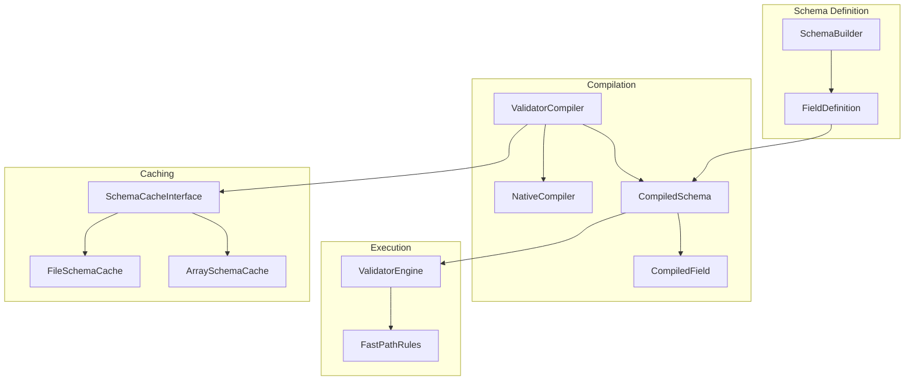
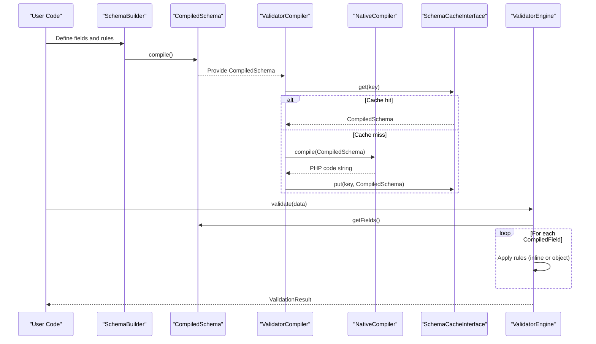
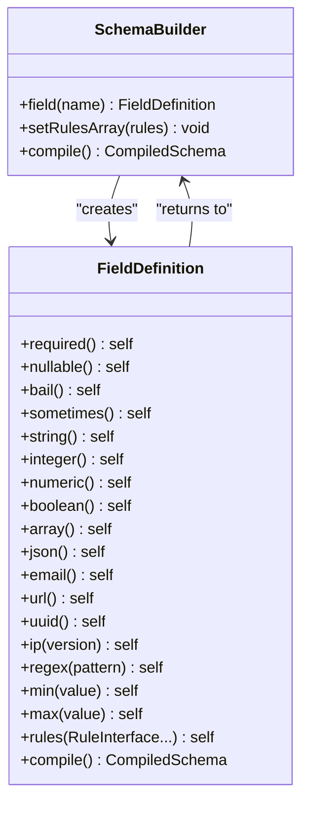
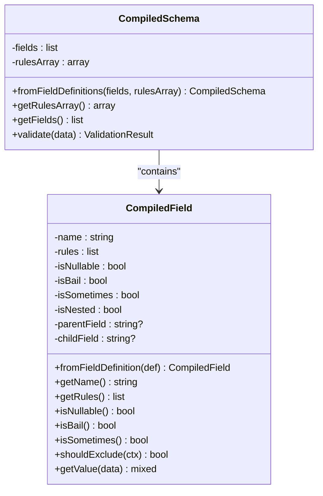
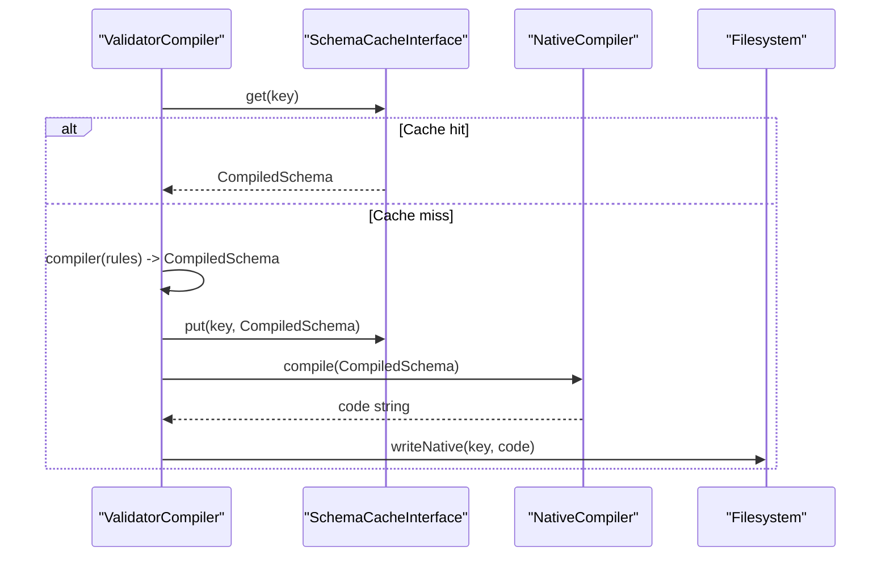
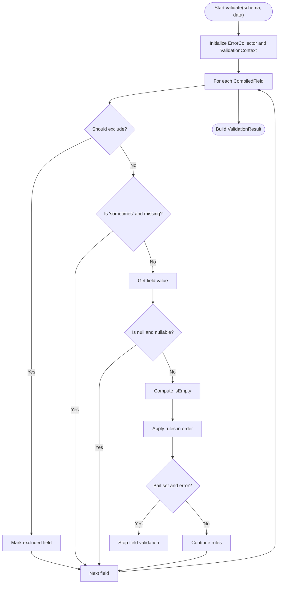
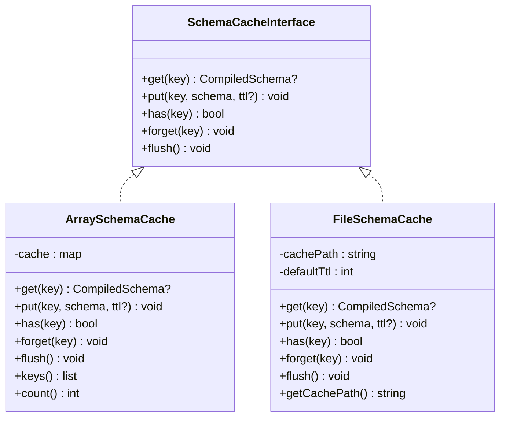
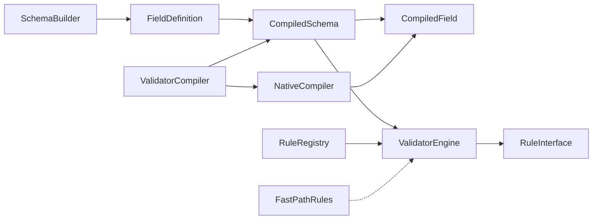

# Schema Compilation and Optimization

<cite>
**Referenced Files in This Document**
- [NativeCompiler.php](file://src/Compilation/NativeCompiler.php)
- [ValidatorCompiler.php](file://src/Compilation/ValidatorCompiler.php)
- [CompiledSchema.php](file://src/Execution/CompiledSchema.php)
- [CompiledField.php](file://src/Execution/CompiledField.php)
- [SchemaBuilder.php](file://src/Schema/SchemaBuilder.php)
- [FieldDefinition.php](file://src/Schema/FieldDefinition.php)
- [ValidatorEngine.php](file://src/Execution/ValidatorEngine.php)
- [FastPathRules.php](file://src/Compilation/FastPathRules.php)
- [SchemaCacheInterface.php](file://src/Cache/SchemaCacheInterface.php)
- [ArraySchemaCache.php](file://src/Cache/ArraySchemaCache.php)
- [FileSchemaCache.php](file://src/Cache/FileSchemaCache.php)
- [RuleInterface.php](file://src/Rules/RuleInterface.php)
- [RuleRegistry.php](file://src/Rules/RuleRegistry.php)
- [benchmark.php](file://tests/benchmark.php)
- [final_benchmark.php](file://tests/final_benchmark.php)
</cite>

## Table of Contents
1. [Introduction](#introduction)
2. [Project Structure](#project-structure)
3. [Core Components](#core-components)
4. [Architecture Overview](#architecture-overview)
5. [Detailed Component Analysis](#detailed-component-analysis)
6. [Dependency Analysis](#dependency-analysis)
7. [Performance Considerations](#performance-considerations)
8. [Troubleshooting Guide](#troubleshooting-guide)
9. [Conclusion](#conclusion)
10. [Appendices](#appendices)

## Introduction
This document explains the schema compilation and optimization pipeline in vi/validation, from declarative schema definition to compiled runtime execution. It covers:
- How SchemaBuilder constructs field-level rules into CompiledSchema
- How CompiledField optimizes rule ordering and metadata
- How NativeCompiler generates highly optimized PHP code for validation
- How ValidatorCompiler orchestrates caching and precompilation
- How FastPathRules accelerates common validations
- How caches (Array and File) improve throughput
- Practical workflows, caching strategies, benchmarking, and debugging tips

## Project Structure
The compilation and optimization pipeline spans several modules:
- Schema definition and construction: SchemaBuilder, FieldDefinition
- Compilation artifacts: CompiledSchema, CompiledField
- Execution engine: ValidatorEngine
- Optimization and codegen: NativeCompiler, ValidatorCompiler, FastPathRules
- Caching: SchemaCacheInterface, ArraySchemaCache, FileSchemaCache
- Rule system: RuleInterface, RuleRegistry

**Diagram sources**
- [SchemaBuilder.php](file://src/Schema/SchemaBuilder.php#L9-L35)
- [FieldDefinition.php](file://src/Schema/FieldDefinition.php#L9-L657)
- [CompiledSchema.php](file://src/Execution/CompiledSchema.php#L9-L67)
- [CompiledField.php](file://src/Execution/CompiledField.php#L10-L176)
- [ValidatorCompiler.php](file://src/Compilation/ValidatorCompiler.php#L10-L194)
- [NativeCompiler.php](file://src/Compilation/NativeCompiler.php#L17-L309)
- [ValidatorEngine.php](file://src/Execution/ValidatorEngine.php#L11-L176)
- [FastPathRules.php](file://src/Compilation/FastPathRules.php#L13-L241)
- [SchemaCacheInterface.php](file://src/Cache/SchemaCacheInterface.php#L9-L35)
- [ArraySchemaCache.php](file://src/Cache/ArraySchemaCache.php#L9-L74)
- [FileSchemaCache.php](file://src/Cache/FileSchemaCache.php#L9-L107)

**Section sources**
- [SchemaBuilder.php](file://src/Schema/SchemaBuilder.php#L9-L35)
- [FieldDefinition.php](file://src/Schema/FieldDefinition.php#L9-L657)
- [CompiledSchema.php](file://src/Execution/CompiledSchema.php#L9-L67)
- [CompiledField.php](file://src/Execution/CompiledField.php#L10-L176)
- [ValidatorCompiler.php](file://src/Compilation/ValidatorCompiler.php#L10-L194)
- [NativeCompiler.php](file://src/Compilation/NativeCompiler.php#L17-L309)
- [ValidatorEngine.php](file://src/Execution/ValidatorEngine.php#L11-L176)
- [FastPathRules.php](file://src/Compilation/FastPathRules.php#L13-L241)
- [SchemaCacheInterface.php](file://src/Cache/SchemaCacheInterface.php#L9-L35)
- [ArraySchemaCache.php](file://src/Cache/ArraySchemaCache.php#L9-L74)
- [FileSchemaCache.php](file://src/Cache/FileSchemaCache.php#L9-L107)

## Core Components
- SchemaBuilder: Fluent DSL to define fields and rules; compiles to CompiledSchema.
- FieldDefinition: Holds per-field rules and fluent rule builders.
- CompiledSchema: Immutable artifact containing CompiledField instances and rules array.
- CompiledField: Normalized, deduplicated, and reordered rules with metadata (nullable, bail, sometimes, exclusion).
- ValidatorCompiler: Orchestrates object and native code caching, precompilation, and loading.
- NativeCompiler: Generates optimized PHP closures for validation with inlined fast-path logic.
- ValidatorEngine: Executes CompiledSchema using either compiled code or rule objects.
- FastPathRules: Inline helpers for common rules to accelerate validation.
- Caches: In-memory and filesystem caches for CompiledSchema to avoid recompilation.

**Section sources**
- [SchemaBuilder.php](file://src/Schema/SchemaBuilder.php#L9-L35)
- [FieldDefinition.php](file://src/Schema/FieldDefinition.php#L9-L657)
- [CompiledSchema.php](file://src/Execution/CompiledSchema.php#L9-L67)
- [CompiledField.php](file://src/Execution/CompiledField.php#L10-L176)
- [ValidatorCompiler.php](file://src/Compilation/ValidatorCompiler.php#L10-L194)
- [NativeCompiler.php](file://src/Compilation/NativeCompiler.php#L17-L309)
- [ValidatorEngine.php](file://src/Execution/ValidatorEngine.php#L11-L176)
- [FastPathRules.php](file://src/Compilation/FastPathRules.php#L13-L241)
- [SchemaCacheInterface.php](file://src/Cache/SchemaCacheInterface.php#L9-L35)
- [ArraySchemaCache.php](file://src/Cache/ArraySchemaCache.php#L9-L74)
- [FileSchemaCache.php](file://src/Cache/FileSchemaCache.php#L9-L107)

## Architecture Overview
The compilation pipeline transforms a declarative schema into an optimized execution unit. The runtime can execute via:
- Compiled native code (generated by NativeCompiler)
- Rule objects executed by ValidatorEngine

**Diagram sources**
- [SchemaBuilder.php](file://src/Schema/SchemaBuilder.php#L31-L34)
- [CompiledSchema.php](file://src/Execution/CompiledSchema.php#L27-L66)
- [ValidatorCompiler.php](file://src/Compilation/ValidatorCompiler.php#L33-L73)
- [NativeCompiler.php](file://src/Compilation/NativeCompiler.php#L24-L51)
- [SchemaCacheInterface.php](file://src/Cache/SchemaCacheInterface.php#L14-L29)
- [ValidatorEngine.php](file://src/Execution/ValidatorEngine.php#L33-L97)

## Detailed Component Analysis

### SchemaBuilder and FieldDefinition
- SchemaBuilder collects FieldDefinition instances and compiles them into CompiledSchema.
- FieldDefinition exposes fluent methods to attach rules and supports nested fields via dot notation.

**Diagram sources**
- [SchemaBuilder.php](file://src/Schema/SchemaBuilder.php#L9-L35)
- [FieldDefinition.php](file://src/Schema/FieldDefinition.php#L9-L657)

**Section sources**
- [SchemaBuilder.php](file://src/Schema/SchemaBuilder.php#L9-L35)
- [FieldDefinition.php](file://src/Schema/FieldDefinition.php#L24-L622)

### CompiledSchema and CompiledField
- CompiledSchema aggregates CompiledField entries and exposes getFields() for execution.
- CompiledField performs rule deduplication and reordering, marking special semantics (nullable, bail, sometimes, exclusion).

**Diagram sources**
- [CompiledSchema.php](file://src/Execution/CompiledSchema.php#L9-L67)
- [CompiledField.php](file://src/Execution/CompiledField.php#L10-L176)

**Section sources**
- [CompiledSchema.php](file://src/Execution/CompiledSchema.php#L9-L67)
- [CompiledField.php](file://src/Execution/CompiledField.php#L10-L176)

### ValidatorCompiler and NativeCompiler
- ValidatorCompiler coordinates cache retrieval, object caching, and native code generation.
- NativeCompiler emits a PHP closure that validates data with minimal overhead, inlining fast-path logic and handling bail, nullable, and sometimes semantics.

**Diagram sources**
- [ValidatorCompiler.php](file://src/Compilation/ValidatorCompiler.php#L33-L73)
- [NativeCompiler.php](file://src/Compilation/NativeCompiler.php#L24-L51)
- [SchemaCacheInterface.php](file://src/Cache/SchemaCacheInterface.php#L14-L29)

**Section sources**
- [ValidatorCompiler.php](file://src/Compilation/ValidatorCompiler.php#L10-L194)
- [NativeCompiler.php](file://src/Compilation/NativeCompiler.php#L17-L309)

### ValidatorEngine and FastPathRules
- ValidatorEngine executes CompiledSchema, applying rules and honoring bail/nullable/sometimes/exclude semantics.
- FastPathRules provides ultra-fast checks for common rules to short-circuit expensive rule object instantiation.

**Diagram sources**
- [ValidatorEngine.php](file://src/Execution/ValidatorEngine.php#L33-L97)
- [CompiledField.php](file://src/Execution/CompiledField.php#L148-L161)

**Section sources**
- [ValidatorEngine.php](file://src/Execution/ValidatorEngine.php#L11-L176)
- [FastPathRules.php](file://src/Compilation/FastPathRules.php#L13-L241)

### Caching Strategies
- Object caching: SchemaCacheInterface implementations (ArraySchemaCache, FileSchemaCache) store CompiledSchema keyed by rule sets.
- Native code caching: ValidatorCompiler writes generated PHP closures to disk under a native directory keyed by content and environment.
- Precompilation: Legacy precompiled artifacts can be written and loaded for backward compatibility.

**Diagram sources**
- [SchemaCacheInterface.php](file://src/Cache/SchemaCacheInterface.php#L9-L35)
- [ArraySchemaCache.php](file://src/Cache/ArraySchemaCache.php#L9-L74)
- [FileSchemaCache.php](file://src/Cache/FileSchemaCache.php#L9-L107)

**Section sources**
- [SchemaCacheInterface.php](file://src/Cache/SchemaCacheInterface.php#L9-L35)
- [ArraySchemaCache.php](file://src/Cache/ArraySchemaCache.php#L9-L74)
- [FileSchemaCache.php](file://src/Cache/FileSchemaCache.php#L9-L107)
- [ValidatorCompiler.php](file://src/Compilation/ValidatorCompiler.php#L79-L133)

## Dependency Analysis
- SchemaBuilder depends on FieldDefinition and produces CompiledSchema.
- CompiledSchema depends on CompiledField and ValidatorEngine for execution.
- ValidatorCompiler depends on SchemaCacheInterface and NativeCompiler.
- NativeCompiler depends on CompiledSchema and CompiledField and uses reflection to extract rule metadata.
- ValidatorEngine depends on RuleInterface and RuleRegistry indirectly via rule instances.
- FastPathRules is independent and used by higher layers for fast checks.

**Diagram sources**
- [SchemaBuilder.php](file://src/Schema/SchemaBuilder.php#L9-L35)
- [FieldDefinition.php](file://src/Schema/FieldDefinition.php#L9-L657)
- [CompiledSchema.php](file://src/Execution/CompiledSchema.php#L9-L67)
- [CompiledField.php](file://src/Execution/CompiledField.php#L10-L176)
- [ValidatorCompiler.php](file://src/Compilation/ValidatorCompiler.php#L10-L26)
- [NativeCompiler.php](file://src/Compilation/NativeCompiler.php#L7-L11)
- [ValidatorEngine.php](file://src/Execution/ValidatorEngine.php#L7-L11)
- [RuleInterface.php](file://src/Rules/RuleInterface.php#L9-L15)
- [RuleRegistry.php](file://src/Rules/RuleRegistry.php#L14-L301)
- [FastPathRules.php](file://src/Compilation/FastPathRules.php#L13-L241)

**Section sources**
- [SchemaBuilder.php](file://src/Schema/SchemaBuilder.php#L9-L35)
- [FieldDefinition.php](file://src/Schema/FieldDefinition.php#L9-L657)
- [CompiledSchema.php](file://src/Execution/CompiledSchema.php#L9-L67)
- [CompiledField.php](file://src/Execution/CompiledField.php#L10-L176)
- [ValidatorCompiler.php](file://src/Compilation/ValidatorCompiler.php#L10-L26)
- [NativeCompiler.php](file://src/Compilation/NativeCompiler.php#L7-L11)
- [ValidatorEngine.php](file://src/Execution/ValidatorEngine.php#L7-L11)
- [RuleInterface.php](file://src/Rules/RuleInterface.php#L9-L15)
- [RuleRegistry.php](file://src/Rules/RuleRegistry.php#L14-L301)
- [FastPathRules.php](file://src/Compilation/FastPathRules.php#L13-L241)

## Performance Considerations
- Rule inlining: NativeCompiler emits tight conditionals for common rules, reducing object allocation and method dispatch overhead.
- Fast-path checks: FastPathRules avoids rule object instantiation for frequently used rules.
- Bail and early-exit: CompiledField marks bail and ValidatorEngine honors bail to stop rule evaluation early.
- Nullable short-circuit: Fields marked nullable skip rule evaluation when value is null.
- Nested access: CompiledField handles dot notation efficiently; NativeCompiler uses helper for deep paths.
- Caching: Object cache prevents repeated compilation; native code cache avoids cold-start costs.
- Memory efficiency: CompiledSchema stores only rule instances and metadata; CompiledField deduplicates marker rules.

[No sources needed since this section provides general guidance]

## Troubleshooting Guide
Common issues and remedies:
- Unexpected rule execution order: Review CompiledField’s deduplication and reordering logic for marker rules (bail, required, nullable).
- “Rule not inlined” warnings: NativeCompiler only inlines a subset of rules; fallback to object-based validation is automatic.
- Cache misses: Ensure cache path is writable and keys are stable; use ValidatorCompiler::generateKey for object cache and NativeCompiler::generateKey for native cache.
- Exclusions not applied: Verify CompiledField.shouldExclude and exclusion rules are present.
- Debugging compiled code: Generated closures include metadata comments; inspect the emitted file in the native cache directory.
- Performance regressions: Run benchmarks to compare before/after; confirm cache warming and precompilation steps.

**Section sources**
- [CompiledField.php](file://src/Execution/CompiledField.php#L50-L113)
- [NativeCompiler.php](file://src/Compilation/NativeCompiler.php#L94-L105)
- [ValidatorCompiler.php](file://src/Compilation/ValidatorCompiler.php#L190-L193)
- [ValidatorEngine.php](file://src/Execution/ValidatorEngine.php#L148-L159)

## Conclusion
vi/validation’s compilation and optimization pipeline converts declarative schemas into efficient execution units. By combining rule inlining, fast-path checks, strategic caching, and metadata-driven optimizations, it achieves significant performance gains while maintaining flexibility and correctness. Adopting precompilation and native code caching yields near-zero-cost validation loops for hot schemas.

[No sources needed since this section summarizes without analyzing specific files]

## Appendices

### A. Compilation Workflow Examples
- Build schema with SchemaBuilder, compile to CompiledSchema, and validate with ValidatorEngine.
- Enable caching via ValidatorCompiler with a cache path to persist native code and CompiledSchema.

**Section sources**
- [SchemaBuilder.php](file://src/Schema/SchemaBuilder.php#L31-L34)
- [CompiledSchema.php](file://src/Execution/CompiledSchema.php#L27-L36)
- [ValidatorEngine.php](file://src/Execution/ValidatorEngine.php#L59-L66)
- [ValidatorCompiler.php](file://src/Compilation/ValidatorCompiler.php#L33-L73)

### B. Caching Strategies
- Object cache: Use ArraySchemaCache for in-memory reuse within a process; FileSchemaCache for persistent storage across deployments.
- Native cache: ValidatorCompiler.writeNative writes generated PHP closures keyed by content and environment.
- Precompilation: Legacy precompiled artifacts can be written and cleared when rules change.

**Section sources**
- [ArraySchemaCache.php](file://src/Cache/ArraySchemaCache.php#L9-L74)
- [FileSchemaCache.php](file://src/Cache/FileSchemaCache.php#L9-L107)
- [ValidatorCompiler.php](file://src/Compilation/ValidatorCompiler.php#L79-L133)

### C. Performance Benchmarking
- Use provided benchmarks to measure throughput and parity:
  - Basic benchmark: [benchmark.php](file://tests/benchmark.php#L1-L55)
  - Final benchmark with cache and parity: [final_benchmark.php](file://tests/final_benchmark.php#L1-L80)

**Section sources**
- [benchmark.php](file://tests/benchmark.php#L1-L55)
- [final_benchmark.php](file://tests/final_benchmark.php#L1-L80)

### D. Rule Optimization During Compilation
- Marker rule deduplication and ordering: CompiledField ensures bail, required, and nullable appear first.
- Property extraction: NativeCompiler reflects rule classes to extract parameters (e.g., min/max limits) for inlined checks.
- Implicit vs explicit rules: Non-implicit rules are skipped when values are empty.

**Section sources**
- [CompiledField.php](file://src/Execution/CompiledField.php#L50-L113)
- [NativeCompiler.php](file://src/Compilation/NativeCompiler.php#L131-L172)
- [ValidatorEngine.php](file://src/Execution/ValidatorEngine.php#L78-L82)

### E. Memory Efficiency Gains
- CompiledSchema holds immutable field descriptors and rule arrays.
- CompiledField consolidates rule metadata and removes redundant marker rules.
- NativeCompiler reduces allocations by emitting tight conditionals and avoiding object calls.

**Section sources**
- [CompiledSchema.php](file://src/Execution/CompiledSchema.php#L11-L21)
- [CompiledField.php](file://src/Execution/CompiledField.php#L29-L44)
- [NativeCompiler.php](file://src/Compilation/NativeCompiler.php#L131-L172)