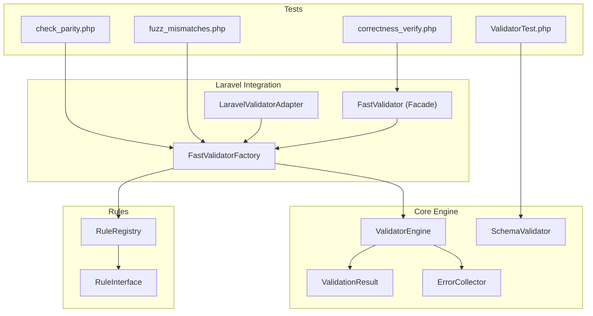
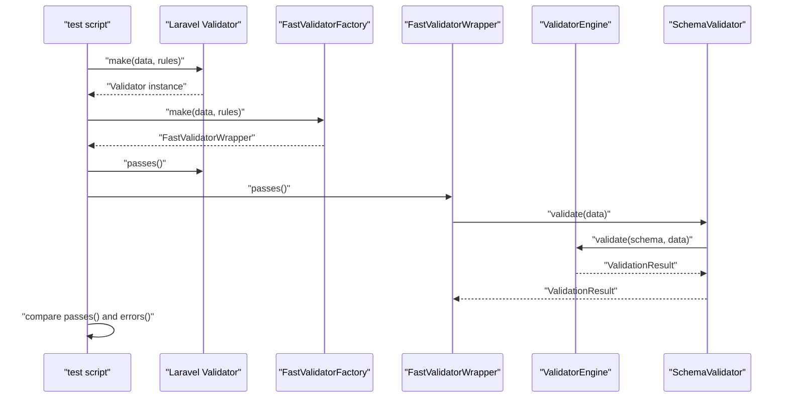
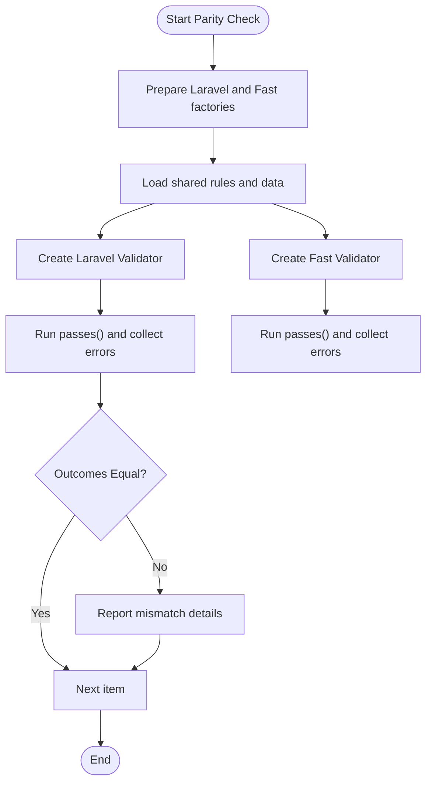
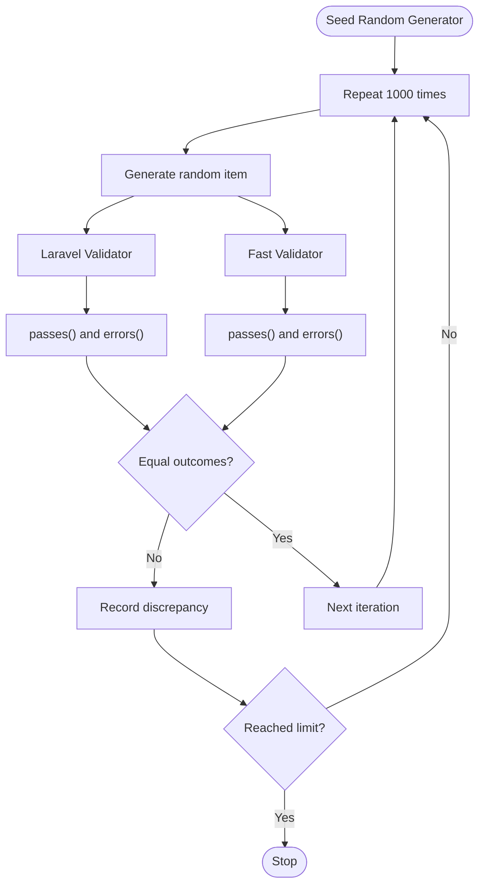
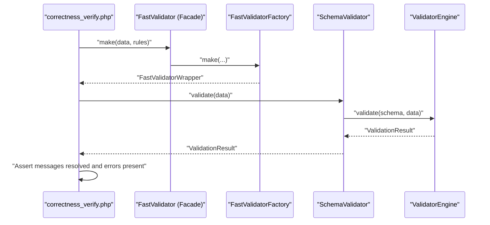
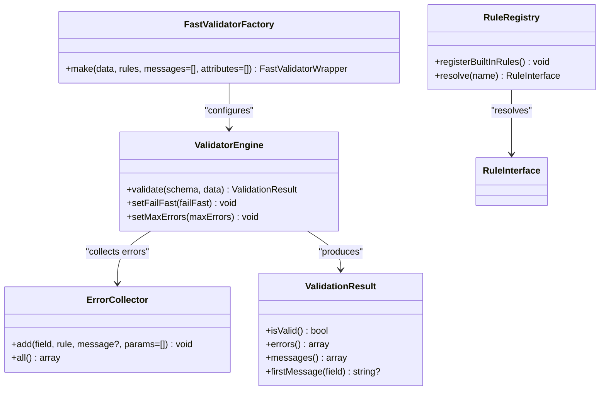
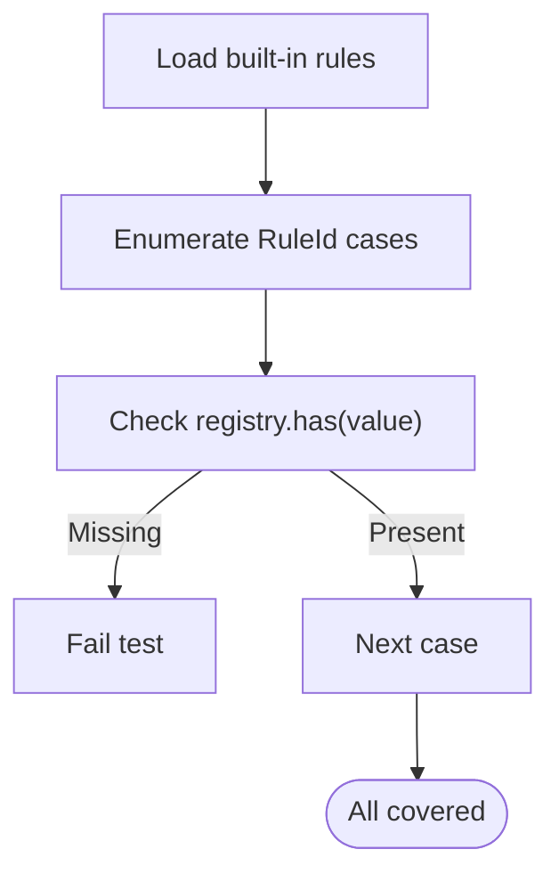
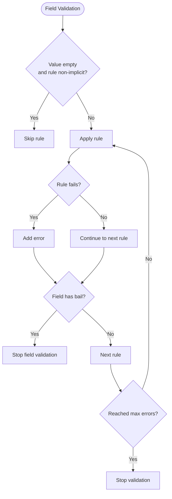
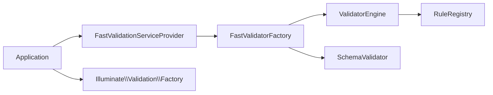

# Correctness Verification

<cite>
**Referenced Files in This Document**
- [fuzz_mismatches.php](file://tests/fuzz_mismatches.php)
- [check_parity.php](file://tests/check_parity.php)
- [correctness_verify.php](file://tests/correctness_verify.php)
- [ValidatorEngine.php](file://src/Execution/ValidatorEngine.php)
- [ValidationResult.php](file://src/Execution/ValidationResult.php)
- [ErrorCollector.php](file://src/Execution/ErrorCollector.php)
- [FastValidatorFactory.php](file://src/Laravel/FastValidatorFactory.php)
- [LaravelValidatorAdapter.php](file://src/Laravel/LaravelValidatorAdapter.php)
- [FastValidator.php](file://src/Laravel/Facades/FastValidator.php)
- [RuleRegistry.php](file://src/Rules/RuleRegistry.php)
- [RuleInterface.php](file://src/Rules/RuleInterface.php)
- [Validator.php](file://src/Validator.php)
- [composer.json](file://composer.json)
- [ValidatorTest.php](file://tests/Unit/ValidatorTest.php)
- [RuleIdTest.php](file://tests/Unit/Rules/RuleIdTest.php)
</cite>

## Table of Contents
1. [Introduction](#introduction)
2. [Project Structure](#project-structure)
3. [Core Components](#core-components)
4. [Architecture Overview](#architecture-overview)
5. [Detailed Component Analysis](#detailed-component-analysis)
6. [Dependency Analysis](#dependency-analysis)
7. [Performance Considerations](#performance-considerations)
8. [Troubleshooting Guide](#troubleshooting-guide)
9. [Conclusion](#conclusion)
10. [Appendices](#appendices)

## Introduction
This document describes correctness verification and validation accuracy testing workflows for the vi/validation library. It focuses on parity checking against Laravel’s built-in validator, fuzz testing strategies to uncover edge-case discrepancies, and automated validation accuracy checks. It also covers test data generation, rule implementation validation, backward compatibility, and precision across data types and scenarios.

## Project Structure
The repository is organized around a high-performance validation engine with Laravel integration points and a comprehensive suite of unit and correctness tests. Key areas:
- Core engine: execution, schema compilation, and rule registry
- Laravel integration: factory, adapter, and facade
- Tests: parity checks, fuzzing, correctness verification, and unit tests

**Diagram sources**
- [ValidatorEngine.php](file://src/Execution/ValidatorEngine.php#L1-L177)
- [ValidationResult.php](file://src/Execution/ValidationResult.php#L1-L142)
- [ErrorCollector.php](file://src/Execution/ErrorCollector.php#L1-L51)
- [FastValidatorFactory.php](file://src/Laravel/FastValidatorFactory.php#L1-L207)
- [LaravelValidatorAdapter.php](file://src/Laravel/LaravelValidatorAdapter.php#L1-L56)
- [FastValidator.php](file://src/Laravel/Facades/FastValidator.php#L1-L23)
- [RuleRegistry.php](file://src/Rules/RuleRegistry.php#L1-L302)
- [RuleInterface.php](file://src/Rules/RuleInterface.php#L1-L16)
- [check_parity.php](file://tests/check_parity.php#L1-L73)
- [fuzz_mismatches.php](file://tests/fuzz_mismatches.php#L1-L75)
- [correctness_verify.php](file://tests/correctness_verify.php#L1-L71)
- [ValidatorTest.php](file://tests/Unit/ValidatorTest.php#L1-L123)

**Section sources**
- [composer.json](file://composer.json#L1-L36)

## Core Components
- ValidatorEngine orchestrates validation execution, applies rules, manages bail and fail-fast behavior, and collects errors.
- ValidationResult exposes standardized accessors for validity, raw errors, formatted messages, and first messages.
- ErrorCollector accumulates rule failures with field, rule name, parameters, and optional custom messages.
- FastValidatorFactory builds SchemaValidator instances from Laravel-style rules, supports caching, and configures message resolution and performance options.
- RuleRegistry registers built-in rules and resolves rule names/aliases to concrete implementations.
- LaravelValidatorAdapter integrates the fast engine into Laravel’s Validator factory interface.
- Facade FastValidator provides a convenient entry point mirroring Laravel’s API.

**Section sources**
- [ValidatorEngine.php](file://src/Execution/ValidatorEngine.php#L1-L177)
- [ValidationResult.php](file://src/Execution/ValidationResult.php#L1-L142)
- [ErrorCollector.php](file://src/Execution/ErrorCollector.php#L1-L51)
- [FastValidatorFactory.php](file://src/Laravel/FastValidatorFactory.php#L1-L207)
- [RuleRegistry.php](file://src/Rules/RuleRegistry.php#L1-L302)
- [LaravelValidatorAdapter.php](file://src/Laravel/LaravelValidatorAdapter.php#L1-L56)
- [FastValidator.php](file://src/Laravel/Facades/FastValidator.php#L1-L23)

## Architecture Overview
The correctness verification pipeline compares the fast engine’s outcomes against Laravel’s Validator for identical inputs and rule sets. The flow ensures parity in pass/fail decisions and error message semantics.

**Diagram sources**
- [check_parity.php](file://tests/check_parity.php#L55-L63)
- [fuzz_mismatches.php](file://tests/fuzz_mismatches.php#L59-L60)
- [FastValidatorFactory.php](file://src/Laravel/FastValidatorFactory.php#L51-L60)
- [ValidatorEngine.php](file://src/Execution/ValidatorEngine.php#L33-L98)
- [ValidationResult.php](file://src/Execution/ValidationResult.php#L59-L70)

## Detailed Component Analysis

### Parity Checking Mechanisms
Parity checks compare:
- Pass/fail outcome
- Presence and shape of errors per field
- Formatted messages resolution

Scripts demonstrate:
- Iterating representative data samples and asserting equal outcomes.
- Verifying lazy message resolution and absence of unresolved keys.

**Diagram sources**
- [check_parity.php](file://tests/check_parity.php#L52-L72)
- [correctness_verify.php](file://tests/correctness_verify.php#L41-L70)

**Section sources**
- [check_parity.php](file://tests/check_parity.php#L1-L73)
- [correctness_verify.php](file://tests/correctness_verify.php#L1-L71)

### Fuzz Testing Strategies
Fuzzing generates random data items and compares outcomes across a thousand iterations. It surfaces discrepancies in:
- Mixed data types (strings, integers, nulls)
- Edge cases (empty strings, invalid emails, boundary values)
- Optional fields presence/absence

**Diagram sources**
- [fuzz_mismatches.php](file://tests/fuzz_mismatches.php#L56-L70)

**Section sources**
- [fuzz_mismatches.php](file://tests/fuzz_mismatches.php#L1-L75)

### Correctness Verification Workflows
Workflows include:
- Lazy message resolution verification: ensure messages are resolved and not left as unresolved keys.
- Backward compatibility checks: confirm RuleId enum coverage matches registered rules.
- Precision validation: nested fields, nullable fields, batch validation.

**Diagram sources**
- [correctness_verify.php](file://tests/correctness_verify.php#L41-L70)
- [FastValidator.php](file://src/Laravel/Facades/FastValidator.php#L16-L22)
- [FastValidatorFactory.php](file://src/Laravel/FastValidatorFactory.php#L51-L60)
- [ValidatorEngine.php](file://src/Execution/ValidatorEngine.php#L33-L98)

**Section sources**
- [correctness_verify.php](file://tests/correctness_verify.php#L1-L71)
- [ValidatorTest.php](file://tests/Unit/ValidatorTest.php#L1-L123)
- [RuleIdTest.php](file://tests/Unit/Rules/RuleIdTest.php#L1-L73)

### Automated Validation Accuracy Checks
Automated checks leverage:
- PHPUnit tests for schema-level validation (pass/fail, nested fields, nullable, batch).
- Rule registry coverage assertions to maintain backward compatibility.
- Consistent message resolution via MessageResolver in ValidationResult.

**Diagram sources**
- [ValidatorEngine.php](file://src/Execution/ValidatorEngine.php#L1-L177)
- [ValidationResult.php](file://src/Execution/ValidationResult.php#L1-L142)
- [ErrorCollector.php](file://src/Execution/ErrorCollector.php#L1-L51)
- [FastValidatorFactory.php](file://src/Laravel/FastValidatorFactory.php#L1-L207)
- [RuleRegistry.php](file://src/Rules/RuleRegistry.php#L1-L302)

**Section sources**
- [ValidatorTest.php](file://tests/Unit/ValidatorTest.php#L1-L123)
- [RuleIdTest.php](file://tests/Unit/Rules/RuleIdTest.php#L1-L73)

### Ensuring Backward Compatibility
Backward compatibility is ensured by:
- Registering all built-in rules in RuleRegistry.
- Confirming that every RuleId enum value has a corresponding registered rule.
- Verifying that registered rules have matching enum cases.

**Diagram sources**
- [RuleIdTest.php](file://tests/Unit/Rules/RuleIdTest.php#L26-L31)
- [RuleRegistry.php](file://src/Rules/RuleRegistry.php#L195-L300)

**Section sources**
- [RuleIdTest.php](file://tests/Unit/Rules/RuleIdTest.php#L1-L73)
- [RuleRegistry.php](file://src/Rules/RuleRegistry.php#L1-L302)

### Maintaining Validation Precision Across Data Types
Precision is maintained by:
- Explicit handling of empty values and implicit vs non-implicit rules.
- Bail behavior to stop field validation on first failure.
- Fail-fast and max-errors thresholds to control resource usage.
- Nullable fields allowing null without triggering non-implicit rules.

**Diagram sources**
- [ValidatorEngine.php](file://src/Execution/ValidatorEngine.php#L76-L95)

**Section sources**
- [ValidatorEngine.php](file://src/Execution/ValidatorEngine.php#L1-L177)

## Dependency Analysis
External dependencies and integration points:
- illuminate/validation is required for Laravel integration and Validator compatibility.
- Composer extra laravel provider and alias enable seamless Laravel usage.

**Diagram sources**
- [composer.json](file://composer.json#L23-L31)
- [FastValidatorFactory.php](file://src/Laravel/FastValidatorFactory.php#L1-L207)
- [LaravelValidatorAdapter.php](file://src/Laravel/LaravelValidatorAdapter.php#L1-L56)

**Section sources**
- [composer.json](file://composer.json#L1-L36)

## Performance Considerations
- Fail-fast and max-errors tuning controls throughput and memory usage during validation.
- Schema caching reduces repeated parsing and compilation overhead.
- Lazy message resolution defers translation lookups until messages are requested.

[No sources needed since this section provides general guidance]

## Troubleshooting Guide
Common issues and remedies:
- Unresolved messages: ensure message resolver is configured and messages are not returned as unresolved keys.
- Mismatches between engines: verify identical rule definitions, locales, and custom attributes/messages.
- Excessive errors: adjust max-errors or enable fail-fast to cut off long-running validations.
- Rule registration conflicts: confirm unique rule names and aliases in RuleRegistry.

**Section sources**
- [correctness_verify.php](file://tests/correctness_verify.php#L54-L63)
- [ValidationResult.php](file://src/Execution/ValidationResult.php#L77-L96)
- [ValidatorEngine.php](file://src/Execution/ValidatorEngine.php#L148-L159)
- [RuleRegistry.php](file://src/Rules/RuleRegistry.php#L55-L78)

## Conclusion
The correctness verification framework combines parity checks, fuzz testing, and automated unit tests to ensure the fast engine behaves identically to Laravel’s validator. By registering all built-in rules, resolving messages lazily, and controlling validation behavior via configurable options, the system maintains backward compatibility and precision across diverse data types and scenarios.

[No sources needed since this section summarizes without analyzing specific files]

## Appendices
- Example scripts for parity, fuzzing, and correctness verification are located under tests/.
- Rule implementations are registered centrally via RuleRegistry and resolved through RuleInterface.

[No sources needed since this section provides general guidance]