# Integration Testing

<cite>
**Referenced Files in This Document**
- [README.md](file://README.md)
- [composer.json](file://composer.json)
- [phpunit.xml](file://phpunit.xml)
- [src/Validator.php](file://src/Validator.php)
- [src/SchemaValidator.php](file://src/SchemaValidator.php)
- [src/Execution/ValidatorEngine.php](file://src/Execution/ValidatorEngine.php)
- [src/Execution/ValidationResult.php](file://src/Execution/ValidationResult.php)
- [src/Execution/ErrorCollector.php](file://src/Execution/ErrorCollector.php)
- [src/Execution/ValidationContext.php](file://src/Execution/ValidationContext.php)
- [src/Execution/BatchValidationResult.php](file://src/Execution/BatchValidationResult.php)
- [src/Execution/ChunkedValidator.php](file://src/Execution/ChunkedValidator.php)
- [src/Laravel/FastValidationServiceProvider.php](file://src/Laravel/FastValidationServiceProvider.php)
- [src/Laravel/FastValidatorFactory.php](file://src/Laravel/FastValidatorFactory.php)
- [src/Laravel/LaravelValidatorAdapter.php](file://src/Laravel/LaravelValidatorAdapter.php)
- [src/Laravel/Facades/FastValidator.php](file://src/Laravel/Facades/FastValidator.php)
- [src/Laravel/Octane/OctaneValidatorProvider.php](file://src/Laravel/Octane/OctaneValidatorProvider.php)
- [src/Runtime/StatelessValidator.php](file://src/Runtime/StatelessValidator.php)
- [src/Runtime/ValidatorPool.php](file://src/Runtime/ValidatorPool.php)
- [src/Cache/ArraySchemaCache.php](file://src/Cache/ArraySchemaCache.php)
- [src/Cache/FileSchemaCache.php](file://src/Cache/FileSchemaCache.php)
- [src/Cache/SchemaCacheInterface.php](file://src/Cache/SchemaCacheInterface.php)
- [src/Compilation/ValidatorCompiler.php](file://src/Compilation/ValidatorCompiler.php)
- [src/Compilation/NativeCompiler.php](file://src/Compilation/NativeCompiler.php)
- [src/Compilation/PrecompiledValidator.php](file://src/Compilation/PrecompiledValidator.php)
- [src/Messages/MessageResolver.php](file://src/Messages/MessageResolver.php)
- [src/Messages/Translator.php](file://src/Messages/Translator.php)
- [src/Rules/RuleRegistry.php](file://src/Rules/RuleRegistry.php)
- [src/Rules/LaravelRuleParser.php](file://src/Rules/LaravelRuleParser.php)
- [tests/Unit/IntegrationTest.php](file://tests/Unit/IntegrationTest.php)
- [tests/benchmark.php](file://tests/benchmark.php)
</cite>

## Table of Contents
1. [Introduction](#introduction)
2. [Project Structure](#project-structure)
3. [Core Components](#core-components)
4. [Architecture Overview](#architecture-overview)
5. [Detailed Component Analysis](#detailed-component-analysis)
6. [Dependency Analysis](#dependency-analysis)
7. [Performance Considerations](#performance-considerations)
8. [Troubleshooting Guide](#troubleshooting-guide)
9. [Conclusion](#conclusion)
10. [Appendices](#appendices)

## Introduction
This document describes integration testing approaches for vi/validation, focusing on end-to-end validation pipelines from schema definition to result processing. It covers Laravel integration scenarios, batch and streaming validation workflows, multi-rule validation chains, error propagation, performance under load, edge cases, boundary conditions, and integration points with external systems such as databases and password hashers.

## Project Structure
The repository is organized around a core validation engine, Laravel integration, execution helpers, compilation and caching, and extensive unit tests. The most relevant areas for integration testing are:
- Schema definition and compilation
- Validation engine and result representation
- Laravel service provider and factory
- Batch/streaming execution utilities
- Caching and precompilation
- Message resolution and localization

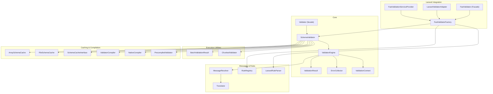

**Diagram sources**
- [src/Validator.php](file://src/Validator.php#L9-L15)
- [src/SchemaValidator.php](file://src/SchemaValidator.php#L13-L30)
- [src/Execution/ValidatorEngine.php](file://src/Execution/ValidatorEngine.php#L11-L31)
- [src/Execution/ValidationResult.php](file://src/Execution/ValidationResult.php#L9-L32)
- [src/Execution/ErrorCollector.php](file://src/Execution/ErrorCollector.php#L7-L13)
- [src/Execution/ValidationContext.php](file://src/Execution/ValidationContext.php#L7-L21)
- [src/Execution/BatchValidationResult.php](file://src/Execution/BatchValidationResult.php#L17-L26)
- [src/Execution/ChunkedValidator.php](file://src/Execution/ChunkedValidator.php#L16-L23)
- [src/Laravel/FastValidationServiceProvider.php](file://src/Laravel/FastValidationServiceProvider.php#L12-L30)
- [src/Laravel/FastValidatorFactory.php](file://src/Laravel/FastValidatorFactory.php#L19-L41)
- [src/Laravel/LaravelValidatorAdapter.php](file://src/Laravel/LaravelValidatorAdapter.php#L9-L19)
- [src/Laravel/Facades/FastValidator.php](file://src/Laravel/Facades/FastValidator.php)
- [src/Cache/ArraySchemaCache.php](file://src/Cache/ArraySchemaCache)
- [src/Cache/FileSchemaCache.php](file://src/Cache/FileSchemaCache)
- [src/Cache/SchemaCacheInterface.php](file://src/Cache/SchemaCacheInterface.php)
- [src/Compilation/ValidatorCompiler.php](file://src/Compilation/ValidatorCompiler.php)
- [src/Compilation/NativeCompiler.php](file://src/Compilation/NativeCompiler.php)
- [src/Compilation/PrecompiledValidator.php](file://src/Compilation/PrecompiledValidator.php)
- [src/Messages/MessageResolver.php](file://src/Messages/MessageResolver.php)
- [src/Messages/Translator.php](file://src/Messages/Translator.php)
- [src/Rules/RuleRegistry.php](file://src/Rules/RuleRegistry.php)
- [src/Rules/LaravelRuleParser.php](file://src/Rules/LaravelRuleParser.php)

**Section sources**
- [README.md](file://README.md#L1-L120)
- [composer.json](file://composer.json#L1-L36)
- [phpunit.xml](file://phpunit.xml#L1-L18)

## Core Components
- Validator facade exposes a fluent builder for schemas.
- SchemaValidator compiles rules into a CompiledSchema and executes validation via ValidatorEngine.
- ValidatorEngine orchestrates rule application, short-circuiting, bail behavior, and error collection.
- ValidationResult encapsulates raw and formatted errors, validated data, and convenience accessors.
- Laravel integration registers a FastValidatorFactory singleton, publishes configuration, and optionally overrides Laravel’s validator.
- BatchValidationResult and ChunkedValidator enable memory-efficient batch and streaming validation.
- Caching and compilation reduce repeated schema parsing and improve throughput.

**Section sources**
- [src/Validator.php](file://src/Validator.php#L9-L15)
- [src/SchemaValidator.php](file://src/SchemaValidator.php#L13-L30)
- [src/Execution/ValidatorEngine.php](file://src/Execution/ValidatorEngine.php#L11-L31)
- [src/Execution/ValidationResult.php](file://src/Execution/ValidationResult.php#L9-L32)
- [src/Laravel/FastValidationServiceProvider.php](file://src/Laravel/FastValidationServiceProvider.php#L12-L30)
- [src/Execution/BatchValidationResult.php](file://src/Execution/BatchValidationResult.php#L17-L26)
- [src/Execution/ChunkedValidator.php](file://src/Execution/ChunkedValidator.php#L16-L23)
- [src/Cache/ArraySchemaCache.php](file://src/Cache/ArraySchemaCache)
- [src/Cache/FileSchemaCache.php](file://src/Cache/FileSchemaCache.php)
- [src/Compilation/ValidatorCompiler.php](file://src/Compilation/ValidatorCompiler.php)

## Architecture Overview
The integration pipeline integrates Laravel’s validation ecosystem with vi/validation’s high-performance engine. Two modes are supported:
- Parallel mode: explicit use of FastValidatorFactory.
- Override mode: adapter routes Laravel’s Validator::make through the fast engine when applicable.

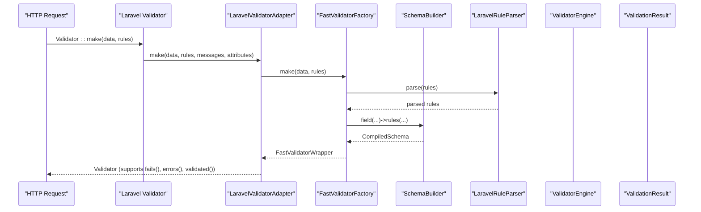

**Diagram sources**
- [src/Laravel/FastValidationServiceProvider.php](file://src/Laravel/FastValidationServiceProvider.php#L32-L52)
- [src/Laravel/LaravelValidatorAdapter.php](file://src/Laravel/LaravelValidatorAdapter.php#L27-L34)
- [src/Laravel/FastValidatorFactory.php](file://src/Laravel/FastValidatorFactory.php#L51-L109)
- [src/Rules/LaravelRuleParser.php](file://src/Rules/LaravelRuleParser.php)
- [src/SchemaValidator.php](file://src/SchemaValidator.php#L54-L73)

## Detailed Component Analysis

### End-to-End Pipeline: Schema Definition to Result Processing
- Build a schema using the fluent interface.
- Compile the schema into a CompiledSchema.
- Execute validation against single or multiple records.
- Inspect ValidationResult for raw errors, formatted messages, and validated data.

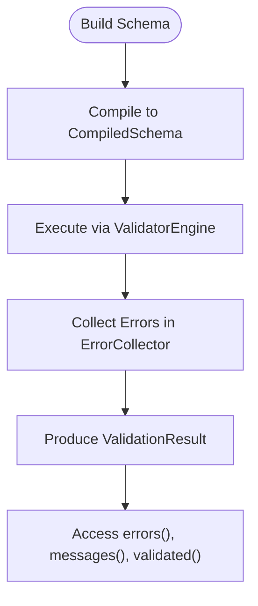

**Diagram sources**
- [src/Validator.php](file://src/Validator.php#L11-L14)
- [src/SchemaValidator.php](file://src/SchemaValidator.php#L54-L73)
- [src/Execution/ValidatorEngine.php](file://src/Execution/ValidatorEngine.php#L33-L98)
- [src/Execution/ErrorCollector.php](file://src/Execution/ErrorCollector.php#L17-L25)
- [src/Execution/ValidationResult.php](file://src/Execution/ValidationResult.php#L67-L96)

**Section sources**
- [src/Validator.php](file://src/Validator.php#L9-L15)
- [src/SchemaValidator.php](file://src/SchemaValidator.php#L54-L73)
- [src/Execution/ValidatorEngine.php](file://src/Execution/ValidatorEngine.php#L33-L98)
- [src/Execution/ValidationResult.php](file://src/Execution/ValidationResult.php#L67-L96)

### Laravel Integration Scenarios
- Provider registration and aliasing of FastValidatorFactory.
- Publishing configuration and choosing mode (parallel or override).
- Adapter behavior: routes make() to FastValidatorFactory and falls back for unsupported rules.

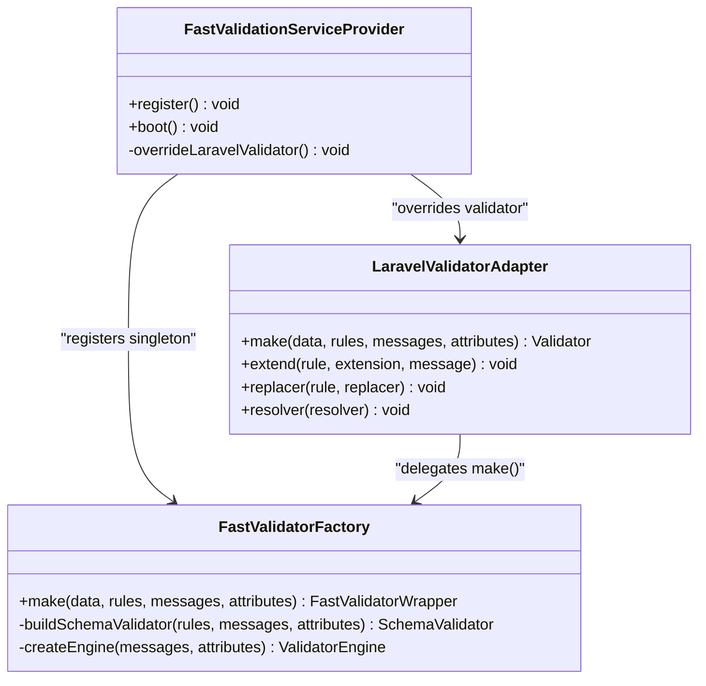

**Diagram sources**
- [src/Laravel/FastValidationServiceProvider.php](file://src/Laravel/FastValidationServiceProvider.php#L14-L52)
- [src/Laravel/FastValidatorFactory.php](file://src/Laravel/FastValidatorFactory.php#L51-L109)
- [src/Laravel/LaravelValidatorAdapter.php](file://src/Laravel/LaravelValidatorAdapter.php#L27-L34)

**Section sources**
- [src/Laravel/FastValidationServiceProvider.php](file://src/Laravel/FastValidationServiceProvider.php#L32-L52)
- [src/Laravel/FastValidatorFactory.php](file://src/Laravel/FastValidatorFactory.php#L51-L109)
- [src/Laravel/LaravelValidatorAdapter.php](file://src/Laravel/LaravelValidatorAdapter.php#L27-L34)

### Batch Validation Workflows
- validateMany: materialized array of results.
- stream: generator yielding one result at a time.
- each: immediate callback processing without storing results.
- failures: yields only failed results with original index.
- firstFailure: fail-fast to the first failure.
- allValid: memory-efficient check for completeness.

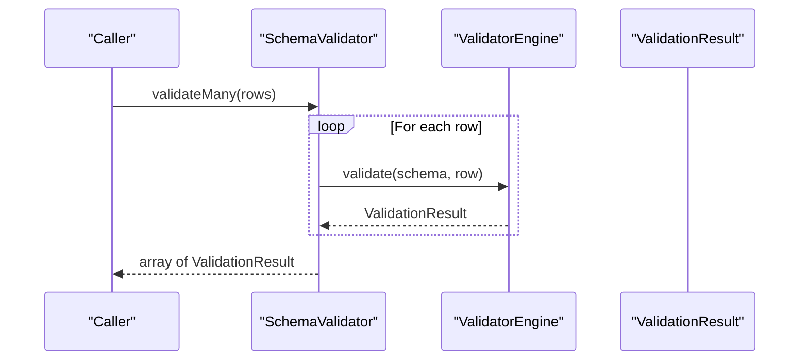

**Diagram sources**
- [src/SchemaValidator.php](file://src/SchemaValidator.php#L84-L93)
- [src/Execution/ValidatorEngine.php](file://src/Execution/ValidatorEngine.php#L33-L98)

**Section sources**
- [src/SchemaValidator.php](file://src/SchemaValidator.php#L84-L203)

### Multi-Rule Validation Chains and Conditional Logic
- Implicit vs non-implicit rules influence skipping on “empty” values.
- Bail behavior stops further rule evaluation for a field upon first failure.
- Exclusion rules remove fields from validated output.
- Nested field access via dot notation up to two levels.

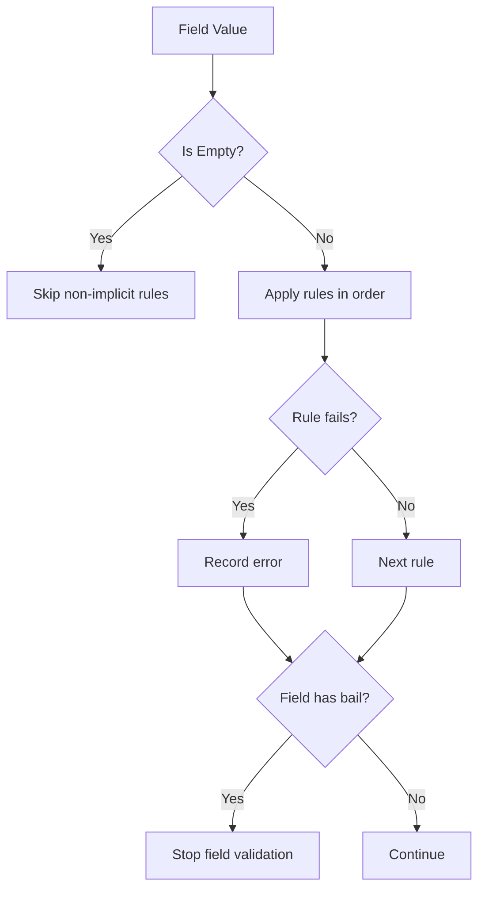

**Diagram sources**
- [src/Execution/ValidatorEngine.php](file://src/Execution/ValidatorEngine.php#L76-L94)
- [src/Execution/ValidationContext.php](file://src/Execution/ValidationContext.php#L43-L73)

**Section sources**
- [src/Execution/ValidatorEngine.php](file://src/Execution/ValidatorEngine.php#L76-L94)
- [src/Execution/ValidationContext.php](file://src/Execution/ValidationContext.php#L43-L73)

### Error Propagation Through the System
- ErrorCollector aggregates per-field errors with rule names and optional messages.
- ValidationResult exposes raw errors, formatted messages, flattened messages, and first-error helpers.
- MessageResolver resolves localized messages using Translator.

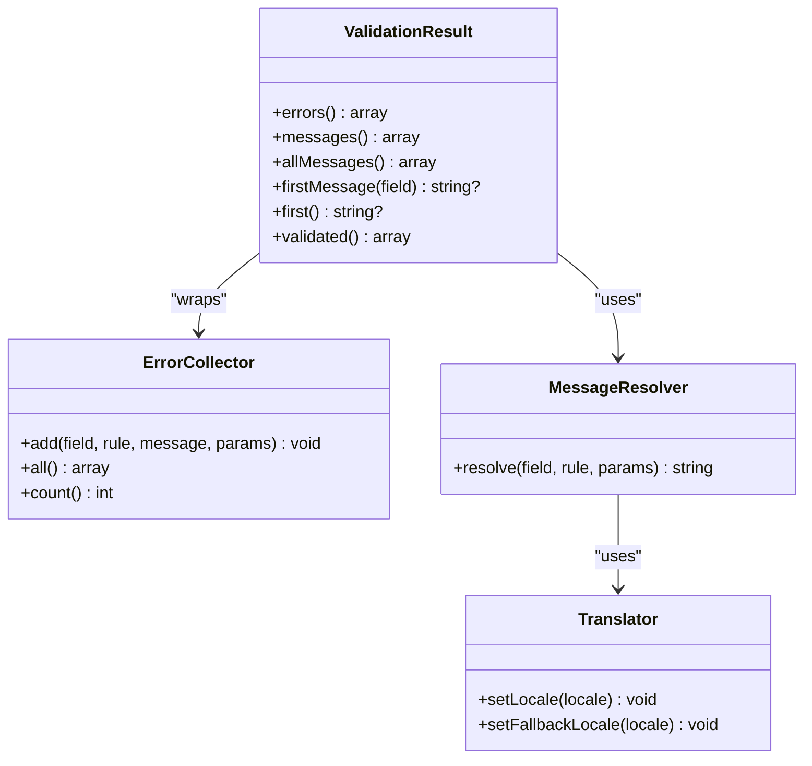

**Diagram sources**
- [src/Execution/ErrorCollector.php](file://src/Execution/ErrorCollector.php#L17-L25)
- [src/Execution/ValidationResult.php](file://src/Execution/ValidationResult.php#L67-L128)
- [src/Messages/MessageResolver.php](file://src/Messages/MessageResolver.php)
- [src/Messages/Translator.php](file://src/Messages/Translator.php)

**Section sources**
- [src/Execution/ErrorCollector.php](file://src/Execution/ErrorCollector.php#L17-L25)
- [src/Execution/ValidationResult.php](file://src/Execution/ValidationResult.php#L67-L128)
- [src/Messages/MessageResolver.php](file://src/Messages/MessageResolver.php)
- [src/Messages/Translator.php](file://src/Messages/Translator.php)

### Chunked Validation and Streaming Under Load
- ChunkedValidator buffers rows and validates in fixed-size chunks.
- streamChunks yields BatchValidationResult per chunk for controlled memory usage.
- streamFailures yields only failing results with original indices.
- countFailures computes failure counts without storing all results.

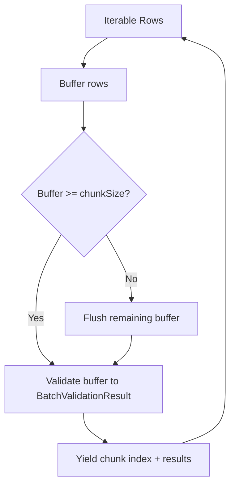

**Diagram sources**
- [src/Execution/ChunkedValidator.php](file://src/Execution/ChunkedValidator.php#L34-L81)

**Section sources**
- [src/Execution/ChunkedValidator.php](file://src/Execution/ChunkedValidator.php#L34-L127)

### Real-World Validation Scenarios
- Multi-field forms with required, type, size, and comparison rules.
- Nested structures (depth 2) using dot notation.
- Conditional required rules and prohibited rules.
- Formatted messages and custom attribute names.

**Section sources**
- [tests/Unit/IntegrationTest.php](file://tests/Unit/IntegrationTest.php#L12-L83)
- [README.md](file://README.md#L107-L204)

### Edge Cases and Boundary Conditions
- Nullable fields: allow null and short-circuit other rules.
- Empty values: non-implicit rules skipped for empty values.
- Bail: stops rule evaluation for a field after first failure.
- Exclusions: fields removed from validated output.
- Nested access: dot notation for parent.child with depth-2 support.

**Section sources**
- [src/Execution/ValidatorEngine.php](file://src/Execution/ValidatorEngine.php#L72-L94)
- [src/Execution/ValidationContext.php](file://src/Execution/ValidationContext.php#L43-L73)
- [src/Execution/ValidationResult.php](file://src/Execution/ValidationResult.php#L45-L57)

### Integration Points with External Systems
- Database validation hooks via DatabaseValidatorInterface injected into ValidationContext.
- Password hashing via PasswordHasherInterface injected into ValidationContext.
- StatelessValidator for isolation in long-running processes.
- ValidatorPool for concurrency in Octane/Swoole/RoadRunner.

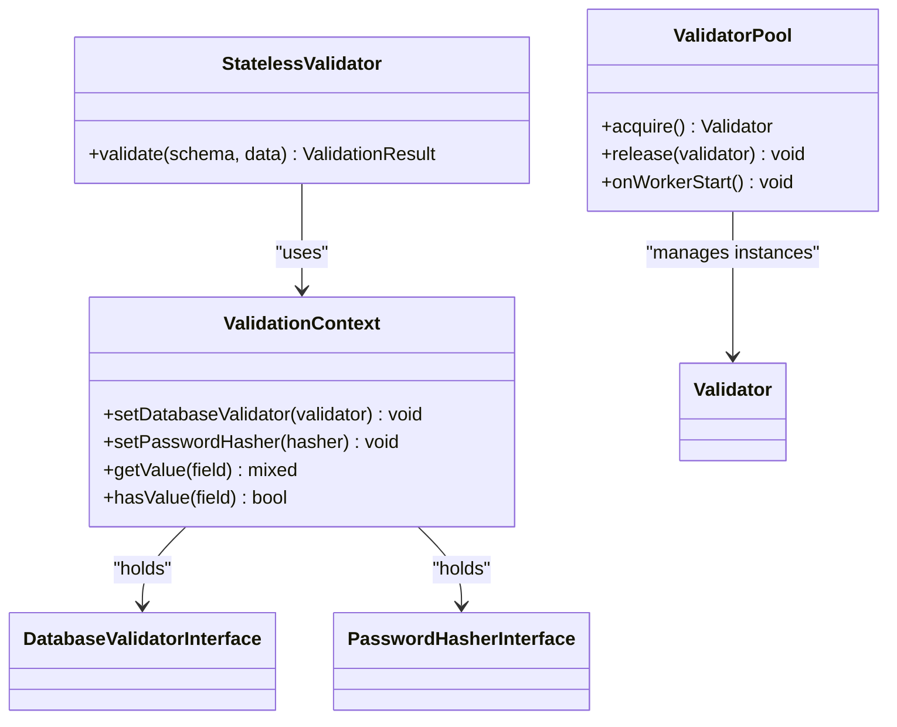

**Diagram sources**
- [src/Execution/ValidationContext.php](file://src/Execution/ValidationContext.php#L23-L41)
- [src/Runtime/StatelessValidator.php](file://src/Runtime/StatelessValidator.php)
- [src/Runtime/ValidatorPool.php](file://src/Runtime/ValidatorPool.php)

**Section sources**
- [src/Execution/ValidationContext.php](file://src/Execution/ValidationContext.php#L23-L41)
- [src/Runtime/StatelessValidator.php](file://src/Runtime/StatelessValidator.php)
- [src/Runtime/ValidatorPool.php](file://src/Runtime/ValidatorPool.php)

## Dependency Analysis
- Composer autoload maps PSR-4 namespace to src/.
- Laravel integration depends on illuminate/validation.
- Tests autoload under Vi\Validation\Tests\ via tests/.

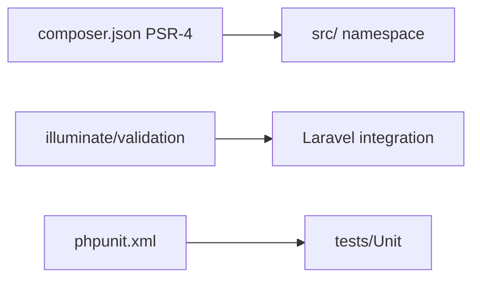

**Diagram sources**
- [composer.json](file://composer.json#L10-L18)
- [composer.json](file://composer.json#L7-L8)
- [phpunit.xml](file://phpunit.xml#L12-L16)

**Section sources**
- [composer.json](file://composer.json#L10-L18)
- [phpunit.xml](file://phpunit.xml#L12-L16)

## Performance Considerations
- Precompiled validators and native compiler reduce overhead for repeated schemas.
- Schema caching (array or file) avoids re-parsing rules.
- Streaming APIs (stream, each, failures) keep memory usage constant.
- Chunked validation controls memory footprint for large datasets.
- Benchmark script demonstrates throughput measurement for 10k validations.

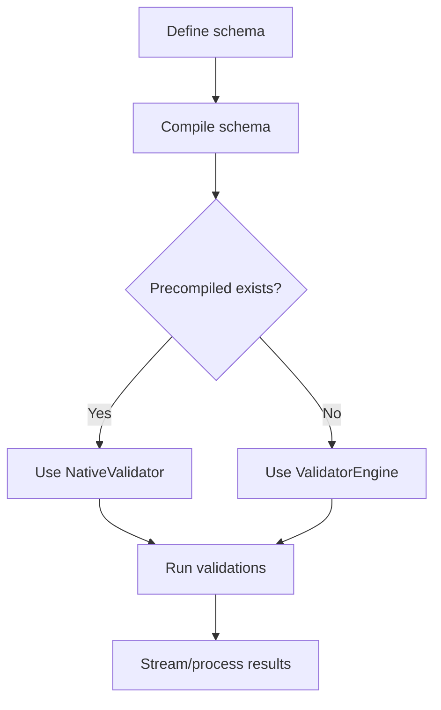

**Diagram sources**
- [src/SchemaValidator.php](file://src/SchemaValidator.php#L54-L73)
- [src/Compilation/NativeCompiler.php](file://src/Compilation/NativeCompiler.php)
- [src/Compilation/PrecompiledValidator.php](file://src/Compilation/PrecompiledValidator.php)
- [tests/benchmark.php](file://tests/benchmark.php#L39-L54)

**Section sources**
- [src/SchemaValidator.php](file://src/SchemaValidator.php#L54-L73)
- [src/Compilation/NativeCompiler.php](file://src/Compilation/NativeCompiler.php)
- [src/Compilation/PrecompiledValidator.php](file://src/Compilation/PrecompiledValidator.php)
- [tests/benchmark.php](file://tests/benchmark.php#L39-L54)

## Troubleshooting Guide
- Verify Laravel mode configuration and adapter behavior.
- Confirm schema cache driver and TTL settings.
- Check rule parsing and registry registration.
- Validate message resolver and translator locales.
- Inspect error collector and result accessors for debugging.

**Section sources**
- [src/Laravel/FastValidationServiceProvider.php](file://src/Laravel/FastValidationServiceProvider.php#L38-L52)
- [src/Laravel/FastValidatorFactory.php](file://src/Laravel/FastValidatorFactory.php#L146-L175)
- [src/Rules/RuleRegistry.php](file://src/Rules/RuleRegistry.php)
- [src/Messages/MessageResolver.php](file://src/Messages/MessageResolver.php)
- [src/Execution/ErrorCollector.php](file://src/Execution/ErrorCollector.php#L17-L25)
- [src/Execution/ValidationResult.php](file://src/Execution/ValidationResult.php#L67-L128)

## Conclusion
vi/validation provides a robust, high-performance validation pipeline with strong Laravel integration. Integration tests should validate the end-to-end flow from schema definition to result processing, cover Laravel modes and adapters, exercise batch and streaming workflows, assert error propagation and localization, and measure performance under realistic loads. Edge-case coverage ensures correctness for nullable, empty, bail, and nested fields.

## Appendices
- Example usage and modes are documented in the project README.
- Unit tests demonstrate integration scenarios and multi-rule chains.

**Section sources**
- [README.md](file://README.md#L379-L506)
- [tests/Unit/IntegrationTest.php](file://tests/Unit/IntegrationTest.php#L12-L83)