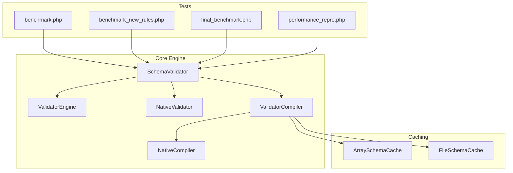
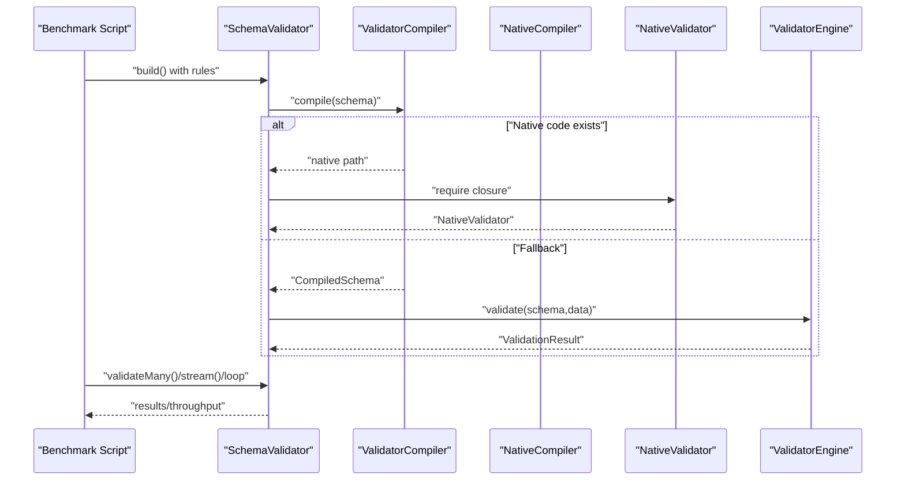
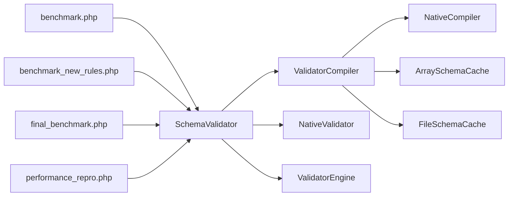

# Performance Benchmarking

<cite>
**Referenced Files in This Document**
- [benchmark.php](file://tests/benchmark.php)
- [benchmark_new_rules.php](file://tests/benchmark_new_rules.php)
- [final_benchmark.php](file://tests/final_benchmark.php)
- [performance_repro.php](file://tests/performance_repro.php)
- [SchemaValidator.php](file://src/SchemaValidator.php)
- [ValidatorEngine.php](file://src/Execution/ValidatorEngine.php)
- [NativeValidator.php](file://src/Execution/NativeValidator.php)
- [NativeCompiler.php](file://src/Compilation/NativeCompiler.php)
- [ValidatorCompiler.php](file://src/Compilation/ValidatorCompiler.php)
- [ArraySchemaCache.php](file://src/Cache/ArraySchemaCache.php)
- [FileSchemaCache.php](file://src/Cache/FileSchemaCache.php)
- [BatchValidationResult.php](file://src/Execution/BatchValidationResult.php)
- [README.md](file://README.md)
</cite>

## Table of Contents
1. [Introduction](#introduction)
2. [Project Structure](#project-structure)
3. [Core Components](#core-components)
4. [Architecture Overview](#architecture-overview)
5. [Detailed Component Analysis](#detailed-component-analysis)
6. [Dependency Analysis](#dependency-analysis)
7. [Performance Considerations](#performance-considerations)
8. [Troubleshooting Guide](#troubleshooting-guide)
9. [Conclusion](#conclusion)
10. [Appendices](#appendices)

## Introduction
This document explains the performance benchmarking tools and methodologies in vi/validation. It covers the benchmarking suite scripts, performance measurement techniques, benchmark result interpretation, and optimization validation strategies. It also compares vi/validation against Laravel’s built-in validator and provides practical guidance for running benchmarks, interpreting results, and identifying performance bottlenecks in validation workflows.

## Project Structure
The benchmarking suite resides under the tests directory and exercises the core validation engine, compilation pipeline, and streaming APIs. The suite includes:
- benchmark.php: baseline throughput test for standard rules
- benchmark_new_rules.php: throughput test for extended/new rules
- final_benchmark.php: parity and performance benchmark with compiled schema
- performance_repro.php: comparative benchmark between vi/validation and Laravel’s validator

**Diagram sources**
- [benchmark.php](file://tests/benchmark.php#L1-L55)
- [benchmark_new_rules.php](file://tests/benchmark_new_rules.php#L1-L67)
- [final_benchmark.php](file://tests/final_benchmark.php#L1-L80)
- [performance_repro.php](file://tests/performance_repro.php#L1-L96)
- [SchemaValidator.php](file://src/SchemaValidator.php#L1-L205)
- [ValidatorEngine.php](file://src/Execution/ValidatorEngine.php#L1-L177)
- [NativeValidator.php](file://src/Execution/NativeValidator.php#L1-L39)
- [NativeCompiler.php](file://src/Compilation/NativeCompiler.php#L1-L310)
- [ValidatorCompiler.php](file://src/Compilation/ValidatorCompiler.php#L1-L195)
- [ArraySchemaCache.php](file://src/Cache/ArraySchemaCache.php#L1-L75)
- [FileSchemaCache.php](file://src/Cache/FileSchemaCache.php#L1-L108)

**Section sources**
- [benchmark.php](file://tests/benchmark.php#L1-L55)
- [benchmark_new_rules.php](file://tests/benchmark_new_rules.php#L1-L67)
- [final_benchmark.php](file://tests/final_benchmark.php#L1-L80)
- [performance_repro.php](file://tests/performance_repro.php#L1-L96)

## Core Components
- SchemaValidator orchestrates schema building, compilation, and validation. It supports native precompiled execution and multiple streaming APIs for memory-efficient validation.
- ValidatorEngine performs rule application, short-circuiting, and error collection.
- NativeValidator executes precompiled closures for maximum throughput.
- NativeCompiler generates optimized PHP closures from schemas.
- ValidatorCompiler manages schema compilation, caching, and native code emission.
- ArraySchemaCache and FileSchemaCache provide in-memory and persistent caches respectively.

**Section sources**
- [SchemaValidator.php](file://src/SchemaValidator.php#L1-L205)
- [ValidatorEngine.php](file://src/Execution/ValidatorEngine.php#L1-L177)
- [NativeValidator.php](file://src/Execution/NativeValidator.php#L1-L39)
- [NativeCompiler.php](file://src/Compilation/NativeCompiler.php#L1-L310)
- [ValidatorCompiler.php](file://src/Compilation/ValidatorCompiler.php#L1-L195)
- [ArraySchemaCache.php](file://src/Cache/ArraySchemaCache.php#L1-L75)
- [FileSchemaCache.php](file://src/Cache/FileSchemaCache.php#L1-L108)

## Architecture Overview
The benchmarking suite validates three primary paths:
- Standard rules benchmark: measures throughput for typical rulesets
- New rules benchmark: measures throughput for extended/new rules
- Final benchmark: compiles schema, verifies parity, and measures sustained throughput
- Comparative benchmark: runs Laravel’s validator alongside vi/validation for apples-to-apples comparison

**Diagram sources**
- [benchmark.php](file://tests/benchmark.php#L1-L55)
- [benchmark_new_rules.php](file://tests/benchmark_new_rules.php#L1-L67)
- [final_benchmark.php](file://tests/final_benchmark.php#L1-L80)
- [SchemaValidator.php](file://src/SchemaValidator.php#L35-L73)
- [ValidatorCompiler.php](file://src/Compilation/ValidatorCompiler.php#L33-L74)
- [NativeCompiler.php](file://src/Compilation/NativeCompiler.php#L24-L51)
- [NativeValidator.php](file://src/Execution/NativeValidator.php#L27-L37)
- [ValidatorEngine.php](file://src/Execution/ValidatorEngine.php#L33-L98)

## Detailed Component Analysis

### Benchmark Suite Scripts
- benchmark.php
  - Builds a schema with common rules, generates synthetic data, and measures preparation and validation time for 10,000 rows. Computes throughput and counts failures.
  - Key measurements: preparation time, validation time, rows per second, failure count.
  - Memory usage: intentionally disables garbage collection during preparation to avoid GC spikes skewing results.
  - Throughput measurement: total time divided into iterations; rows per second computed from count and duration.

- benchmark_new_rules.php
  - Similar structure to benchmark.php but exercises extended/new rules (e.g., alpha-dash, MAC address, ULID, uppercase, date format, multiple-of, not-regex).
  - Measures throughput for these rulesets and reports failures.

- final_benchmark.php
  - Ensures cache directory exists, compiles schema with configuration, checks parity with normal and invalid data, then runs 50,000 iterations using high-resolution timing.
  - Reports total time, throughput, and average time per validation in microseconds.

- performance_repro.php
  - Sets up a minimal Laravel-like environment, registers FastValidatorFactory, and benchmarks streaming validation using vi/validation versus Laravel’s validator via Illuminate\Support\Benchmark.
  - Demonstrates generator-based streaming and parity checks.

**Section sources**
- [benchmark.php](file://tests/benchmark.php#L1-L55)
- [benchmark_new_rules.php](file://tests/benchmark_new_rules.php#L1-L67)
- [final_benchmark.php](file://tests/final_benchmark.php#L1-L80)
- [performance_repro.php](file://tests/performance_repro.php#L1-L96)

### Measurement Techniques and Interpretation
- Preparation time: time to build schema and generate data; useful for understanding overhead of schema compilation and data generation.
- Validation time: wall-clock time for executing validations; indicates runtime performance.
- Throughput: number of validations processed per second; higher is better.
- Average time per validation: reciprocal of throughput; lower is better.
- Failures: sanity check that validation is functioning and catching invalid data.

Interpretation guidelines:
- If throughput drops significantly between runs, inspect schema complexity, rule set, and data characteristics.
- If failures are unexpectedly high/low, verify rule definitions and data generation logic.
- Compare final_benchmark.php results across environments to detect regressions.

**Section sources**
- [benchmark.php](file://tests/benchmark.php#L36-L54)
- [benchmark_new_rules.php](file://tests/benchmark_new_rules.php#L49-L66)
- [final_benchmark.php](file://tests/final_benchmark.php#L62-L77)

### Memory Usage Tracking
- Garbage collection control: scripts disable GC during preparation to avoid GC spikes skewing timing.
- Streaming APIs: prefer stream(), failures(), each(), and chunked streaming to avoid materializing all results in memory.
- Memory-efficient patterns: README highlights memory trade-offs between validateMany (O(n)) and streaming APIs (O(1) or O(chunk)).

Practical tips:
- Use stream() for large datasets to keep memory footprint low.
- Use failures() to report only errors without storing successes.
- Use chunked streaming for batch processing with controlled memory.

**Section sources**
- [benchmark.php](file://tests/benchmark.php#L8-L10)
- [benchmark_new_rules.php](file://tests/benchmark_new_rules.php#L16-L18)
- [README.md](file://README.md#L367-L376)

### Validation Throughput Measurement
- Microsecond precision: final_benchmark.php uses high-resolution timing to compute throughput and per-operation latency.
- Warm-up: performance_repro.php warms caches/compilation before benchmarking.
- Iterations: final_benchmark.php runs fixed iterations to stabilize timing; adjust count for desired statistical confidence.

**Section sources**
- [final_benchmark.php](file://tests/final_benchmark.php#L66-L77)
- [performance_repro.php](file://tests/performance_repro.php#L84-L88)

### Comparative Analysis with Laravel’s Built-in Validator
- performance_repro.php demonstrates side-by-side benchmarking using Illuminate\Support\Benchmark and vi/validation’s FastValidator.
- It builds a generator-based dataset, warms caches, and runs a single benchmark iteration to compare performance characteristics.
- Use this script to quantify speedups or regressions when migrating to vi/validation.

**Section sources**
- [performance_repro.php](file://tests/performance_repro.php#L1-L96)

### Optimization Validation Strategies
- Precompilation and caching: ValidatorCompiler writes native PHP closures and optionally precompiled schemas to disk. Ensure cache_path is configured and writable.
- Native execution path: SchemaValidator detects precompiled native validators and bypasses the interpreter for maximum speed.
- Streaming over batching: For large datasets, favor streaming APIs to reduce peak memory usage and improve responsiveness.

**Section sources**
- [ValidatorCompiler.php](file://src/Compilation/ValidatorCompiler.php#L79-L103)
- [ValidatorCompiler.php](file://src/Compilation/ValidatorCompiler.php#L138-L154)
- [SchemaValidator.php](file://src/SchemaValidator.php#L60-L73)
- [README.md](file://README.md#L266-L327)

### Running Benchmarks
- Standard rules: execute benchmark.php to measure baseline throughput.
- Extended rules: execute benchmark_new_rules.php to assess performance impact of additional rules.
- Final benchmark: execute final_benchmark.php to validate parity and measure sustained throughput with compiled schema.
- Comparative: execute performance_repro.php to compare against Laravel’s validator.

Tips:
- Ensure cache directory exists for compiled schemas (final_benchmark.php creates it automatically).
- Warm caches by running a small validation before measuring.
- Adjust dataset sizes and iteration counts to fit your environment.

**Section sources**
- [benchmark.php](file://tests/benchmark.php#L1-L55)
- [benchmark_new_rules.php](file://tests/benchmark_new_rules.php#L1-L67)
- [final_benchmark.php](file://tests/final_benchmark.php#L1-L80)
- [performance_repro.php](file://tests/performance_repro.php#L1-L96)

### Interpreting Results
- Baseline vs. extended rules: compare throughput between standard and extended rule sets to identify rule-specific bottlenecks.
- Parity checks: final_benchmark.php ensures correctness before measuring performance.
- Streaming vs. batching: use streaming APIs for large datasets to maintain low memory usage and predictable latencies.

**Section sources**
- [benchmark.php](file://tests/benchmark.php#L40-L54)
- [benchmark_new_rules.php](file://tests/benchmark_new_rules.php#L52-L66)
- [final_benchmark.php](file://tests/final_benchmark.php#L38-L60)

### Identifying Performance Bottlenecks
- Rule complexity: complex rules (regex, database checks) increase validation time. Profile individual rules by isolating them.
- Data size and shape: deeply nested or large arrays increase traversal cost. Simplify schemas where possible.
- Memory pressure: avoid validateMany for large datasets; switch to streaming APIs.
- Compilation overhead: ensure schemas are compiled and cached; re-use compiled validators across runs.

**Section sources**
- [ValidatorEngine.php](file://src/Execution/ValidatorEngine.php#L76-L94)
- [README.md](file://README.md#L367-L376)

## Dependency Analysis
The benchmarking suite depends on the core validation stack. The following diagram maps key dependencies among components used by the benchmarks.

**Diagram sources**
- [benchmark.php](file://tests/benchmark.php#L1-L55)
- [benchmark_new_rules.php](file://tests/benchmark_new_rules.php#L1-L67)
- [final_benchmark.php](file://tests/final_benchmark.php#L1-L80)
- [performance_repro.php](file://tests/performance_repro.php#L1-L96)
- [SchemaValidator.php](file://src/SchemaValidator.php#L1-L205)
- [ValidatorCompiler.php](file://src/Compilation/ValidatorCompiler.php#L1-L195)
- [NativeCompiler.php](file://src/Compilation/NativeCompiler.php#L1-L310)
- [NativeValidator.php](file://src/Execution/NativeValidator.php#L1-L39)
- [ValidatorEngine.php](file://src/Execution/ValidatorEngine.php#L1-L177)
- [ArraySchemaCache.php](file://src/Cache/ArraySchemaCache.php#L1-L75)
- [FileSchemaCache.php](file://src/Cache/FileSchemaCache.php#L1-L108)

**Section sources**
- [benchmark.php](file://tests/benchmark.php#L1-L55)
- [benchmark_new_rules.php](file://tests/benchmark_new_rules.php#L1-L67)
- [final_benchmark.php](file://tests/final_benchmark.php#L1-L80)
- [performance_repro.php](file://tests/performance_repro.php#L1-L96)

## Performance Considerations
- Prefer native execution: ensure compiled native validators are generated and loaded to minimize interpreter overhead.
- Use streaming APIs: for large datasets, stream results to keep memory usage constant.
- Tune error collection: limit max errors and enable fail-fast when appropriate to reduce processing time.
- Cache schemas: leverage in-memory and file-based caches to avoid repeated compilation.

[No sources needed since this section provides general guidance]

## Troubleshooting Guide
Common issues and remedies:
- Missing cache directory: final_benchmark.php creates the directory; ensure permissions allow writing.
- Unexpectedly low throughput: verify schema complexity, rule set, and data characteristics; consider streaming APIs.
- Memory spikes: switch from validateMany to stream(), each(), or chunked streaming.
- Incorrect results: run parity checks (final_benchmark.php) to confirm correctness before measuring performance.

**Section sources**
- [final_benchmark.php](file://tests/final_benchmark.php#L8-L12)
- [README.md](file://README.md#L367-L376)

## Conclusion
The benchmarking suite provides a comprehensive toolkit to measure and validate vi/validation performance. By leveraging native compilation, caching, and streaming APIs, teams can achieve high throughput with predictable memory usage. Use the provided scripts to establish baselines, compare against Laravel’s validator, and continuously monitor for regressions.

[No sources needed since this section summarizes without analyzing specific files]

## Appendices

### Benchmark Scripts Reference
- benchmark.php: baseline throughput for standard rules
- benchmark_new_rules.php: throughput for extended/new rules
- final_benchmark.php: parity + sustained throughput with compiled schema
- performance_repro.php: comparative benchmark with Laravel’s validator

**Section sources**
- [benchmark.php](file://tests/benchmark.php#L1-L55)
- [benchmark_new_rules.php](file://tests/benchmark_new_rules.php#L1-L67)
- [final_benchmark.php](file://tests/final_benchmark.php#L1-L80)
- [performance_repro.php](file://tests/performance_repro.php#L1-L96)