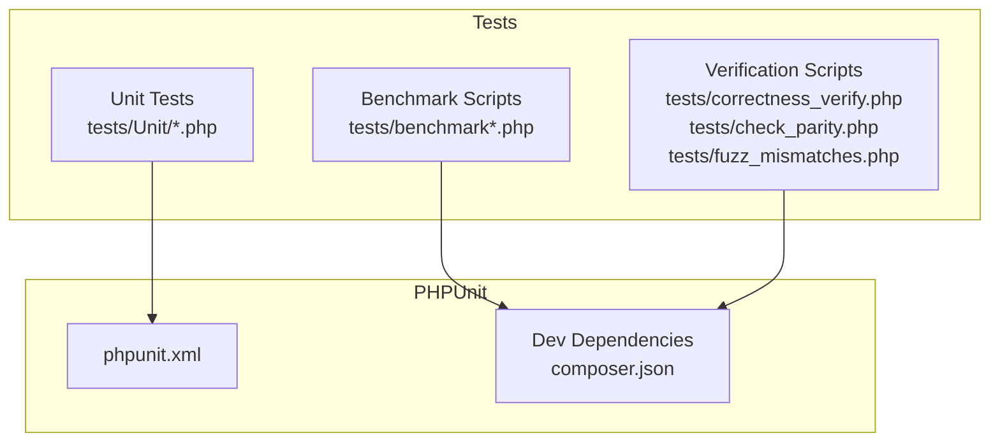
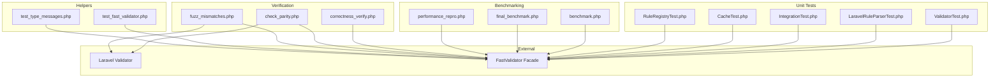
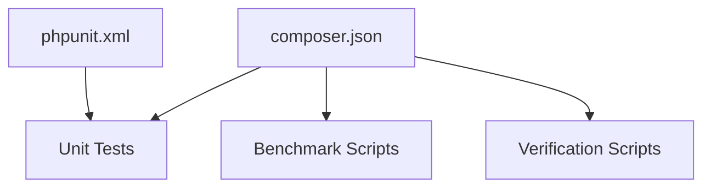
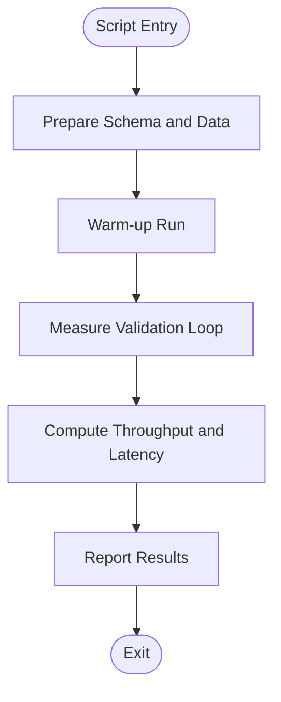
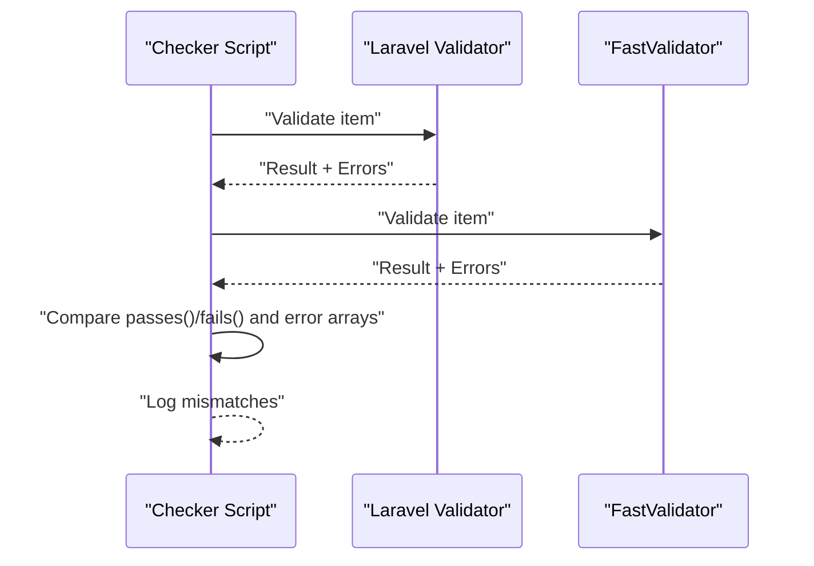

# Testing and Benchmarking

<cite>
**Referenced Files in This Document**
- [benchmark.php](file://tests/benchmark.php)
- [final_benchmark.php](file://tests/final_benchmark.php)
- [performance_repro.php](file://tests/performance_repro.php)
- [correctness_verify.php](file://tests/correctness_verify.php)
- [check_parity.php](file://tests/check_parity.php)
- [fuzz_mismatches.php](file://tests/fuzz_mismatches.php)
- [phpunit.xml](file://phpunit.xml)
- [composer.json](file://composer.json)
- [ValidatorTest.php](file://tests/Unit/ValidatorTest.php)
- [LaravelRuleParserTest.php](file://tests/Unit/LaravelRuleParserTest.php)
- [IntegrationTest.php](file://tests/Unit/IntegrationTest.php)
- [CacheTest.php](file://tests/Unit/CacheTest.php)
- [RuleRegistryTest.php](file://tests/Unit/RuleRegistryTest.php)
- [test_fast_validator.php](file://test_fast_validator.php)
- [test_type_messages.php](file://test_type_messages.php)
</cite>

## Table of Contents
1. [Introduction](#introduction)
2. [Project Structure](#project-structure)
3. [Core Components](#core-components)
4. [Architecture Overview](#architecture-overview)
5. [Detailed Component Analysis](#detailed-component-analysis)
6. [Dependency Analysis](#dependency-analysis)
7. [Performance Considerations](#performance-considerations)
8. [Troubleshooting Guide](#troubleshooting-guide)
9. [Conclusion](#conclusion)
10. [Appendices](#appendices)

## Introduction
This document describes testing strategies and benchmarking tools for the vi/validation library. It covers unit testing with PHPUnit, integration testing patterns, correctness verification, parity checks against Laravel validation, fuzz testing, performance measurement techniques, and practical examples for custom rules and regression testing. It also outlines continuous integration readiness via the existing PHPUnit configuration and Composer setup.

## Project Structure
The repository organizes tests under the tests directory with two primary categories:
- Unit tests: Located under tests/Unit/, covering individual components such as validators, rule parsing, caching, and registry behavior.
- Benchmarking and verification scripts: Located directly under tests/, including benchmark.php, final_benchmark.php, performance_repro.php, correctness_verify.php, check_parity.php, and fuzz_mismatches.php.

Key testing-related files:
- phpunit.xml: PHPUnit configuration that defines the Unit test suite and source inclusion.
- composer.json: Dev dependencies including phpunit/phpunit and autoload configuration for tests.

**Diagram sources**
- [phpunit.xml](file://phpunit.xml#L7-L11)
- [composer.json](file://composer.json#L20-L22)

**Section sources**
- [phpunit.xml](file://phpunit.xml#L1-L18)
- [composer.json](file://composer.json#L1-L36)

## Core Components
This section summarizes the testing and benchmarking capabilities present in the repository.

- Unit testing with PHPUnit:
  - Tests cover schema validation, nested fields, nullable fields, batch validation, rule parsing, integration of various rules, cache behavior, and rule registry mechanics.
  - Example suites: ValidatorTest.php, LaravelRuleParserTest.php, IntegrationTest.php, CacheTest.php, RuleRegistryTest.php.

- Benchmarking tools:
  - benchmark.php: Measures preparation and validation throughput for a synthetic dataset.
  - final_benchmark.php: Compiles schema, performs parity checks against expected outcomes, and measures performance over many iterations.
  - performance_repro.php: Reproduces performance scenarios using Laravel’s Benchmark utility and FastValidator facade.

- Correctness and parity verification:
  - correctness_verify.php: Verifies lazy message resolution and ensures messages are properly resolved.
  - check_parity.php: Compares FastValidator results with Laravel Validator for a set of test cases.
  - fuzz_mismatches.php: Randomly generates inputs to detect discrepancies between FastValidator and Laravel Validator.

- Practical helpers:
  - test_fast_validator.php: Exercises new rules (e.g., alpha_dash, lowercase, uppercase, multiple_of, doesnt_start_with) via FastValidatorFactory.
  - test_type_messages.php: Demonstrates type-specific error messages for rules like min, max, size, and between.

**Section sources**
- [ValidatorTest.php](file://tests/Unit/ValidatorTest.php#L1-L123)
- [LaravelRuleParserTest.php](file://tests/Unit/LaravelRuleParserTest.php#L1-L171)
- [IntegrationTest.php](file://tests/Unit/IntegrationTest.php#L1-L85)
- [CacheTest.php](file://tests/Unit/CacheTest.php#L1-L83)
- [RuleRegistryTest.php](file://tests/Unit/RuleRegistryTest.php#L1-L132)
- [benchmark.php](file://tests/benchmark.php#L1-L55)
- [final_benchmark.php](file://tests/final_benchmark.php#L1-L80)
- [performance_repro.php](file://tests/performance_repro.php#L1-L96)
- [correctness_verify.php](file://tests/correctness_verify.php#L1-L71)
- [check_parity.php](file://tests/check_parity.php#L1-L73)
- [fuzz_mismatches.php](file://tests/fuzz_mismatches.php#L1-L75)
- [test_fast_validator.php](file://test_fast_validator.php#L1-L116)
- [test_type_messages.php](file://test_type_messages.php#L1-L115)

## Architecture Overview
The testing and benchmarking architecture integrates PHPUnit-based unit tests with standalone scripts that exercise performance and correctness. The scripts rely on the FastValidator facade and Laravel’s Validator to compare behavior and measure throughput.

**Diagram sources**
- [ValidatorTest.php](file://tests/Unit/ValidatorTest.php#L1-L123)
- [LaravelRuleParserTest.php](file://tests/Unit/LaravelRuleParserTest.php#L1-L171)
- [IntegrationTest.php](file://tests/Unit/IntegrationTest.php#L1-L85)
- [CacheTest.php](file://tests/Unit/CacheTest.php#L1-L83)
- [RuleRegistryTest.php](file://tests/Unit/RuleRegistryTest.php#L1-L132)
- [benchmark.php](file://tests/benchmark.php#L1-L55)
- [final_benchmark.php](file://tests/final_benchmark.php#L1-L80)
- [performance_repro.php](file://tests/performance_repro.php#L1-L96)
- [correctness_verify.php](file://tests/correctness_verify.php#L1-L71)
- [check_parity.php](file://tests/check_parity.php#L1-L73)
- [fuzz_mismatches.php](file://tests/fuzz_mismatches.php#L1-L75)
- [test_fast_validator.php](file://test_fast_validator.php#L1-L116)
- [test_type_messages.php](file://test_type_messages.php#L1-L115)

## Detailed Component Analysis

### Unit Testing with PHPUnit
- ValidatorTest.php validates basic, nested, nullable, and batch validation scenarios, ensuring correctness of compiled schema behavior.
- LaravelRuleParserTest.php verifies parsing of Laravel-style rules, including closures and composite rules.
- IntegrationTest.php exercises a wide range of rules and checks error messages for correctness.
- CacheTest.php validates cache behavior including put/get, forget, flush, TTL expiration, and key enumeration.
- RuleRegistryTest.php validates registration, aliasing, duplicate detection, and resolution of rules.

Recommended practices derived from these tests:
- Use compile() to build reusable schemas.
- Validate both passes() and errors() for assertions.
- Assert presence of specific error keys and messages.
- Test edge cases like nested fields and nullable values.
- Verify cache TTL semantics and key management.

**Section sources**
- [ValidatorTest.php](file://tests/Unit/ValidatorTest.php#L1-L123)
- [LaravelRuleParserTest.php](file://tests/Unit/LaravelRuleParserTest.php#L1-L171)
- [IntegrationTest.php](file://tests/Unit/IntegrationTest.php#L1-L85)
- [CacheTest.php](file://tests/Unit/CacheTest.php#L1-L83)
- [RuleRegistryTest.php](file://tests/Unit/RuleRegistryTest.php#L1-L132)

### Integration Testing Patterns
- IntegrationTest.php demonstrates end-to-end validation using a fluent schema builder and verifies error messages for multiple rule types.
- LaravelRuleParserTest.php validates rule parsing and composition, including closure rules and mixed arrays of rules.

Best practices:
- Compose complex rulesets and assert both validation outcomes and error messages.
- Use representative datasets to cover typical and edge cases.

**Section sources**
- [IntegrationTest.php](file://tests/Unit/IntegrationTest.php#L1-L85)
- [LaravelRuleParserTest.php](file://tests/Unit/LaravelRuleParserTest.php#L1-L171)

### Performance Testing Methodologies
- benchmark.php:
  - Builds a schema, generates a synthetic dataset, measures preparation and validation time, and computes throughput.
  - Disables garbage collection to minimize noise during timing.
- final_benchmark.php:
  - Ensures cache directory exists, compiles schema with caching enabled, runs parity checks, and measures high-volume throughput using high-resolution timing.
- performance_repro.php:
  - Sets up a minimal Laravel-like container, registers FastValidatorFactory, and benchmarks streaming validation using Laravel’s Benchmark utility.

Performance measurement techniques:
- Warm-up runs to precompile and cache schemas.
- Use high-resolution timers for accurate microsecond measurements.
- Compare throughput across iterations and compute average per-validation time.

**Section sources**
- [benchmark.php](file://tests/benchmark.php#L1-L55)
- [final_benchmark.php](file://tests/final_benchmark.php#L1-L80)
- [performance_repro.php](file://tests/performance_repro.php#L1-L96)

### Correctness Verification and Parity Checking
- correctness_verify.php:
  - Validates lazy message resolution by asserting that resolved messages do not remain as unresolved tokens.
- check_parity.php:
  - Compares FastValidator and Laravel Validator results for a predefined dataset and reports mismatches.
- fuzz_mismatches.php:
  - Generates random inputs to uncover discrepancies between FastValidator and Laravel Validator.

Parity verification workflow:
- Prepare identical datasets and rules for both validators.
- Compare passes()/fails() outcomes and error arrays.
- Fail fast on mismatch and log offending inputs.

**Section sources**
- [correctness_verify.php](file://tests/correctness_verify.php#L1-L71)
- [check_parity.php](file://tests/check_parity.php#L1-L73)
- [fuzz_mismatches.php](file://tests/fuzz_mismatches.php#L1-L75)

### Fuzz Testing Strategies
- fuzz_mismatches.php:
  - Randomly constructs inputs with varied field presence and types.
  - Iteratively compares validator outputs and logs first N mismatches.

Guidelines:
- Increase iteration counts for deeper exploration.
- Log inputs and error sets for reproducibility.
- Focus on boundary conditions (min/max, null handling, type coercion).

**Section sources**
- [fuzz_mismatches.php](file://tests/fuzz_mismatches.php#L1-L75)

### Writing Tests for Custom Rules
- test_fast_validator.php:
  - Demonstrates usage of new rules (alpha_dash, lowercase, uppercase, multiple_of, doesnt_start_with) via FastValidatorFactory.
- test_type_messages.php:
  - Shows type-specific error messages for numeric, string, and array sizes.

Practical steps:
- Build a factory with desired configuration (e.g., locale, cache disabled).
- Compose rule arrays and validate both passes/fails and error content.
- Assert specific error messages for targeted feedback.

**Section sources**
- [test_fast_validator.php](file://test_fast_validator.php#L1-L116)
- [test_type_messages.php](file://test_type_messages.php#L1-L115)

### Continuous Integration Setup
- phpunit.xml:
  - Defines a Unit test suite and includes src in coverage/source.
  - Uses a cache directory for PHPUnit artifacts.
- composer.json:
  - Declares phpunit/phpunit as a dev dependency.
  - Configures PSR-4 autoloading for tests.

Recommendations:
- Run phpunit with cache enabled for faster subsequent runs.
- Integrate phpunit and benchmark scripts in CI jobs.
- Store benchmark baselines and alert on regressions.

**Section sources**
- [phpunit.xml](file://phpunit.xml#L1-L18)
- [composer.json](file://composer.json#L20-L22)

## Dependency Analysis
The testing stack relies on:
- PHPUnit for unit tests.
- Laravel Validator and FastValidator for parity and performance comparisons.
- Composer-managed autoload and dev dependencies.

**Diagram sources**
- [phpunit.xml](file://phpunit.xml#L1-L18)
- [composer.json](file://composer.json#L20-L22)

**Section sources**
- [phpunit.xml](file://phpunit.xml#L1-L18)
- [composer.json](file://composer.json#L20-L22)

## Performance Considerations
- Warm-up runs: Execute a single validation pass before measuring throughput to compile and cache schemas.
- Disable GC spikes: benchmark.php disables garbage collection during timing to reduce noise.
- High-resolution timing: final_benchmark.php uses high-precision timers and converts nanoseconds to seconds for reporting.
- Throughput metrics: Compute total time, validations per second, and average microseconds per validation.
- Streaming validation: performance_repro.php demonstrates streaming validation with Laravel’s Benchmark utility.

[No sources needed since this section provides general guidance]

## Troubleshooting Guide
Common issues and resolutions:
- Parity mismatches:
  - Use check_parity.php to isolate failing inputs and compare error arrays.
  - Enable verbose logging and diff error structures.
- Lazy message resolution failures:
  - correctness_verify.php asserts resolved messages; ensure translation loader and locale are configured.
- Fuzzing reveals edge cases:
  - fuzz_mismatches.php helps identify boundary conditions; add targeted unit tests for discovered cases.
- Performance regressions:
  - final_benchmark.php baseline measurements; track throughput and average latency trends over time.

**Section sources**
- [check_parity.php](file://tests/check_parity.php#L1-L73)
- [correctness_verify.php](file://tests/correctness_verify.php#L1-L71)
- [fuzz_mismatches.php](file://tests/fuzz_mismatches.php#L1-L75)
- [final_benchmark.php](file://tests/final_benchmark.php#L1-L80)

## Conclusion
The repository provides a robust testing and benchmarking toolkit combining PHPUnit-driven unit tests, parity checks against Laravel validation, fuzz testing, and performance measurement scripts. By leveraging these tools, contributors can validate correctness, ensure parity, optimize performance, and maintain reliability through regression testing.

[No sources needed since this section summarizes without analyzing specific files]

## Appendices

### Appendix A: Benchmark Script Flow

**Diagram sources**
- [benchmark.php](file://tests/benchmark.php#L1-L55)
- [final_benchmark.php](file://tests/final_benchmark.php#L1-L80)

### Appendix B: Parity Check Sequence

**Diagram sources**
- [check_parity.php](file://tests/check_parity.php#L1-L73)