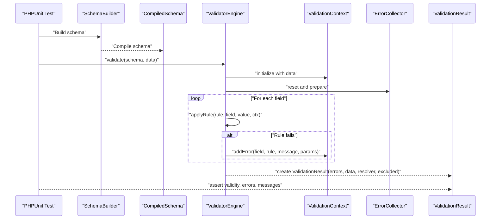
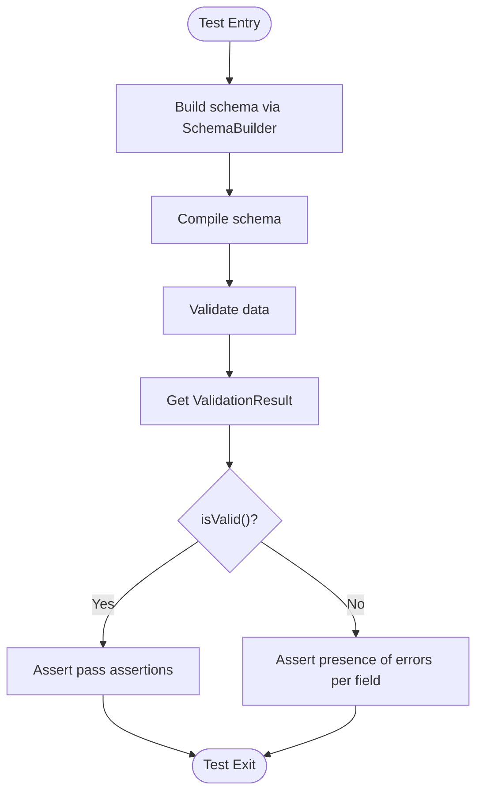
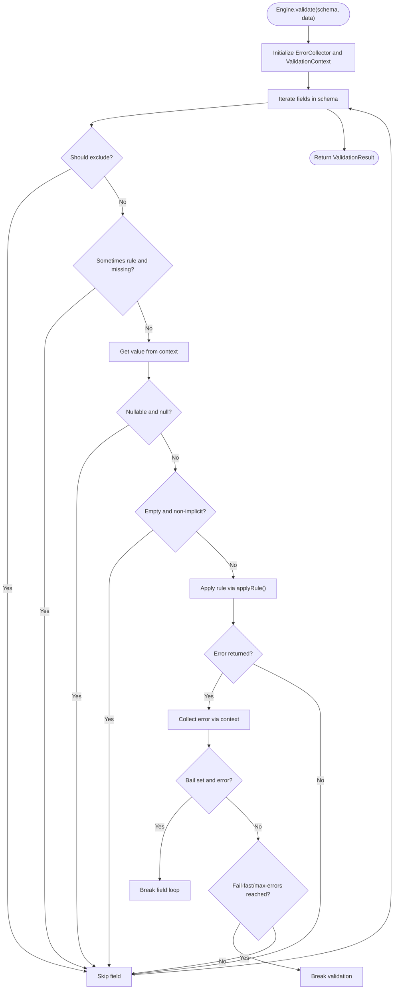
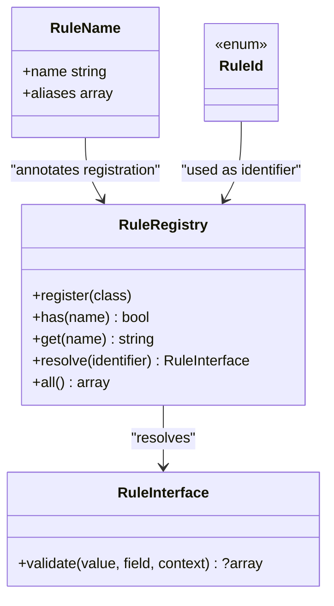
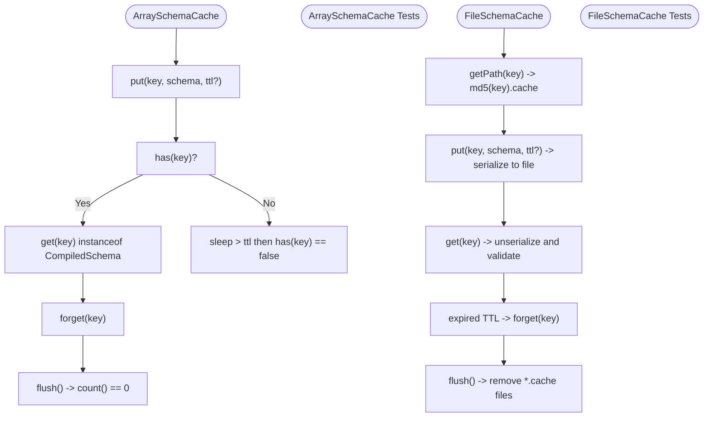
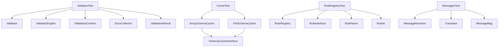

# Unit Testing

<cite>
**Referenced Files in This Document**
- [phpunit.xml](file://phpunit.xml)
- [composer.json](file://composer.json)
- [Validator.php](file://src/Validator.php)
- [ValidatorEngine.php](file://src/Execution/ValidatorEngine.php)
- [ValidationContext.php](file://src/Execution/ValidationContext.php)
- [ErrorCollector.php](file://src/Execution/ErrorCollector.php)
- [ValidationResult.php](file://src/Execution/ValidationResult.php)
- [ArraySchemaCache.php](file://src/Cache/ArraySchemaCache.php)
- [FileSchemaCache.php](file://src/Cache/FileSchemaCache.php)
- [SchemaCacheInterface.php](file://src/Cache/SchemaCacheInterface.php)
- [RuleRegistry.php](file://src/Rules/RuleRegistry.php)
- [RuleInterface.php](file://src/Rules/RuleInterface.php)
- [RuleName.php](file://src/Rules/RuleName.php)
- [RuleId.php](file://src/Rules/RuleId.php)
- [MessageResolver.php](file://src/Messages/MessageResolver.php)
- [Translator.php](file://src/Messages/Translator.php)
- [MessageBag.php](file://src/Messages/MessageBag.php)
- [ValidatorTest.php](file://tests/Unit/ValidatorTest.php)
- [CacheTest.php](file://tests/Unit/CacheTest.php)
- [RuleRegistryTest.php](file://tests/Unit/RuleRegistryTest.php)
- [MessagesTest.php](file://tests/Unit/MessagesTest.php)
- [CoreTypeRulesTest.php](file://tests/Unit/Rules/CoreTypeRulesTest.php)
- [StringValidationRulesTest.php](file://tests/Unit/Rules/StringValidationRulesTest.php)
- [ComparisonRulesTest.php](file://tests/Unit/Rules/ComparisonRulesTest.php)
- [RuleIdTest.php](file://tests/Unit/Rules/RuleIdTest.php)
</cite>

## Table of Contents
1. [Introduction](#introduction)
2. [Project Structure](#project-structure)
3. [Core Components](#core-components)
4. [Architecture Overview](#architecture-overview)
5. [Detailed Component Analysis](#detailed-component-analysis)
6. [Dependency Analysis](#dependency-analysis)
7. [Performance Considerations](#performance-considerations)
8. [Troubleshooting Guide](#troubleshooting-guide)
9. [Conclusion](#conclusion)
10. [Appendices](#appendices)

## Introduction
This document provides comprehensive unit testing strategies for the vi/validation library. It covers PHPUnit configuration, test organization patterns, and practical guidance for testing core components such as the Validator, RuleRegistry, Cache systems, and Message handling. It also explains how to write effective test cases for validation rules, schema compilation, and the execution engine, along with examples for custom rules, validation logic, and error handling scenarios. Mocking strategies for external dependencies, test fixtures, and assertion patterns used throughout the codebase are documented to help maintain reliable and readable unit tests.

## Project Structure
The repository follows a layered structure with clear separation of concerns:
- src: Core library code organized by domain (Execution, Cache, Rules, Messages, Schema, Laravel integration)
- tests: Unit tests organized by feature area (Rules, Core components, and integrations)
- phpunit.xml: PHPUnit configuration defining test suites and source inclusion
- composer.json: Autoload configuration and dev dependencies

```mermaid
graph TB
subgraph "Tests"
T_Unit["tests/Unit"]
T_Rules["tests/Unit/Rules"]
T_Unit_Validator["tests/Unit/ValidatorTest.php"]
T_Unit_Cache["tests/Unit/CacheTest.php"]
T_Unit_RuleRegistry["tests/Unit/RuleRegistryTest.php"]
T_Unit_Messages["tests/Unit/MessagesTest.php"]
T_Rules_Core["tests/Unit/Rules/CoreTypeRulesTest.php"]
T_Rules_String["tests/Unit/Rules/StringValidationRulesTest.php"]
T_Rules_Comparison["tests/Unit/Rules/ComparisonRulesTest.php"]
T_Rules_RuleId["tests/Unit/Rules/RuleIdTest.php"]
end
subgraph "Source"
S_Validator["src/Validator.php"]
S_Exec["src/Execution/*"]
S_Cache["src/Cache/*"]
S_Rules["src/Rules/*"]
S_Messages["src/Messages/*"]
end
T_Unit --> S_Validator
T_Unit --> S_Exec
T_Unit --> S_Cache
T_Unit --> S_Rules
T_Unit --> S_Messages
T_Rules_Core --> S_Rules
T_Rules_String --> S_Rules
T_Rules_Comparison --> S_Rules
T_Rules_RuleId --> S_Rules
```

**Diagram sources**
- [phpunit.xml](file://phpunit.xml#L7-L11)
- [composer.json](file://composer.json#L10-L19)
- [Validator.php](file://src/Validator.php#L1-L16)
- [ValidatorEngine.php](file://src/Execution/ValidatorEngine.php#L1-L177)
- [ArraySchemaCache.php](file://src/Cache/ArraySchemaCache.php#L1-L75)
- [RuleRegistry.php](file://src/Rules/RuleRegistry.php)

**Section sources**
- [phpunit.xml](file://phpunit.xml#L1-L18)
- [composer.json](file://composer.json#L1-L36)

## Core Components
This section outlines the primary components under test and their roles in unit testing:
- Validator: Entry point for building and compiling schemas
- Execution Engine: Validates compiled schemas against input data, manages errors, and applies rules
- Validation Context: Provides access to input data and error collection during validation
- Error Collector: Aggregates validation errors
- Validation Result: Encapsulates validation outcomes and message formatting
- Cache Systems: Array-based and file-based caches for compiled schemas
- Rule Registry: Registers and resolves built-in and custom rules
- Message Handling: Translator, MessageResolver, and MessageBag for localized and formatted messages

Key testing patterns:
- Use SchemaBuilder via Validator to compile schemas and validate data
- Instantiate Execution components (ValidatorEngine, ValidationContext, ErrorCollector) to simulate validation runs
- Mock external dependencies (e.g., database validators, password hashers) when testing rule logic
- Verify ValidationResult behavior (validity, errors, messages, validated data)

**Section sources**
- [Validator.php](file://src/Validator.php#L9-L15)
- [ValidatorEngine.php](file://src/Execution/ValidatorEngine.php#L33-L98)
- [ValidationContext.php](file://src/Execution/ValidationContext.php#L17-L96)
- [ErrorCollector.php](file://src/Execution/ErrorCollector.php#L17-L49)
- [ValidationResult.php](file://src/Execution/ValidationResult.php#L22-L140)

## Architecture Overview
The unit testing architecture mirrors the runtime architecture. Tests exercise the execution pipeline from schema compilation to validation result generation, while isolating external dependencies through mocks and controlled fixtures.

**Diagram sources**
- [Validator.php](file://src/Validator.php#L11-L14)
- [ValidatorEngine.php](file://src/Execution/ValidatorEngine.php#L33-L98)
- [ValidationContext.php](file://src/Execution/ValidationContext.php#L17-L96)
- [ErrorCollector.php](file://src/Execution/ErrorCollector.php#L17-L49)
- [ValidationResult.php](file://src/Execution/ValidationResult.php#L22-L96)

## Detailed Component Analysis

### PHPUnit Configuration and Test Organization
- Test suite configuration defines a single Unit suite that scans tests/Unit
- Source inclusion ensures coverage of src for reporting and IDE support
- Dev autoloading maps tests namespace to tests directory for PSR-4 compliance

Best practices:
- Keep tests in tests/Unit organized by feature (e.g., Rules/, Core/)
- Use descriptive test method names that reflect behavior under test
- Leverage setUp/tearDown to initialize shared fixtures and reset state

**Section sources**
- [phpunit.xml](file://phpunit.xml#L7-L16)
- [composer.json](file://composer.json#L15-L19)

### Validator and Schema Compilation
Testing strategy:
- Build schemas using Validator::schema() and SchemaBuilder
- Compile schemas and validate various data sets (pass/fail, nested fields, nullable fields)
- Validate batch processing using SchemaValidator

Assertion patterns:
- Assert validity via ValidationResult::isValid()
- Inspect errors via ValidationResult::errors() and assert array keys for expected fields
- Validate batch results length and per-record validity

**Diagram sources**
- [Validator.php](file://src/Validator.php#L11-L14)
- [ValidatorTest.php](file://tests/Unit/ValidatorTest.php#L12-L121)

**Section sources**
- [ValidatorTest.php](file://tests/Unit/ValidatorTest.php#L12-L121)

### Execution Engine and Validation Logic
Testing strategy:
- Construct ValidatorEngine with optional MessageResolver, fail-fast, and max-errors
- Simulate validation by passing CompiledSchema and input data
- Verify bail behavior, fail-fast short-circuit, and max-errors limits

Key assertion patterns:
- Use ErrorCollector to verify error counts and presence
- Validate that implicit rules are applied even on empty values
- Confirm non-implicit rules skip empty values unless overridden

**Diagram sources**
- [ValidatorEngine.php](file://src/Execution/ValidatorEngine.php#L33-L98)
- [ValidatorEngine.php](file://src/Execution/ValidatorEngine.php#L127-L175)
- [ValidationContext.php](file://src/Execution/ValidationContext.php#L43-L96)
- [ErrorCollector.php](file://src/Execution/ErrorCollector.php#L17-L49)

**Section sources**
- [ValidatorEngine.php](file://src/Execution/ValidatorEngine.php#L33-L98)
- [ValidationContext.php](file://src/Execution/ValidationContext.php#L43-L96)
- [ErrorCollector.php](file://src/Execution/ErrorCollector.php#L17-L49)

### RuleRegistry and Rule Resolution
Testing strategy:
- Register mock rules with aliases and RuleId annotations
- Verify duplicate registration throws exceptions
- Resolve rules by name, alias, and RuleId
- Ensure re-registering the same class is allowed
- Validate that all built-in RuleId cases are registered

Assertion patterns:
- Expect LogicException for duplicates
- Expect InvalidArgumentException for unknown rules
- Assert resolved instances are of expected types

**Diagram sources**
- [RuleRegistry.php](file://src/Rules/RuleRegistry.php)
- [RuleInterface.php](file://src/Rules/RuleInterface.php)
- [RuleName.php](file://src/Rules/RuleName.php)
- [RuleId.php](file://src/Rules/RuleId.php)

**Section sources**
- [RuleRegistryTest.php](file://tests/Unit/RuleRegistryTest.php#L25-L103)
- [RuleIdTest.php](file://tests/Unit/Rules/RuleIdTest.php#L15-L71)

### Cache Systems
Testing strategy:
- Test ArraySchemaCache for put/get/has/forget/flush and TTL expiration
- Verify keys retrieval and count
- For FileSchemaCache, verify file creation, serialization, and cleanup

Assertion patterns:
- Assert cache presence/absence after TTL expiry
- Assert flush clears entries
- Assert keys include expected identifiers

**Diagram sources**
- [ArraySchemaCache.php](file://src/Cache/ArraySchemaCache.php#L14-L73)
- [FileSchemaCache.php](file://src/Cache/FileSchemaCache.php#L24-L106)
- [SchemaCacheInterface.php](file://src/Cache/SchemaCacheInterface.php#L9-L35)

**Section sources**
- [CacheTest.php](file://tests/Unit/CacheTest.php#L14-L76)
- [ArraySchemaCache.php](file://src/Cache/ArraySchemaCache.php#L14-L73)
- [FileSchemaCache.php](file://src/Cache/FileSchemaCache.php#L24-L106)

### Message Handling
Testing strategy:
- Translator: locale switching, placeholder replacement, adding custom messages
- MessageResolver: resolving default/custom attributes and messages
- MessageBag: adding, retrieving, counting, and emptiness checks

Assertion patterns:
- Assert placeholders are replaced and locale changes take effect
- Assert custom messages override defaults
- Assert first() and firstMessage() semantics

**Section sources**
- [MessagesTest.php](file://tests/Unit/MessagesTest.php#L14-L127)
- [MessageResolver.php](file://src/Messages/MessageResolver.php)
- [Translator.php](file://src/Messages/Translator.php)
- [MessageBag.php](file://src/Messages/MessageBag.php)

### Testing Individual Validation Rules
Testing strategy:
- Create ValidationContext with ErrorCollector for each test
- Instantiate specific rules and call validate() with varied inputs
- Assert null for success and associative arrays for failures
- For rules requiring contextual data (e.g., ConfirmedRule), populate ValidationContext accordingly

Examples of assertion patterns:
- Core type rules: numeric, boolean, array, date, json
- String rules: alpha, alphanumeric, regex, url, uuid, ip (IPv4/IPv6 variants)
- Comparison rules: in/not_in, between, size, confirmed, same, different

**Section sources**
- [CoreTypeRulesTest.php](file://tests/Unit/Rules/CoreTypeRulesTest.php#L18-L162)
- [StringValidationRulesTest.php](file://tests/Unit/Rules/StringValidationRulesTest.php#L19-L143)
- [ComparisonRulesTest.php](file://tests/Unit/Rules/ComparisonRulesTest.php#L20-L177)

### Writing Tests for Custom Rules
Guidelines:
- Implement RuleInterface and optionally annotate with RuleName for automatic registration
- Use RuleRegistry::register() in tests to register custom rules
- Provide meaningful RuleId values for built-in parity
- Validate rule behavior comprehensively with edge cases (null, empty, type coercion)

Mocking strategies:
- For rules that depend on external services (database, hashing), inject mock implementations via ValidationContext setters or engine configuration
- Isolate rule logic by avoiding real network/file I/O in unit tests

### Testing Schema Compilation and Execution Engine Functionality
Guidelines:
- Compose schemas with required/nullable, nested fields, and conditional rules
- Validate both positive and negative cases
- Use ValidationResult helpers (messages(), firstMessage(), allMessages()) to assert formatted output
- For batch validation, assert counts and per-record validity

### Examples of Testing Error Handling Scenarios
- Fail-fast mode: assert early termination upon first error
- Max errors limit: assert validation stops after reaching configured threshold
- Bail behavior: assert subsequent rules are skipped after first failure for a field
- Exclusion rules: assert excluded fields are omitted from validated data

## Dependency Analysis
The unit tests rely on internal components and leverage PHPUnit’s mocking capabilities. Dependencies include:
- Execution components (ValidatorEngine, ValidationContext, ErrorCollector, ValidationResult)
- Cache components (ArraySchemaCache, FileSchemaCache, SchemaCacheInterface)
- Rule registry and rule implementations
- Message handling components

**Diagram sources**
- [ValidatorTest.php](file://tests/Unit/ValidatorTest.php#L12-L121)
- [CacheTest.php](file://tests/Unit/CacheTest.php#L14-L76)
- [RuleRegistryTest.php](file://tests/Unit/RuleRegistryTest.php#L18-L103)
- [MessagesTest.php](file://tests/Unit/MessagesTest.php#L14-L127)
- [ValidatorEngine.php](file://src/Execution/ValidatorEngine.php#L33-L98)
- [ValidationContext.php](file://src/Execution/ValidationContext.php#L17-L96)
- [ErrorCollector.php](file://src/Execution/ErrorCollector.php#L17-L49)
- [ValidationResult.php](file://src/Execution/ValidationResult.php#L22-L96)
- [ArraySchemaCache.php](file://src/Cache/ArraySchemaCache.php#L14-L73)
- [FileSchemaCache.php](file://src/Cache/FileSchemaCache.php#L24-L106)
- [SchemaCacheInterface.php](file://src/Cache/SchemaCacheInterface.php#L9-L35)
- [RuleRegistry.php](file://src/Rules/RuleRegistry.php)
- [RuleInterface.php](file://src/Rules/RuleInterface.php)
- [RuleName.php](file://src/Rules/RuleName.php)
- [RuleId.php](file://src/Rules/RuleId.php)
- [MessageResolver.php](file://src/Messages/MessageResolver.php)
- [Translator.php](file://src/Messages/Translator.php)
- [MessageBag.php](file://src/Messages/MessageBag.php)

**Section sources**
- [ValidatorEngine.php](file://src/Execution/ValidatorEngine.php#L33-L98)
- [ArraySchemaCache.php](file://src/Cache/ArraySchemaCache.php#L14-L73)
- [FileSchemaCache.php](file://src/Cache/FileSchemaCache.php#L24-L106)
- [RuleRegistry.php](file://src/Rules/RuleRegistry.php)

## Performance Considerations
- Prefer ArraySchemaCache for in-memory caching during tests to avoid filesystem overhead
- Use minimal test fixtures and reuse shared contexts where appropriate
- Avoid excessive sleep() in tests; use deterministic TTL handling or mock time-sensitive logic
- Keep rule-specific tests focused and isolated to reduce test flakiness

## Troubleshooting Guide
Common issues and resolutions:
- Duplicate rule registration: Expect LogicException when registering conflicting names or aliases
- Unknown rule resolution: Expect InvalidArgumentException for unregistered identifiers
- Cache misses/expiry: Verify TTL logic and ensure flush/forget operations are called as needed
- Message formatting: Ensure MessageResolver is configured and custom attributes/messages are set before asserting messages()

**Section sources**
- [RuleRegistryTest.php](file://tests/Unit/RuleRegistryTest.php#L25-L103)
- [CacheTest.php](file://tests/Unit/CacheTest.php#L49-L63)
- [MessagesTest.php](file://tests/Unit/MessagesTest.php#L98-L126)

## Conclusion
The vi/validation library provides a robust foundation for unit testing through clearly separated components and consistent interfaces. By leveraging PHPUnit’s capabilities, carefully structured test suites, and targeted mocking strategies, developers can confidently validate schema compilation, execution logic, rule behavior, caching mechanisms, and message handling. Following the patterns and guidelines outlined here ensures maintainable, readable, and reliable unit tests across the entire codebase.

## Appendices
- Example test method names and assertions:
  - Basic validation passes/fails with field-level errors
  - Nested field validation and error scoping
  - Nullable field acceptance
  - Batch validation result counts and per-record validity
  - Rule-specific validations for core types, strings, and comparisons
  - Cache put/get/forget/flush and TTL expiration
  - Message translation, placeholder replacement, and custom messages
  - Rule registry duplicate detection and resolution by name/alias/RuleId