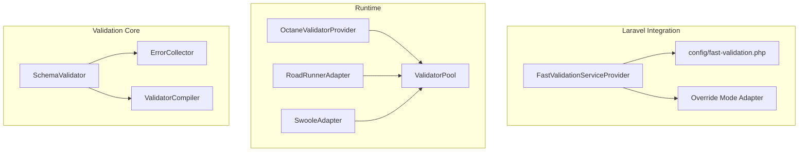
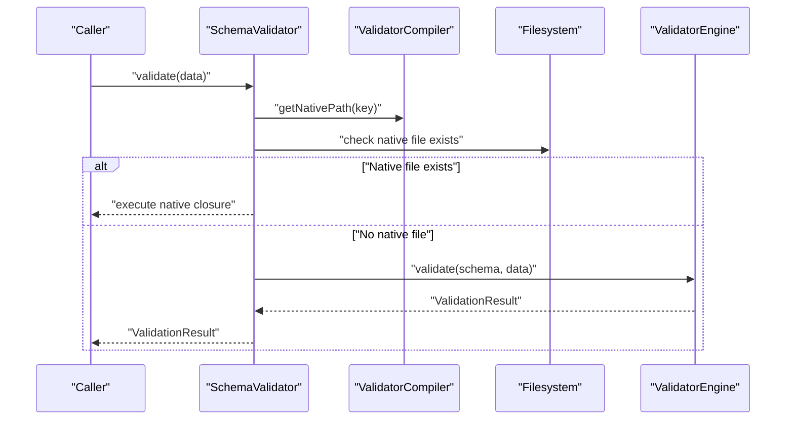
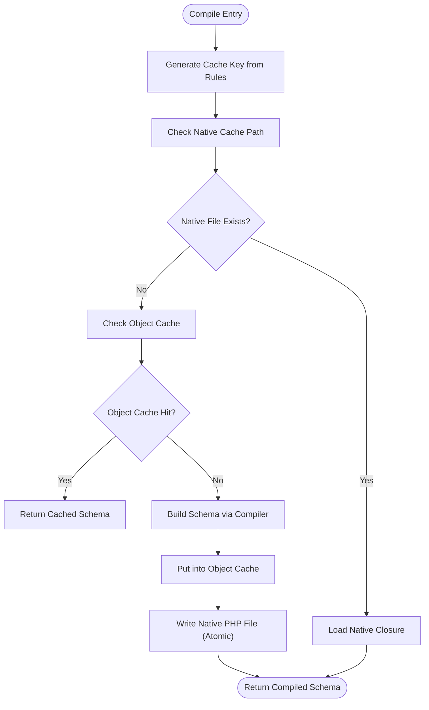
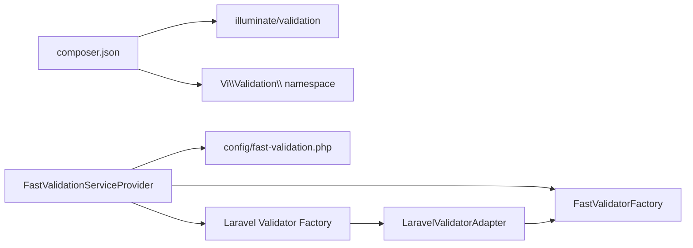

# Troubleshooting and FAQ

<cite>
**Referenced Files in This Document**
- [README.md](file://README.md)
- [composer.json](file://composer.json)
- [config/fast-validation.php](file://config/fast-validation.php)
- [src/Laravel/FastValidationServiceProvider.php](file://src/Laravel/FastValidationServiceProvider.php)
- [src/Runtime/ValidatorPool.php](file://src/Runtime/ValidatorPool.php)
- [src/Laravel/Octane/OctaneValidatorProvider.php](file://src/Laravel/Octane/OctaneValidatorProvider.php)
- [src/Runtime/Workers/RoadRunnerAdapter.php](file://src/Runtime/Workers/RoadRunnerAdapter.php)
- [src/Runtime/Workers/SwooleAdapter.php](file://src/Runtime/Workers/SwooleAdapter.php)
- [src/Execution/ErrorCollector.php](file://src/Execution/ErrorCollector.php)
- [src/Compilation/ValidatorCompiler.php](file://src/Compilation/ValidatorCompiler.php)
- [src/SchemaValidator.php](file://src/SchemaValidator.php)
- [tests/Unit/IntegrationTest.php](file://tests/Unit/IntegrationTest.php)
- [tests/Unit/ValidatorTest.php](file://tests/Unit/ValidatorTest.php)
</cite>

## Table of Contents
1. [Introduction](#introduction)
2. [Project Structure](#project-structure)
3. [Core Components](#core-components)
4. [Architecture Overview](#architecture-overview)
5. [Detailed Component Analysis](#detailed-component-analysis)
6. [Dependency Analysis](#dependency-analysis)
7. [Performance Considerations](#performance-considerations)
8. [Troubleshooting Guide](#troubleshooting-guide)
9. [FAQ](#faq)
10. [Conclusion](#conclusion)
11. [Appendices](#appendices)

## Introduction
This document provides a comprehensive troubleshooting and FAQ guide for the vi/validation library. It covers performance tuning, memory usage pitfalls, Laravel integration nuances, configuration errors, schema compilation and rule parsing issues, error message customization, Laravel Octane compatibility, validator pooling, and production deployment tips. It also includes debugging techniques, logging strategies, and diagnostic steps to resolve validation issues quickly.

## Project Structure
The library is organized around a schema-first validation approach with optional Laravel integration, runtime-aware pooling, and configurable caching and compilation strategies. Key areas include:
- Laravel service provider and facades for integration
- Validator pool and runtime adapters for Octane, Swoole, and RoadRunner
- Schema compilation and caching subsystems
- Execution engine and error collection
- Message resolution and localization

**Diagram sources**
- [src/Laravel/FastValidationServiceProvider.php](file://src/Laravel/FastValidationServiceProvider.php#L14-L52)
- [config/fast-validation.php](file://config/fast-validation.php#L15-L95)
- [src/Runtime/ValidatorPool.php](file://src/Runtime/ValidatorPool.php#L12-L138)
- [src/Laravel/Octane/OctaneValidatorProvider.php](file://src/Laravel/Octane/OctaneValidatorProvider.php#L18-L66)
- [src/Runtime/Workers/RoadRunnerAdapter.php](file://src/Runtime/Workers/RoadRunnerAdapter.php#L13-L106)
- [src/Runtime/Workers/SwooleAdapter.php](file://src/Runtime/Workers/SwooleAdapter.php#L13-L94)
- [src/SchemaValidator.php](file://src/SchemaValidator.php#L13-L30)
- [src/Execution/ErrorCollector.php](file://src/Execution/ErrorCollector.php#L7-L50)
- [src/Compilation/ValidatorCompiler.php](file://src/Compilation/ValidatorCompiler.php#L10-L74)

**Section sources**
- [README.md](file://README.md#L379-L507)
- [config/fast-validation.php](file://config/fast-validation.php#L15-L95)

## Core Components
- SchemaValidator: Orchestrates validation, selects native precompiled path, and delegates to the execution engine otherwise. Provides streaming and batch APIs with memory-conscious defaults.
- ValidatorPool: Manages pooled StatelessValidator instances for long-running environments.
- OctaneValidatorProvider: Integrates lifecycle hooks for Octane workers and requests.
- RoadRunnerAdapter and SwooleAdapter: Provide runtime-aware lifecycle management for RoadRunner and Swoole coroutines.
- ValidatorCompiler: Handles object caching, native code generation, and precompiled schema persistence.
- ErrorCollector: Aggregates per-field validation errors with rule metadata.
- FastValidationServiceProvider: Registers the factory, publishes config, and optionally overrides Laravel’s validator.

**Section sources**
- [src/SchemaValidator.php](file://src/SchemaValidator.php#L54-L73)
- [src/Runtime/ValidatorPool.php](file://src/Runtime/ValidatorPool.php#L12-L138)
- [src/Laravel/Octane/OctaneValidatorProvider.php](file://src/Laravel/Octane/OctaneValidatorProvider.php#L18-L66)
- [src/Runtime/Workers/RoadRunnerAdapter.php](file://src/Runtime/Workers/RoadRunnerAdapter.php#L13-L106)
- [src/Runtime/Workers/SwooleAdapter.php](file://src/Runtime/Workers/SwooleAdapter.php#L13-L94)
- [src/Compilation/ValidatorCompiler.php](file://src/Compilation/ValidatorCompiler.php#L10-L74)
- [src/Execution/ErrorCollector.php](file://src/Execution/ErrorCollector.php#L7-L50)
- [src/Laravel/FastValidationServiceProvider.php](file://src/Laravel/FastValidationServiceProvider.php#L14-L52)

## Architecture Overview
The library emphasizes compile-once, validate-many semantics. SchemaValidator checks for a native precompiled validator file keyed by rule content; if found, it executes the native closure for maximum throughput. Otherwise, it falls back to the ValidatorEngine. In Laravel, the provider can override the framework validator factory in “override” mode, routing compatible rules through the fast engine.

**Diagram sources**
- [src/SchemaValidator.php](file://src/SchemaValidator.php#L54-L73)
- [src/Compilation/ValidatorCompiler.php](file://src/Compilation/ValidatorCompiler.php#L105-L108)

**Section sources**
- [README.md](file://README.md#L379-L507)
- [src/SchemaValidator.php](file://src/SchemaValidator.php#L54-L73)

## Detailed Component Analysis

### Schema Compilation and Caching
Common issues:
- Schema compilation failures due to unsupported rules or malformed rule syntax
- Missing cache directories or insufficient permissions
- Precompiled cache not regenerated after rule changes
- Native code cache collisions or stale files

Solutions:
- Verify rule syntax against supported rules and ensure all custom rules are registered
- Confirm cache directories exist and are writable
- Clear precompiled caches when updating rules
- Use atomic write mechanisms and unique keys to prevent corruption

**Diagram sources**
- [src/Compilation/ValidatorCompiler.php](file://src/Compilation/ValidatorCompiler.php#L33-L74)
- [src/Compilation/ValidatorCompiler.php](file://src/Compilation/ValidatorCompiler.php#L79-L103)

**Section sources**
- [src/Compilation/ValidatorCompiler.php](file://src/Compilation/ValidatorCompiler.php#L33-L74)
- [src/Compilation/ValidatorCompiler.php](file://src/Compilation/ValidatorCompiler.php#L105-L159)

### Rule Parsing and Unsupported Rules
Symptoms:
- Unexpectedly slow validation in override mode
- Some rules being silently ignored
- Mixed behavior between parallel and override modes

Root causes:
- Unsupported Laravel rules in fast path
- Parser limitations and fallback behavior

Resolution:
- Prefer parallel mode for critical validations until full rule coverage is verified
- Gradually migrate rules to supported set documented in the README
- Use parallel mode to isolate unsupported rules and apply workarounds

**Section sources**
- [README.md](file://README.md#L504-L505)
- [README.md](file://README.md#L509-L644)

### Error Message Customization
Common issues:
- Custom messages not applied
- Attribute names not localized
- Locale switching not taking effect

Resolutions:
- Use the MessageResolver to set custom messages and attributes
- Ensure Translator locale is set appropriately
- Verify language files exist under resources/lang/{locale}

**Section sources**
- [README.md](file://README.md#L648-L696)

### Laravel Octane Compatibility
Issues:
- State leaks between requests
- Validator pool exhaustion or improper lifecycle management
- Coroutine context mismatches

Solutions:
- Enable pooling and configure pool size in the runtime config
- Register OctaneValidatorProvider to hook worker/request lifecycle events
- Use RoadRunnerAdapter or SwooleAdapter for environment-specific lifecycle management
- Ensure StatelessValidator is used to avoid cross-request state

**Section sources**
- [config/fast-validation.php](file://config/fast-validation.php#L86-L95)
- [src/Laravel/Octane/OctaneValidatorProvider.php](file://src/Laravel/Octane/OctaneValidatorProvider.php#L18-L66)
- [src/Runtime/Workers/RoadRunnerAdapter.php](file://src/Runtime/Workers/RoadRunnerAdapter.php#L23-L49)
- [src/Runtime/Workers/SwooleAdapter.php](file://src/Runtime/Workers/SwooleAdapter.php#L25-L52)
- [src/Runtime/ValidatorPool.php](file://src/Runtime/ValidatorPool.php#L26-L54)

### Validator Pooling Problems
Symptoms:
- Out-of-memory during high concurrency
- Pool exhaustion leading to temporary validator creation
- Incorrect acquisition/release causing resource leaks

Guidance:
- Tune pool size according to concurrency needs
- Use withValidator to ensure acquire/release symmetry
- Monitor pool metrics (current pool size, created count)

**Section sources**
- [src/Runtime/ValidatorPool.php](file://src/Runtime/ValidatorPool.php#L59-L108)
- [src/Runtime/ValidatorPool.php](file://src/Runtime/ValidatorPool.php#L113-L132)

### Production Deployment Troubleshooting
Checklist:
- Confirm cache directories exist and are writable
- Precompile schemas in CI/CD and deploy precompiled artifacts
- Set appropriate environment variables for fail-fast, max errors, and pooling
- Validate Octane/Swoole/RoadRunner adapters are loaded
- Monitor memory usage with streaming APIs for large datasets

**Section sources**
- [config/fast-validation.php](file://config/fast-validation.php#L26-L44)
- [config/fast-validation.php](file://config/fast-validation.php#L54-L63)
- [config/fast-validation.php](file://config/fast-validation.php#L86-L95)
- [README.md](file://README.md#L379-L507)

## Dependency Analysis
The library depends on illuminate/validation for Laravel integration and exposes a strict PHP requirement. The service provider registers the factory and optionally overrides the framework validator. Runtime adapters depend on environment detection and lifecycle events.

**Diagram sources**
- [composer.json](file://composer.json#L6-L8)
- [src/Laravel/FastValidationServiceProvider.php](file://src/Laravel/FastValidationServiceProvider.php#L14-L52)

**Section sources**
- [composer.json](file://composer.json#L6-L8)
- [src/Laravel/FastValidationServiceProvider.php](file://src/Laravel/FastValidationServiceProvider.php#L14-L52)

## Performance Considerations
- Prefer native precompiled validators for hot paths; ensure cache path is configured and writable
- Use streaming APIs for large datasets to avoid memory spikes
- Enable fail-fast and cap max errors for quicker feedback
- Use pooling in long-running environments to reduce allocation overhead

[No sources needed since this section provides general guidance]

## Troubleshooting Guide

### Performance Problems
- Symptoms: Slow validation, high CPU usage
- Actions:
  - Enable native compilation and precompile schemas
  - Switch to streaming APIs for large datasets
  - Enable fail-fast and adjust max errors
  - Verify cache directories are writable

**Section sources**
- [src/Compilation/ValidatorCompiler.php](file://src/Compilation/ValidatorCompiler.php#L79-L103)
- [README.md](file://README.md#L266-L376)
- [config/fast-validation.php](file://config/fast-validation.php#L54-L63)

### Memory Leaks
- Symptoms: Increasing memory usage over time
- Actions:
  - Use streaming APIs (stream, each, failures)
  - Avoid validateMany for large datasets
  - Ensure StatelessValidator lifecycle methods are called in long-running processes
  - Clear pools on worker stop

**Section sources**
- [README.md](file://README.md#L266-L376)
- [src/Runtime/ValidatorPool.php](file://src/Runtime/ValidatorPool.php#L47-L54)

### Laravel Integration Challenges
- Symptoms: Rules not applied, override not working
- Actions:
  - Set mode to parallel or override in config
  - Publish and review config file
  - In override mode, verify supported rules and gradually migrate

**Section sources**
- [config/fast-validation.php](file://config/fast-validation.php#L15-L15)
- [src/Laravel/FastValidationServiceProvider.php](file://src/Laravel/FastValidationServiceProvider.php#L32-L52)
- [README.md](file://README.md#L432-L507)

### Configuration Errors
- Symptoms: Schema compilation fails, cache not used
- Actions:
  - Verify cache.enabled and cache.driver
  - Ensure cache.path exists and is writable
  - Check precompile settings and cache_path

**Section sources**
- [config/fast-validation.php](file://config/fast-validation.php#L26-L44)

### Schema Compilation Failures
- Symptoms: Errors during compile or missing compiled schema
- Actions:
  - Validate rule syntax and supported rules
  - Clear precompiled cache and rebuild
  - Check filesystem permissions for cache directories

**Section sources**
- [src/Compilation/ValidatorCompiler.php](file://src/Compilation/ValidatorCompiler.php#L164-L183)

### Rule Parsing Issues
- Symptoms: Some rules ignored in override mode
- Actions:
  - Use parallel mode for critical validations
  - Track unsupported rules and replace with supported alternatives

**Section sources**
- [README.md](file://README.md#L504-L505)

### Error Message Customization Problems
- Symptoms: Default messages not localized or custom messages not applied
- Actions:
  - Use MessageResolver to set custom messages and attributes
  - Set Translator locale and verify language files

**Section sources**
- [README.md](file://README.md#L648-L696)

### Laravel Octane Compatibility Issues
- Symptoms: State leaks, pool exhaustion
- Actions:
  - Enable runtime.pooling and set pool_size
  - Register OctaneValidatorProvider
  - Use adapters for RoadRunner or Swoole

**Section sources**
- [config/fast-validation.php](file://config/fast-validation.php#L86-L95)
- [src/Laravel/Octane/OctaneValidatorProvider.php](file://src/Laravel/Octane/OctaneValidatorProvider.php#L18-L66)
- [src/Runtime/Workers/RoadRunnerAdapter.php](file://src/Runtime/Workers/RoadRunnerAdapter.php#L23-L49)
- [src/Runtime/Workers/SwooleAdapter.php](file://src/Runtime/Workers/SwooleAdapter.php#L25-L52)

### Validator Pooling Problems
- Symptoms: Memory growth, timeouts
- Actions:
  - Increase pool_size
  - Use withValidator to guarantee release
  - Monitor pool metrics

**Section sources**
- [src/Runtime/ValidatorPool.php](file://src/Runtime/ValidatorPool.php#L59-L108)

### Production Deployment Troubleshooting
- Checklist:
  - Precompile schemas in CI/CD
  - Set FAST_VALIDATION_* environment variables
  - Verify cache directories and permissions
  - Confirm Octane/Swoole/RoadRunner adapters are active

**Section sources**
- [config/fast-validation.php](file://config/fast-validation.php#L26-L44)
- [config/fast-validation.php](file://config/fast-validation.php#L54-L63)
- [config/fast-validation.php](file://config/fast-validation.php#L86-L95)

### Debugging Techniques and Logging Strategies
- Techniques:
  - Inspect ValidationResult errors and messages
  - Use failures() to stream only failing rows
  - Enable fail-fast to locate first issue quickly
  - Compare results with unit tests for parity

- Logging:
  - Log error counts and first failures
  - Capture rule and field metadata for diagnostics

**Section sources**
- [src/Execution/ErrorCollector.php](file://src/Execution/ErrorCollector.php#L17-L25)
- [src/SchemaValidator.php](file://src/SchemaValidator.php#L161-L174)
- [tests/Unit/IntegrationTest.php](file://tests/Unit/IntegrationTest.php#L12-L60)
- [tests/Unit/ValidatorTest.php](file://tests/Unit/ValidatorTest.php#L29-L49)

## FAQ

### Which rules are supported?
- Refer to the supported rules list in the README for a comprehensive mapping of Laravel-style rules to internal implementations.

**Section sources**
- [README.md](file://README.md#L509-L644)

### What are the performance expectations?
- The library targets compile-once, validate-many performance. Streaming APIs minimize memory footprint for large datasets.

**Section sources**
- [README.md](file://README.md#L266-L376)

### How do I migrate from Laravel’s built-in validator?
- Start in parallel mode, validate behavior, then cautiously switch to override mode as support expands.

**Section sources**
- [README.md](file://README.md#L432-L507)

### How do I customize error messages?
- Use MessageResolver to set custom messages and attributes, and configure Translator locale.

**Section sources**
- [README.md](file://README.md#L648-L696)

### How do I handle nested fields?
- Dot notation up to two levels is supported. Validate with nested arrays.

**Section sources**
- [README.md](file://README.md#L161-L183)
- [tests/Unit/ValidatorTest.php](file://tests/Unit/ValidatorTest.php#L51-L87)

### How do I deal with nullable fields?
- Use nullable() to allow null while still applying other rules when present.

**Section sources**
- [README.md](file://README.md#L185-L204)

### How do I validate many records efficiently?
- Use streaming APIs (stream, each, failures) to avoid memory spikes.

**Section sources**
- [README.md](file://README.md#L205-L376)

### How do I enable schema caching?
- Configure cache.enabled, driver, ttl, and path in the published config.

**Section sources**
- [config/fast-validation.php](file://config/fast-validation.php#L26-L31)

### How do I precompile validators?
- Enable precompile and cache_path; use ValidatorCompiler to write precompiled artifacts.

**Section sources**
- [config/fast-validation.php](file://config/fast-validation.php#L41-L44)
- [src/Compilation/ValidatorCompiler.php](file://src/Compilation/ValidatorCompiler.php#L138-L154)

### How do I integrate with Laravel Octane?
- Enable runtime pooling, register OctaneValidatorProvider, and ensure adapters are loaded.

**Section sources**
- [config/fast-validation.php](file://config/fast-validation.php#L86-L95)
- [src/Laravel/Octane/OctaneValidatorProvider.php](file://src/Laravel/Octane/OctaneValidatorProvider.php#L18-L66)

### How do I troubleshoot memory leaks in long-running processes?
- Use StatelessValidator lifecycle hooks and ensure pools are released on worker stop.

**Section sources**
- [src/Runtime/ValidatorPool.php](file://src/Runtime/ValidatorPool.php#L47-L54)

### How do I debug rule parsing issues?
- Use parallel mode to isolate unsupported rules and verify behavior against unit tests.

**Section sources**
- [README.md](file://README.md#L504-L505)
- [tests/Unit/IntegrationTest.php](file://tests/Unit/IntegrationTest.php#L12-L60)

### How do I ensure locale switching works?
- Set Translator locale and verify language files exist under resources/lang/{locale}.

**Section sources**
- [README.md](file://README.md#L677-L696)

## Conclusion
By leveraging native compilation, streaming APIs, and runtime-aware pooling, vi/validation delivers high-throughput validation suitable for large-scale applications. Use the troubleshooting and FAQ sections to diagnose and resolve common issues, adopt recommended configurations for production, and maintain robust validation workflows across Laravel and long-running environments.

[No sources needed since this section summarizes without analyzing specific files]

## Appendices

### Best Practices
- Prefer parallel mode for critical validations until full rule support is confirmed
- Precompile schemas and deploy artifacts in CI/CD
- Use streaming APIs for large datasets
- Enable pooling in Octane/Swoole/RoadRunner
- Keep cache directories writable and monitored

**Section sources**
- [README.md](file://README.md#L379-L507)
- [config/fast-validation.php](file://config/fast-validation.php#L26-L44)
- [config/fast-validation.php](file://config/fast-validation.php#L86-L95)