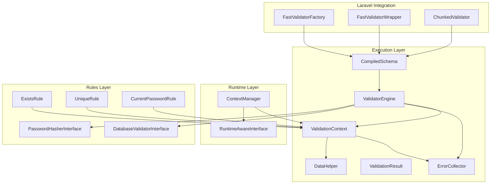
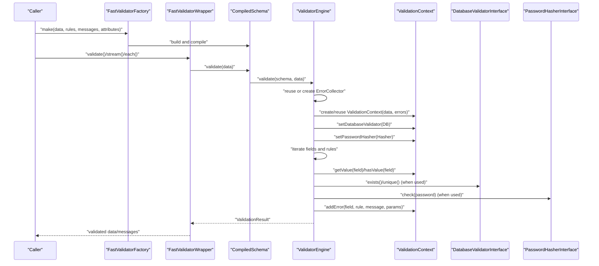
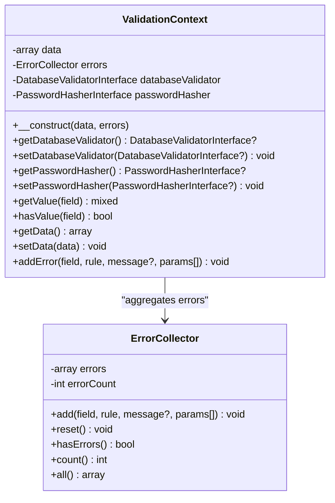
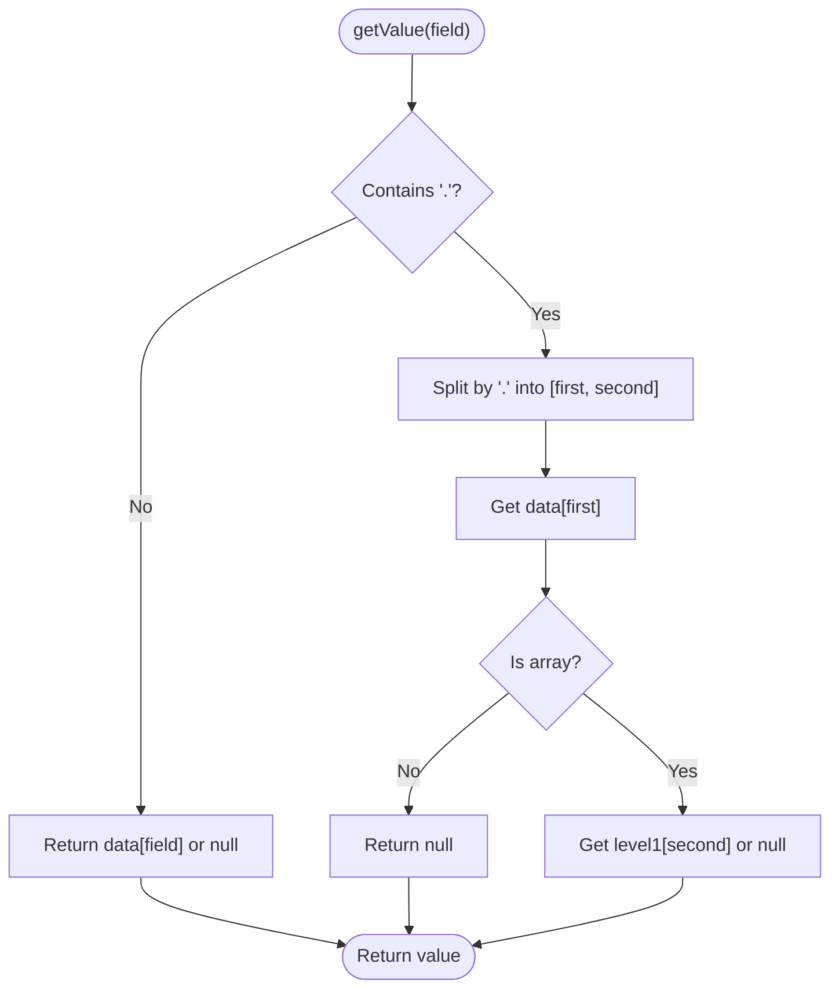
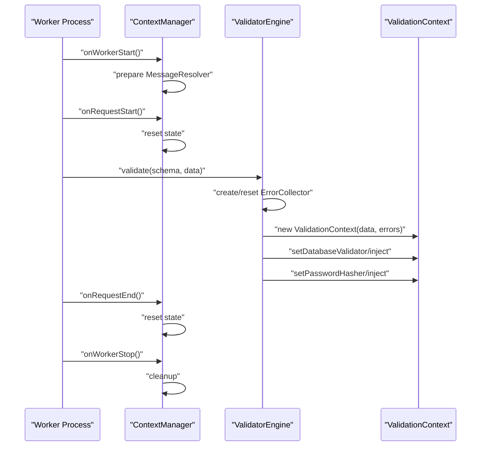
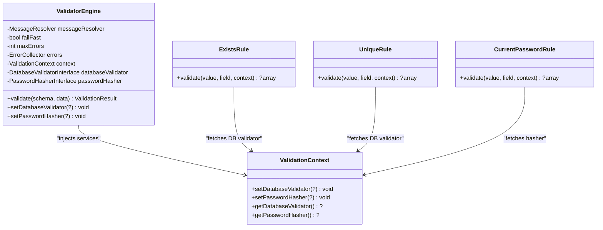
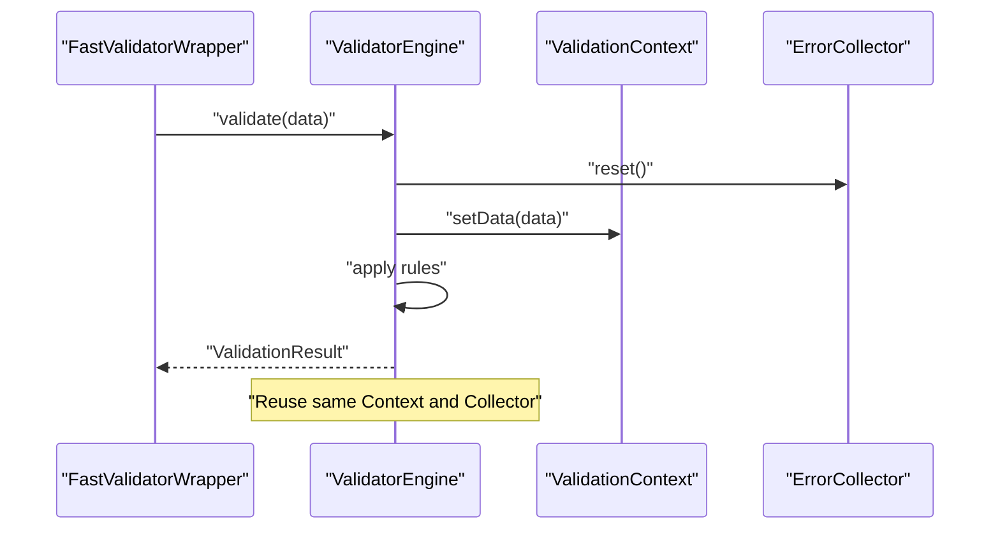
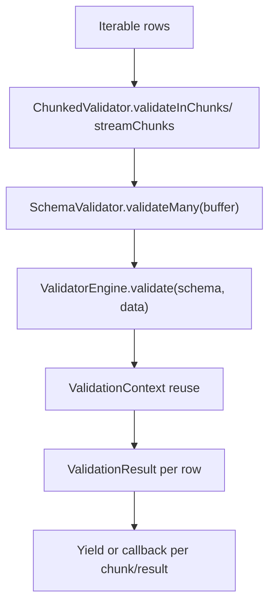
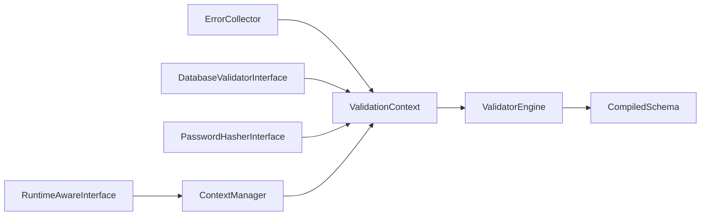

# Context Management

<cite>
**Referenced Files in This Document**
- [ValidationContext.php](file://src/Execution/ValidationContext.php)
- [DataHelper.php](file://src/Execution/DataHelper.php)
- [ValidatorEngine.php](file://src/Execution/ValidatorEngine.php)
- [ContextManager.php](file://src/Runtime/ContextManager.php)
- [RuntimeAwareInterface.php](file://src/Runtime/RuntimeAwareInterface.php)
- [ErrorCollector.php](file://src/Execution/ErrorCollector.php)
- [ValidationResult.php](file://src/Execution/ValidationResult.php)
- [CompiledSchema.php](file://src/Execution/CompiledSchema.php)
- [DatabaseValidatorInterface.php](file://src/Rules/DatabaseValidatorInterface.php)
- [PasswordHasherInterface.php](file://src/Rules/PasswordHasherInterface.php)
- [ExistsRule.php](file://src/Rules/ExistsRule.php)
- [UniqueRule.php](file://src/Rules/UniqueRule.php)
- [CurrentPasswordRule.php](file://src/Rules/CurrentPasswordRule.php)
- [FastValidatorFactory.php](file://src/Laravel/FastValidatorFactory.php)
- [FastValidatorWrapper.php](file://src/Laravel/FastValidatorWrapper.php)
- [ChunkedValidator.php](file://src/Execution/ChunkedValidator.php)
</cite>

## Table of Contents
1. [Introduction](#introduction)
2. [Project Structure](#project-structure)
3. [Core Components](#core-components)
4. [Architecture Overview](#architecture-overview)
5. [Detailed Component Analysis](#detailed-component-analysis)
6. [Dependency Analysis](#dependency-analysis)
7. [Performance Considerations](#performance-considerations)
8. [Troubleshooting Guide](#troubleshooting-guide)
9. [Conclusion](#conclusion)

## Introduction
This document explains the ValidationContext management system that powers the validation engine. It covers how ValidationContext maintains execution state, manages shared resources, coordinates between validation components, and integrates with DataHelper for efficient data retrieval. It also documents context initialization for each validation run, lifecycle management, database validator and password hasher integration, and context reuse patterns for performance optimization during batch processing.

## Project Structure
The ValidationContext system spans several modules:
- Execution layer: ValidationContext, ValidatorEngine, ErrorCollector, ValidationResult, CompiledSchema, DataHelper
- Runtime layer: ContextManager and lifecycle hooks via RuntimeAwareInterface
- Rules layer: DatabaseValidatorInterface and PasswordHasherInterface, plus rule implementations that consume ValidationContext
- Laravel integration: FastValidatorFactory and FastValidatorWrapper orchestrate schema creation and validation lifecycle

**Diagram sources**
- [ValidationContext.php](file://src/Execution/ValidationContext.php#L1-L98)
- [ValidatorEngine.php](file://src/Execution/ValidatorEngine.php#L1-L177)
- [ErrorCollector.php](file://src/Execution/ErrorCollector.php#L1-L51)
- [ValidationResult.php](file://src/Execution/ValidationResult.php#L1-L142)
- [CompiledSchema.php](file://src/Execution/CompiledSchema.php#L1-L68)
- [DataHelper.php](file://src/Execution/DataHelper.php#L1-L32)
- [ContextManager.php](file://src/Runtime/ContextManager.php#L1-L119)
- [RuntimeAwareInterface.php](file://src/Runtime/RuntimeAwareInterface.php#L1-L32)
- [DatabaseValidatorInterface.php](file://src/Rules/DatabaseValidatorInterface.php#L1-L37)
- [PasswordHasherInterface.php](file://src/Rules/PasswordHasherInterface.php#L1-L23)
- [ExistsRule.php](file://src/Rules/ExistsRule.php#L1-L44)
- [UniqueRule.php](file://src/Rules/UniqueRule.php#L1-L46)
- [CurrentPasswordRule.php](file://src/Rules/CurrentPasswordRule.php#L1-L31)
- [FastValidatorFactory.php](file://src/Laravel/FastValidatorFactory.php#L1-L207)
- [FastValidatorWrapper.php](file://src/Laravel/FastValidatorWrapper.php#L1-L400)
- [ChunkedValidator.php](file://src/Execution/ChunkedValidator.php#L1-L154)

**Section sources**
- [ValidationContext.php](file://src/Execution/ValidationContext.php#L1-L98)
- [ValidatorEngine.php](file://src/Execution/ValidatorEngine.php#L1-L177)
- [ContextManager.php](file://src/Runtime/ContextManager.php#L1-L119)
- [FastValidatorFactory.php](file://src/Laravel/FastValidatorFactory.php#L1-L207)

## Core Components
- ValidationContext: Holds the current validation payload, error collector, and optional shared services (database validator and password hasher). Provides field value access with dot notation and error aggregation.
- ValidatorEngine: Orchestrates validation runs, initializes or reuses ValidationContext, injects shared services, applies rules, and enforces fail-fast and max-errors policies.
- ErrorCollector: Centralized error storage with counts and reset semantics.
- ValidationResult: Final result container with helpers to access validated data, formatted messages, and aggregated views.
- CompiledSchema: Encapsulates compiled field definitions and delegates validation to ValidatorEngine.
- DataHelper: Utility for nested data access using dot notation.
- ContextManager: Request-scoped lifecycle manager for ValidationContext and message resolution in long-running workers.
- DatabaseValidatorInterface and PasswordHasherInterface: Extension points for database-backed rules and password checks.
- Rule implementations (ExistsRule, UniqueRule, CurrentPasswordRule): Demonstrate how ValidationContext is consumed for service access and value retrieval.

**Section sources**
- [ValidationContext.php](file://src/Execution/ValidationContext.php#L1-L98)
- [ValidatorEngine.php](file://src/Execution/ValidatorEngine.php#L1-L177)
- [ErrorCollector.php](file://src/Execution/ErrorCollector.php#L1-L51)
- [ValidationResult.php](file://src/Execution/ValidationResult.php#L1-L142)
- [CompiledSchema.php](file://src/Execution/CompiledSchema.php#L1-L68)
- [DataHelper.php](file://src/Execution/DataHelper.php#L1-L32)
- [ContextManager.php](file://src/Runtime/ContextManager.php#L1-L119)
- [DatabaseValidatorInterface.php](file://src/Rules/DatabaseValidatorInterface.php#L1-L37)
- [PasswordHasherInterface.php](file://src/Rules/PasswordHasherInterface.php#L1-L23)
- [ExistsRule.php](file://src/Rules/ExistsRule.php#L1-L44)
- [UniqueRule.php](file://src/Rules/UniqueRule.php#L1-L46)
- [CurrentPasswordRule.php](file://src/Rules/CurrentPasswordRule.php#L1-L31)

## Architecture Overview
The ValidationContext system follows a layered design:
- Data binding: ValidationContext exposes getValue and hasValue for field access, while DataHelper supports dot-notation traversal.
- Shared services: ValidatorEngine injects DatabaseValidatorInterface and PasswordHasherInterface into ValidationContext before each run.
- Lifecycle: ContextManager resets and recreates ValidationContext per request in long-running environments.
- Results: ValidatorEngine produces ValidationResult, which aggregates errors and optionally resolves localized messages.

**Diagram sources**
- [FastValidatorFactory.php](file://src/Laravel/FastValidatorFactory.php#L1-L207)
- [FastValidatorWrapper.php](file://src/Laravel/FastValidatorWrapper.php#L1-L400)
- [CompiledSchema.php](file://src/Execution/CompiledSchema.php#L1-L68)
- [ValidatorEngine.php](file://src/Execution/ValidatorEngine.php#L1-L177)
- [ValidationContext.php](file://src/Execution/ValidationContext.php#L1-L98)
- [DatabaseValidatorInterface.php](file://src/Rules/DatabaseValidatorInterface.php#L1-L37)
- [PasswordHasherInterface.php](file://src/Rules/PasswordHasherInterface.php#L1-L23)

## Detailed Component Analysis

### ValidationContext Responsibilities
- Execution state: Stores the current payload and error collector; exposes methods to mutate and query state.
- Shared resource management: Holds optional DatabaseValidatorInterface and PasswordHasherInterface instances injected by ValidatorEngine.
- Field value access: getValue supports simple and two-level nested fields via dot notation; hasValue mirrors presence checks.
- Error aggregation: Delegates error recording to ErrorCollector via addError.

**Diagram sources**
- [ValidationContext.php](file://src/Execution/ValidationContext.php#L1-L98)
- [ErrorCollector.php](file://src/Execution/ErrorCollector.php#L1-L51)

**Section sources**
- [ValidationContext.php](file://src/Execution/ValidationContext.php#L1-L98)

### Data Binding Mechanisms and Field Access Patterns
- getValue(field): Supports dot notation for nested arrays up to two levels deep. Returns null if missing or invalid.
- hasValue(field): Mirrors presence checks for simple and nested keys.
- DataHelper::get: General-purpose dot-notation accessor used elsewhere for nested traversal.

**Diagram sources**
- [ValidationContext.php](file://src/Execution/ValidationContext.php#L43-L58)
- [DataHelper.php](file://src/Execution/DataHelper.php#L15-L30)

**Section sources**
- [ValidationContext.php](file://src/Execution/ValidationContext.php#L43-L73)
- [DataHelper.php](file://src/Execution/DataHelper.php#L15-L30)

### Context Initialization and Lifecycle Management
- ValidatorEngine.validate: Creates or resets ErrorCollector and ValidationContext per run; injects shared services into ValidationContext.
- ContextManager: Manages ValidationContext per request in long-running workers, resetting state on request boundaries and providing a MessageResolver with custom messages and attributes.

**Diagram sources**
- [ContextManager.php](file://src/Runtime/ContextManager.php#L1-L119)
- [RuntimeAwareInterface.php](file://src/Runtime/RuntimeAwareInterface.php#L1-L32)
- [ValidatorEngine.php](file://src/Execution/ValidatorEngine.php#L33-L44)

**Section sources**
- [ValidatorEngine.php](file://src/Execution/ValidatorEngine.php#L33-L44)
- [ContextManager.php](file://src/Runtime/ContextManager.php#L25-L48)
- [RuntimeAwareInterface.php](file://src/Runtime/RuntimeAwareInterface.php#L12-L30)

### Integration with Database Validator and Password Hasher
- ValidatorEngine sets DatabaseValidatorInterface and PasswordHasherInterface on ValidationContext before validation.
- Rules like ExistsRule, UniqueRule, and CurrentPasswordRule fetch these services from ValidationContext and use them to enforce domain-specific checks.

**Diagram sources**
- [ValidatorEngine.php](file://src/Execution/ValidatorEngine.php#L115-L123)
- [ValidationContext.php](file://src/Execution/ValidationContext.php#L23-L41)
- [ExistsRule.php](file://src/Rules/ExistsRule.php#L23-L42)
- [UniqueRule.php](file://src/Rules/UniqueRule.php#L27-L44)
- [CurrentPasswordRule.php](file://src/Rules/CurrentPasswordRule.php#L12-L29)
- [DatabaseValidatorInterface.php](file://src/Rules/DatabaseValidatorInterface.php#L1-L37)
- [PasswordHasherInterface.php](file://src/Rules/PasswordHasherInterface.php#L1-L23)

**Section sources**
- [ValidatorEngine.php](file://src/Execution/ValidatorEngine.php#L43-L44)
- [ExistsRule.php](file://src/Rules/ExistsRule.php#L29-L35)
- [UniqueRule.php](file://src/Rules/UniqueRule.php#L33-L37)
- [CurrentPasswordRule.php](file://src/Rules/CurrentPasswordRule.php#L18-L22)

### Context Reuse Patterns for Performance Optimization
- ValidatorEngine.validate reuses the same ErrorCollector and ValidationContext across runs, resetting only the data to minimize allocations.
- ContextManager ensures request-scoped isolation in long-running workers, preventing cross-request contamination.
- FastValidatorWrapper supports streaming and chunked processing to avoid materializing all results in memory.

**Diagram sources**
- [ValidatorEngine.php](file://src/Execution/ValidatorEngine.php#L35-L41)
- [FastValidatorWrapper.php](file://src/Laravel/FastValidatorWrapper.php#L74-L85)

**Section sources**
- [ValidatorEngine.php](file://src/Execution/ValidatorEngine.php#L35-L41)
- [ContextManager.php](file://src/Runtime/ContextManager.php#L30-L42)
- [FastValidatorWrapper.php](file://src/Laravel/FastValidatorWrapper.php#L286-L398)

### Batch Processing and Memory Efficiency
- FastValidatorWrapper.stream and each enable streaming validation results for large datasets without storing all results in memory.
- ChunkedValidator processes data in fixed-size chunks, yielding results or only failures to reduce peak memory usage.
- CompiledSchema.validate delegates to ValidatorEngine, which reuses context and collector for each validation run.

**Diagram sources**
- [ChunkedValidator.php](file://src/Execution/ChunkedValidator.php#L34-L81)
- [FastValidatorWrapper.php](file://src/Laravel/FastValidatorWrapper.php#L286-L398)
- [CompiledSchema.php](file://src/Execution/CompiledSchema.php#L59-L66)
- [ValidatorEngine.php](file://src/Execution/ValidatorEngine.php#L33-L44)

**Section sources**
- [ChunkedValidator.php](file://src/Execution/ChunkedValidator.php#L1-L154)
- [FastValidatorWrapper.php](file://src/Laravel/FastValidatorWrapper.php#L286-L398)
- [CompiledSchema.php](file://src/Execution/CompiledSchema.php#L59-L66)

## Dependency Analysis
- ValidationContext depends on ErrorCollector for error aggregation and optionally on DatabaseValidatorInterface and PasswordHasherInterface for rule-specific checks.
- ValidatorEngine composes ValidationContext, ErrorCollector, and shared services; it orchestrates rule application and enforces policy.
- CompiledSchema delegates validation to ValidatorEngine, enabling reuse of the engine and context across validations.
- ContextManager provides lifecycle hooks for long-running workers and request-scoped ValidationContext creation.

**Diagram sources**
- [ValidationContext.php](file://src/Execution/ValidationContext.php#L1-L98)
- [ValidatorEngine.php](file://src/Execution/ValidatorEngine.php#L1-L177)
- [CompiledSchema.php](file://src/Execution/CompiledSchema.php#L1-L68)
- [ContextManager.php](file://src/Runtime/ContextManager.php#L1-L119)
- [RuntimeAwareInterface.php](file://src/Runtime/RuntimeAwareInterface.php#L1-L32)

**Section sources**
- [ValidationContext.php](file://src/Execution/ValidationContext.php#L1-L98)
- [ValidatorEngine.php](file://src/Execution/ValidatorEngine.php#L1-L177)
- [CompiledSchema.php](file://src/Execution/CompiledSchema.php#L1-L68)
- [ContextManager.php](file://src/Runtime/ContextManager.php#L1-L119)

## Performance Considerations
- Context reuse: ValidatorEngine reuses the same ValidationContext and ErrorCollector across runs to reduce allocations.
- Fail-fast and max-errors: ValidatorEngine enforces early termination when the first error occurs or when the maximum number of errors is reached.
- Streaming and chunking: FastValidatorWrapper and ChunkedValidator enable memory-efficient processing of large datasets by yielding results incrementally.
- Request-scoped lifecycle: ContextManager resets state per request in long-running workers to prevent memory leaks and cross-request contamination.

[No sources needed since this section provides general guidance]

## Troubleshooting Guide
- Missing shared services: If DatabaseValidatorInterface or PasswordHasherInterface are not injected, rules that depend on them will not perform external checks and may silently succeed. Ensure ValidatorEngine has these services set before validation.
- Nested field access: getValue supports up to two levels of nesting. For deeper nesting, use DataHelper::get or flatten the payload.
- Error collection overflow: If the number of errors reaches maxErrors, validation stops early. Adjust maxErrors or handle errors progressively.
- Request state leakage: In long-running workers, ensure ContextManager lifecycle hooks are invoked to reset ValidationContext and message resolver state.

**Section sources**
- [ValidatorEngine.php](file://src/Execution/ValidatorEngine.php#L148-L159)
- [ValidationContext.php](file://src/Execution/ValidationContext.php#L43-L58)
- [ContextManager.php](file://src/Runtime/ContextManager.php#L30-L42)

## Conclusion
The ValidationContext management system centralizes execution state, error aggregation, and shared service injection for efficient and scalable validation. Through context reuse, request-scoped lifecycle management, and integration with database validators and password hashers, it enables robust validation workflows across single requests and large-scale batch processing.