# Execution Pipeline

<cite>
**Referenced Files in This Document**
- [ValidatorEngine.php](file://src/Execution/ValidatorEngine.php)
- [CompiledSchema.php](file://src/Execution/CompiledSchema.php)
- [CompiledField.php](file://src/Execution/CompiledField.php)
- [ValidationContext.php](file://src/Execution/ValidationContext.php)
- [DataHelper.php](file://src/Execution/DataHelper.php)
- [ValidationResult.php](file://src/Execution/ValidationResult.php)
- [ErrorCollector.php](file://src/Execution/ErrorCollector.php)
- [BatchValidationResult.php](file://src/Execution/BatchValidationResult.php)
- [ChunkedValidator.php](file://src/Execution/ChunkedValidator.php)
- [NativeValidator.php](file://src/Execution/NativeValidator.php)
- [SometimesRule.php](file://src/Rules/SometimesRule.php)
- [ExcludeRule.php](file://src/Rules/ExcludeRule.php)
- [BailRule.php](file://src/Rules/BailRule.php)
- [NullableRule.php](file://src/Rules/NullableRule.php)
- [RequiredRule.php](file://src/Rules/RequiredRule.php)
</cite>

## Table of Contents
1. [Introduction](#introduction)
2. [Project Structure](#project-structure)
3. [Core Components](#core-components)
4. [Architecture Overview](#architecture-overview)
5. [Detailed Component Analysis](#detailed-component-analysis)
6. [Dependency Analysis](#dependency-analysis)
7. [Performance Considerations](#performance-considerations)
8. [Troubleshooting Guide](#troubleshooting-guide)
9. [Conclusion](#conclusion)

## Introduction
This document explains the validation execution pipeline architecture, focusing on the step-by-step process from schema traversal to rule application. It covers the main execution loop in ValidatorEngine::validate(), field processing order, conditional validation logic, and integrations with CompiledSchema for field iteration, DataHelper for value extraction, and the overall flow from input data to validation results. It also documents field exclusion handling, sometimes rule processing, empty value detection, performance characteristics, and optimization strategies.

## Project Structure
The execution pipeline resides primarily under src/Execution, with supporting rule implementations under src/Rules. Compiled artifacts (CompiledSchema, CompiledField) represent preprocessed field definitions and rules. Validation results are encapsulated in ValidationResult, while ChunkedValidator enables memory-efficient batch processing.

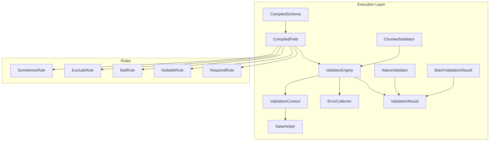

**Diagram sources**
- [ValidatorEngine.php](file://src/Execution/ValidatorEngine.php#L33-L98)
- [CompiledSchema.php](file://src/Execution/CompiledSchema.php#L27-L66)
- [CompiledField.php](file://src/Execution/CompiledField.php#L115-L176)
- [ValidationContext.php](file://src/Execution/ValidationContext.php#L17-L97)
- [DataHelper.php](file://src/Execution/DataHelper.php#L15-L30)
- [ErrorCollector.php](file://src/Execution/ErrorCollector.php#L17-L49)
- [ValidationResult.php](file://src/Execution/ValidationResult.php#L22-L96)
- [BatchValidationResult.php](file://src/Execution/BatchValidationResult.php#L23-L90)
- [ChunkedValidator.php](file://src/Execution/ChunkedValidator.php#L34-L127)
- [NativeValidator.php](file://src/Execution/NativeValidator.php#L27-L37)
- [SometimesRule.php](file://src/Rules/SometimesRule.php#L15-L18)
- [ExcludeRule.php](file://src/Rules/ExcludeRule.php#L15-L18)
- [BailRule.php](file://src/Rules/BailRule.php#L15-L18)
- [NullableRule.php](file://src/Rules/NullableRule.php#L12-L16)
- [RequiredRule.php](file://src/Rules/RequiredRule.php#L12-L27)

**Section sources**
- [ValidatorEngine.php](file://src/Execution/ValidatorEngine.php#L33-L98)
- [CompiledSchema.php](file://src/Execution/CompiledSchema.php#L27-L66)
- [CompiledField.php](file://src/Execution/CompiledField.php#L115-L176)
- [ValidationContext.php](file://src/Execution/ValidationContext.php#L17-L97)
- [DataHelper.php](file://src/Execution/DataHelper.php#L15-L30)
- [ErrorCollector.php](file://src/Execution/ErrorCollector.php#L17-L49)
- [ValidationResult.php](file://src/Execution/ValidationResult.php#L22-L96)
- [BatchValidationResult.php](file://src/Execution/BatchValidationResult.php#L23-L90)
- [ChunkedValidator.php](file://src/Execution/ChunkedValidator.php#L34-L127)
- [NativeValidator.php](file://src/Execution/NativeValidator.php#L27-L37)

## Core Components
- ValidatorEngine: Orchestrates the validation loop, applies rules, manages bail/fast-fail/max-errors, and collects results.
- CompiledSchema: Provides ordered CompiledField instances and exposes a validate method delegating to ValidatorEngine.
- CompiledField: Encapsulates field metadata, rule ordering, exclusion logic, and nested value extraction.
- ValidationContext: Supplies data access helpers, presence checks, and error aggregation to rules.
- DataHelper: Utility for dot-notation value retrieval from arrays.
- ValidationResult: Aggregates errors, raw and formatted messages, and provides validated data with exclusions.
- ErrorCollector: Accumulates structured errors with counts and reset semantics.
- BatchValidationResult: Holds multiple ValidationResult instances with streaming and filtering helpers.
- ChunkedValidator: Streams or buffers large datasets into chunks for memory-efficient validation.
- NativeValidator: Executes a precompiled closure for maximum performance.

**Section sources**
- [ValidatorEngine.php](file://src/Execution/ValidatorEngine.php#L33-L98)
- [CompiledSchema.php](file://src/Execution/CompiledSchema.php#L27-L66)
- [CompiledField.php](file://src/Execution/CompiledField.php#L115-L176)
- [ValidationContext.php](file://src/Execution/ValidationContext.php#L17-L97)
- [DataHelper.php](file://src/Execution/DataHelper.php#L15-L30)
- [ValidationResult.php](file://src/Execution/ValidationResult.php#L22-L96)
- [ErrorCollector.php](file://src/Execution/ErrorCollector.php#L17-L49)
- [BatchValidationResult.php](file://src/Execution/BatchValidationResult.php#L23-L90)
- [ChunkedValidator.php](file://src/Execution/ChunkedValidator.php#L34-L127)
- [NativeValidator.php](file://src/Execution/NativeValidator.php#L27-L37)

## Architecture Overview
The execution pipeline follows a deterministic order:
- CompiledSchema iterates fields in a predefined order.
- For each field, ValidatorEngine decides whether to exclude it, skip due to “sometimes”, extract the value, and then applies rules respecting implicit/non-implicit semantics and bail behavior.
- ValidationContext supplies data access and presence checks.
- Errors are collected centrally and transformed into ValidationResult.

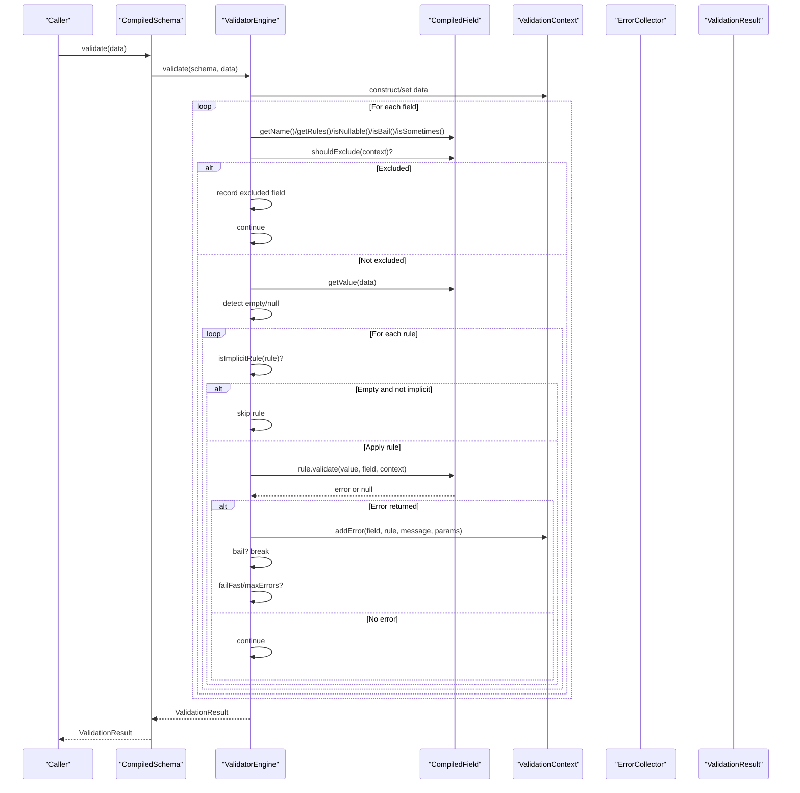

**Diagram sources**
- [CompiledSchema.php](file://src/Execution/CompiledSchema.php#L59-L66)
- [ValidatorEngine.php](file://src/Execution/ValidatorEngine.php#L33-L98)
- [CompiledField.php](file://src/Execution/CompiledField.php#L148-L175)
- [ValidationContext.php](file://src/Execution/ValidationContext.php#L93-L96)
- [ErrorCollector.php](file://src/Execution/ErrorCollector.php#L17-L25)
- [ValidationResult.php](file://src/Execution/ValidationResult.php#L22-L32)

## Detailed Component Analysis

### ValidatorEngine::validate() — Main Execution Loop
Key behaviors:
- Initializes or resets ErrorCollector and ValidationContext with input data.
- Iterates fields from CompiledSchema::getFields().
- Applies exclusion rules via CompiledField::shouldExclude().
- Skips “sometimes” fields when absent using ValidationContext::hasValue().
- Extracts value via CompiledField::getValue() and determines emptiness.
- Applies rules in order, skipping non-implicit rules on empty values.
- Supports bail per field and global fail-fast/max-errors short-circuits.
- Produces ValidationResult with collected errors and excluded fields.

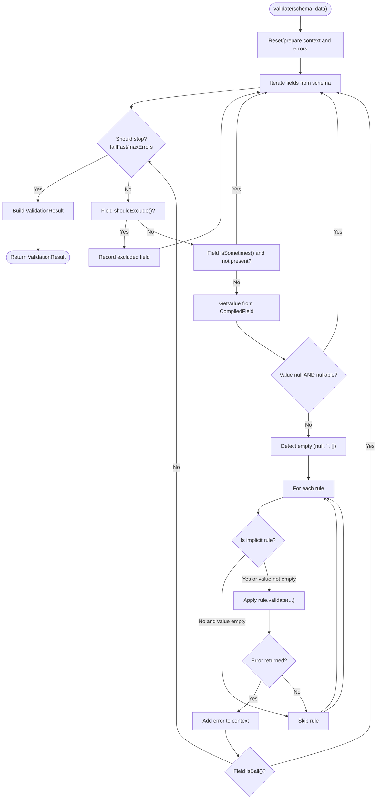

**Diagram sources**
- [ValidatorEngine.php](file://src/Execution/ValidatorEngine.php#L33-L98)
- [CompiledField.php](file://src/Execution/CompiledField.php#L148-L175)
- [ValidationContext.php](file://src/Execution/ValidationContext.php#L60-L73)
- [ErrorCollector.php](file://src/Execution/ErrorCollector.php#L17-L25)

**Section sources**
- [ValidatorEngine.php](file://src/Execution/ValidatorEngine.php#L33-L98)

### CompiledSchema and CompiledField — Schema Traversal and Field Extraction
- CompiledSchema::fromFieldDefinitions builds CompiledField instances and stores them in order.
- CompiledSchema::validate delegates to ValidatorEngine::validate.
- CompiledField encapsulates:
  - Rule deduplication and reordering (marker rules first).
  - Presence of Bail, Required, Nullable, Sometimes, AlwaysExcluded, and exclusion rules.
  - Nested value extraction via dot notation.
  - Exclusion decisions based on AlwaysExcluded and dynamic exclusion rules.

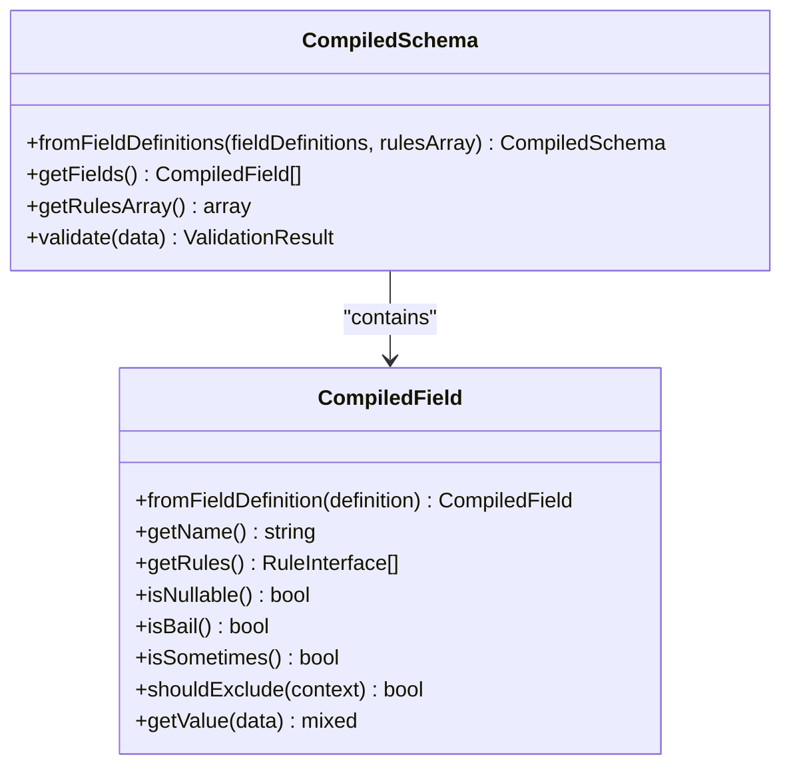

**Diagram sources**
- [CompiledSchema.php](file://src/Execution/CompiledSchema.php#L27-L66)
- [CompiledField.php](file://src/Execution/CompiledField.php#L115-L176)

**Section sources**
- [CompiledSchema.php](file://src/Execution/CompiledSchema.php#L27-L66)
- [CompiledField.php](file://src/Execution/CompiledField.php#L115-L176)

### ValidationContext — Data Access and Presence Checks
- getValue supports simple and depth-2 nested fields using dot notation.
- hasValue checks presence for simple and nested keys.
- addError delegates to ErrorCollector.

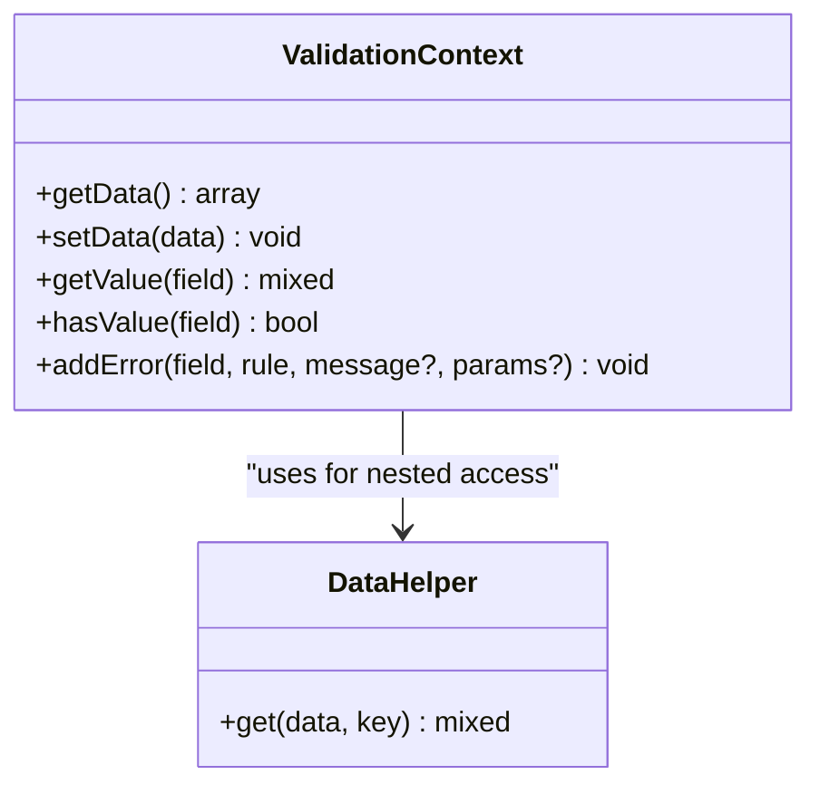

**Diagram sources**
- [ValidationContext.php](file://src/Execution/ValidationContext.php#L17-L97)
- [DataHelper.php](file://src/Execution/DataHelper.php#L15-L30)

**Section sources**
- [ValidationContext.php](file://src/Execution/ValidationContext.php#L17-L97)
- [DataHelper.php](file://src/Execution/DataHelper.php#L15-L30)

### ValidationResult — Results and Formatted Messages
- Aggregates raw errors and provides:
  - isValid()
  - errors()
  - messages() with optional MessageResolver fallback
  - allMessages(), firstMessage(), first()
  - validated() data with excluded fields removed

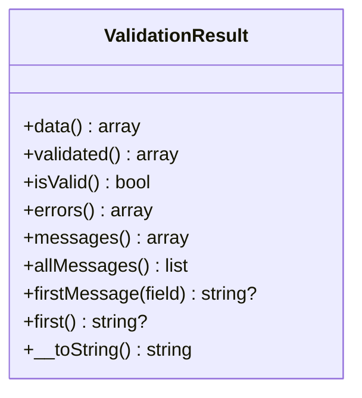

**Diagram sources**
- [ValidationResult.php](file://src/Execution/ValidationResult.php#L22-L141)

**Section sources**
- [ValidationResult.php](file://src/Execution/ValidationResult.php#L22-L141)

### Conditional Validation Logic
- “Sometimes” rule: CompiledField marks isSometimes; ValidatorEngine skips absent fields before rule evaluation.
- “Bail” rule: CompiledField marks isBail; ValidatorEngine stops applying further rules upon first failure for that field.
- “Nullable” rule: CompiledField marks isNullable; ValidatorEngine treats null values as non-empty for non-implicit rules.
- Implicit vs non-implicit rules: ValidatorEngine defines implicit rules and skips non-implicit rules when the value is empty.

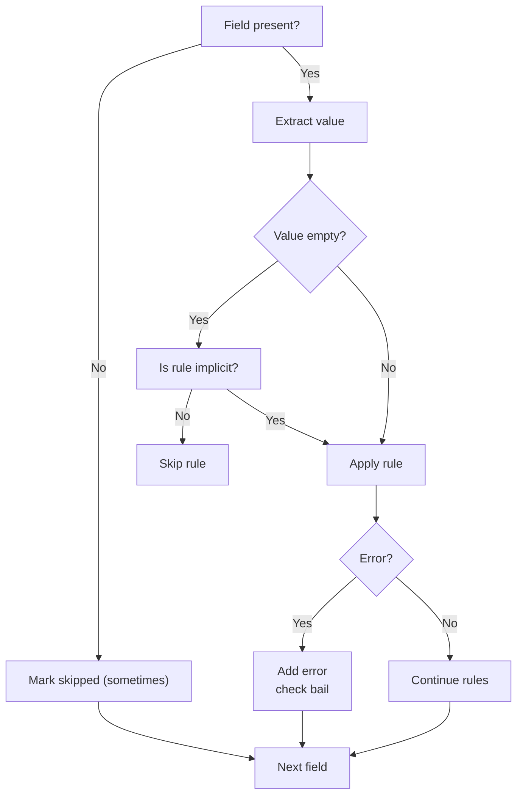

**Diagram sources**
- [ValidatorEngine.php](file://src/Execution/ValidatorEngine.php#L76-L94)
- [CompiledField.php](file://src/Execution/CompiledField.php#L138-L146)
- [SometimesRule.php](file://src/Rules/SometimesRule.php#L15-L18)
- [BailRule.php](file://src/Rules/BailRule.php#L15-L18)
- [NullableRule.php](file://src/Rules/NullableRule.php#L12-L16)
- [RequiredRule.php](file://src/Rules/RequiredRule.php#L12-L27)

**Section sources**
- [ValidatorEngine.php](file://src/Execution/ValidatorEngine.php#L76-L94)
- [CompiledField.php](file://src/Execution/CompiledField.php#L138-L146)
- [SometimesRule.php](file://src/Rules/SometimesRule.php#L15-L18)
- [BailRule.php](file://src/Rules/BailRule.php#L15-L18)
- [NullableRule.php](file://src/Rules/NullableRule.php#L12-L16)
- [RequiredRule.php](file://src/Rules/RequiredRule.php#L12-L27)

### Field Exclusion Handling
- Always-excluded fields: CompiledField sets isAlwaysExcluded; ValidatorEngine records and skips immediately.
- Dynamic exclusion rules: CompiledField collects exclusion rules; ValidatorEngine evaluates shouldExclude(context) per field and skips if true.
- Excluded fields are included in ValidationResult for downstream processing (e.g., removing from validated payload).

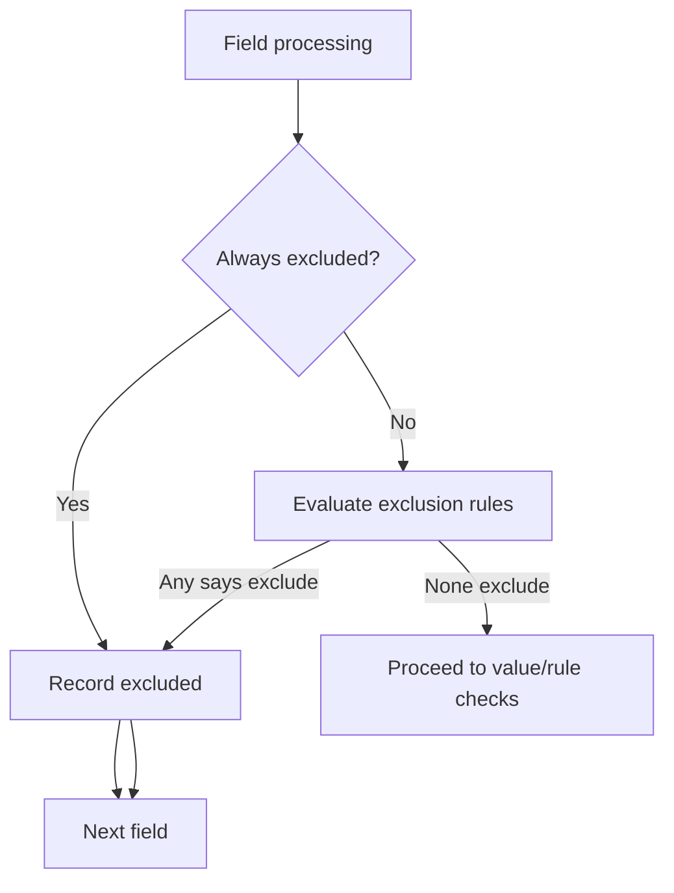

**Diagram sources**
- [CompiledField.php](file://src/Execution/CompiledField.php#L148-L161)
- [ValidatorEngine.php](file://src/Execution/ValidatorEngine.php#L58-L61)
- [ExcludeRule.php](file://src/Rules/ExcludeRule.php#L15-L18)

**Section sources**
- [CompiledField.php](file://src/Execution/CompiledField.php#L148-L161)
- [ValidatorEngine.php](file://src/Execution/ValidatorEngine.php#L58-L61)
- [ExcludeRule.php](file://src/Rules/ExcludeRule.php#L15-L18)

### Integration with CompiledSchema, DataHelper, and ValidationContext
- CompiledSchema drives field iteration and passes CompiledField instances to ValidatorEngine.
- CompiledField.getValue uses ValidationContext for nested access when applicable.
- DataHelper supports dot-notation retrieval used by ValidationContext and CompiledField.

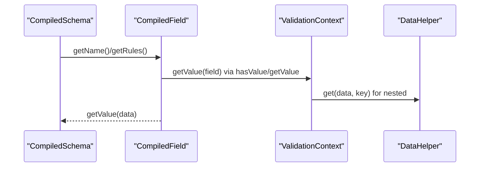

**Diagram sources**
- [CompiledSchema.php](file://src/Execution/CompiledSchema.php#L49-L52)
- [CompiledField.php](file://src/Execution/CompiledField.php#L163-L175)
- [ValidationContext.php](file://src/Execution/ValidationContext.php#L43-L58)
- [DataHelper.php](file://src/Execution/DataHelper.php#L15-L30)

**Section sources**
- [CompiledSchema.php](file://src/Execution/CompiledSchema.php#L49-L52)
- [CompiledField.php](file://src/Execution/CompiledField.php#L163-L175)
- [ValidationContext.php](file://src/Execution/ValidationContext.php#L43-L58)
- [DataHelper.php](file://src/Execution/DataHelper.php#L15-L30)

### Batch and Chunked Validation
- BatchValidationResult holds multiple ValidationResult instances and supports streaming iteration, counting, and filtering failures.
- ChunkedValidator processes large datasets in fixed-size chunks, supporting callbacks, generators, and failure-only streams.

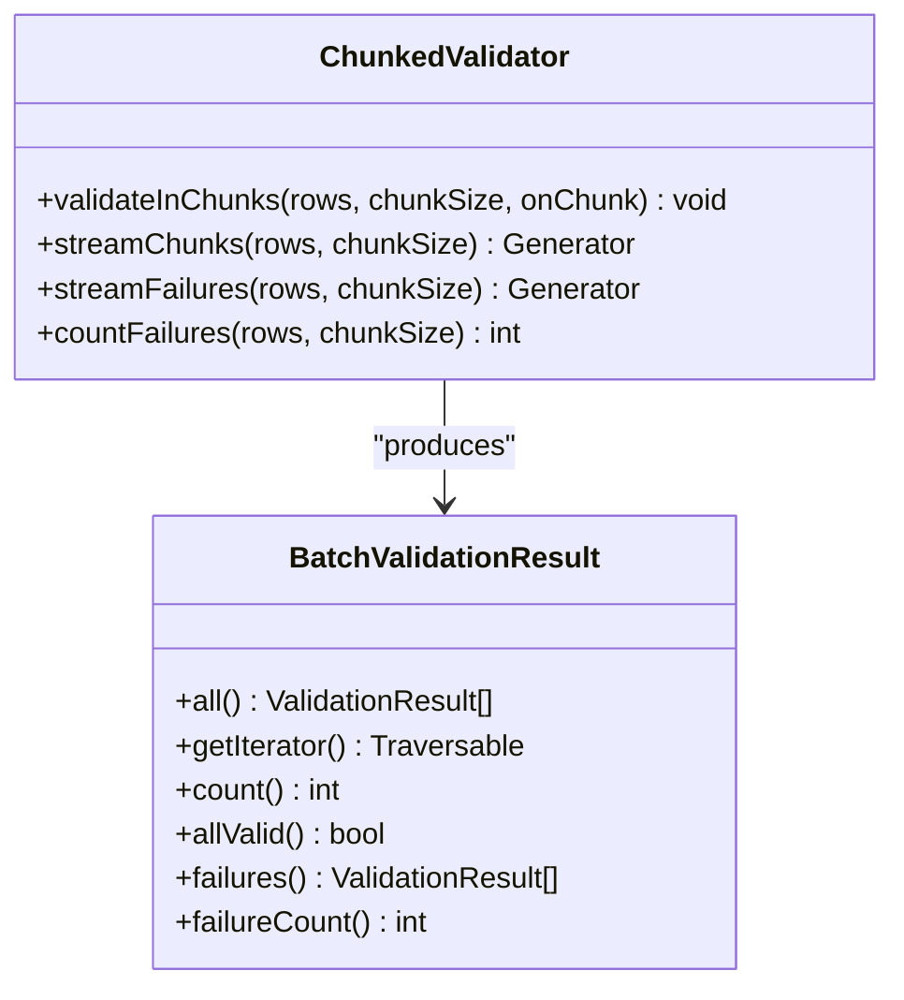

**Diagram sources**
- [BatchValidationResult.php](file://src/Execution/BatchValidationResult.php#L23-L90)
- [ChunkedValidator.php](file://src/Execution/ChunkedValidator.php#L34-L127)

**Section sources**
- [BatchValidationResult.php](file://src/Execution/BatchValidationResult.php#L23-L90)
- [ChunkedValidator.php](file://src/Execution/ChunkedValidator.php#L34-L127)

### NativeValidator — Precompiled Closure Execution
- NativeValidator wraps a precompiled closure returning an associative result with errors and excluded fields, then constructs ValidationResult.

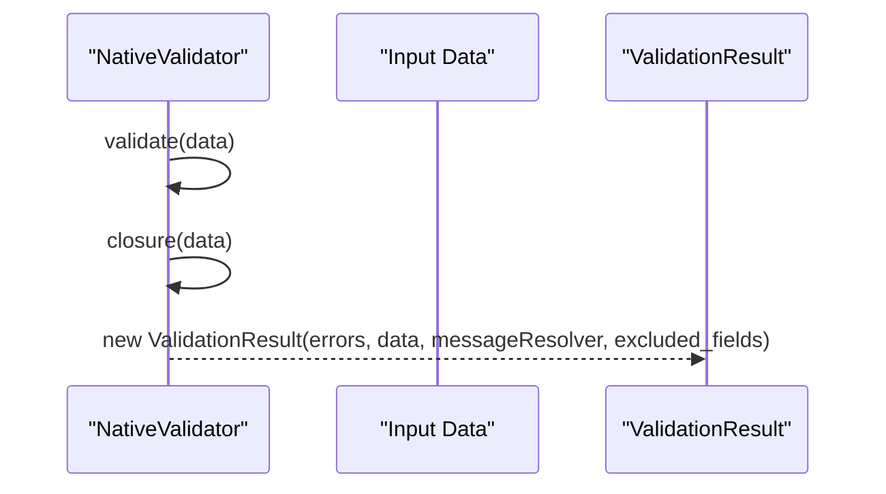

**Diagram sources**
- [NativeValidator.php](file://src/Execution/NativeValidator.php#L27-L37)

**Section sources**
- [NativeValidator.php](file://src/Execution/NativeValidator.php#L27-L37)

## Dependency Analysis
- ValidatorEngine depends on CompiledSchema for field enumeration, CompiledField for per-field metadata and value extraction, ValidationContext for data access and error collection, and ErrorCollector for aggregated errors.
- CompiledField depends on RuleInterface implementations and marker rules to reorder and deduplicate rules.
- ValidationResult depends on ErrorCollector and optionally MessageResolver for message formatting.
- ChunkedValidator depends on SchemaValidator to validate batches and produces BatchValidationResult.

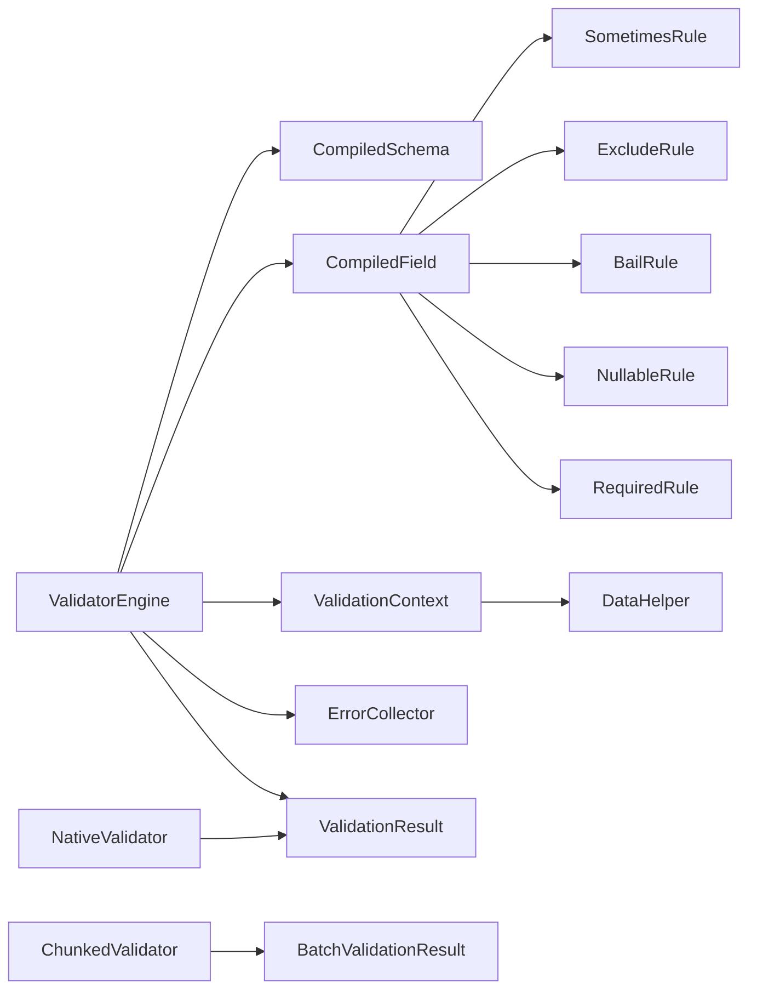

**Diagram sources**
- [ValidatorEngine.php](file://src/Execution/ValidatorEngine.php#L33-L98)
- [CompiledSchema.php](file://src/Execution/CompiledSchema.php#L27-L66)
- [CompiledField.php](file://src/Execution/CompiledField.php#L115-L176)
- [ValidationContext.php](file://src/Execution/ValidationContext.php#L17-L97)
- [DataHelper.php](file://src/Execution/DataHelper.php#L15-L30)
- [ErrorCollector.php](file://src/Execution/ErrorCollector.php#L17-L49)
- [ValidationResult.php](file://src/Execution/ValidationResult.php#L22-L96)
- [BatchValidationResult.php](file://src/Execution/BatchValidationResult.php#L23-L90)
- [ChunkedValidator.php](file://src/Execution/ChunkedValidator.php#L34-L127)
- [NativeValidator.php](file://src/Execution/NativeValidator.php#L27-L37)
- [SometimesRule.php](file://src/Rules/SometimesRule.php#L15-L18)
- [ExcludeRule.php](file://src/Rules/ExcludeRule.php#L15-L18)
- [BailRule.php](file://src/Rules/BailRule.php#L15-L18)
- [NullableRule.php](file://src/Rules/NullableRule.php#L12-L16)
- [RequiredRule.php](file://src/Rules/RequiredRule.php#L12-L27)

**Section sources**
- [ValidatorEngine.php](file://src/Execution/ValidatorEngine.php#L33-L98)
- [CompiledSchema.php](file://src/Execution/CompiledSchema.php#L27-L66)
- [CompiledField.php](file://src/Execution/CompiledField.php#L115-L176)
- [ValidationContext.php](file://src/Execution/ValidationContext.php#L17-L97)
- [DataHelper.php](file://src/Execution/DataHelper.php#L15-L30)
- [ErrorCollector.php](file://src/Execution/ErrorCollector.php#L17-L49)
- [ValidationResult.php](file://src/Execution/ValidationResult.php#L22-L96)
- [BatchValidationResult.php](file://src/Execution/BatchValidationResult.php#L23-L90)
- [ChunkedValidator.php](file://src/Execution/ChunkedValidator.php#L34-L127)
- [NativeValidator.php](file://src/Execution/NativeValidator.php#L27-L37)

## Performance Considerations
- Early exits:
  - failFast stops validation once any error is encountered.
  - maxErrors halts further processing when the error threshold is reached.
  - Field-level bail stops applying subsequent rules after the first failure for that field.
- Rule ordering:
  - Marker rules (Bail, Required, Nullable) are prioritized to enable early decisions and reduce unnecessary evaluations.
- Empty value handling:
  - Non-implicit rules are skipped on empty values, avoiding expensive checks.
- Nested access:
  - Dot-notation retrieval is linear per level; keep nesting shallow for performance.
- Batch and chunked processing:
  - ChunkedValidator processes data in fixed-size buffers to limit memory usage during large-scale validation.
- Precompiled execution:
  - NativeValidator executes a precompiled closure for maximum throughput when applicable.

[No sources needed since this section provides general guidance]

## Troubleshooting Guide
- No errors recorded despite failures:
  - Verify failFast/maxErrors thresholds and ensure errors are being added via ValidationContext::addError.
- Unexpectedly skipped fields:
  - Check “sometimes” presence via ValidationContext::hasValue and CompiledField::isSometimes.
  - Confirm exclusion rules (AlwaysExcluded or dynamic exclusion rules) via CompiledField::shouldExclude.
- “Nullable” fields still failing:
  - Remember that Nullable is a marker; explicit rules like Required still apply. Ensure Required is not conflicting unintentionally.
- Performance bottlenecks:
  - Reduce rule count per field, leverage bail, and ensure marker rules are ordered properly.
  - Use ChunkedValidator for large datasets and NativeValidator when possible.

**Section sources**
- [ValidatorEngine.php](file://src/Execution/ValidatorEngine.php#L148-L159)
- [CompiledField.php](file://src/Execution/CompiledField.php#L148-L161)
- [ValidationContext.php](file://src/Execution/ValidationContext.php#L60-L73)
- [ChunkedValidator.php](file://src/Execution/ChunkedValidator.php#L34-L127)
- [NativeValidator.php](file://src/Execution/NativeValidator.php#L27-L37)

## Conclusion
The execution pipeline is designed for clarity, performance, and scalability. ValidatorEngine orchestrates a deterministic, early-exit-friendly flow that respects field-level and global constraints. CompiledSchema and CompiledField provide efficient traversal and rule ordering, while ValidationContext and DataHelper offer robust data access. Batch and chunked processing enable handling of large datasets, and NativeValidator unlocks precompiled performance. Proper use of marker rules and conditional logic ensures predictable behavior and optimal throughput.