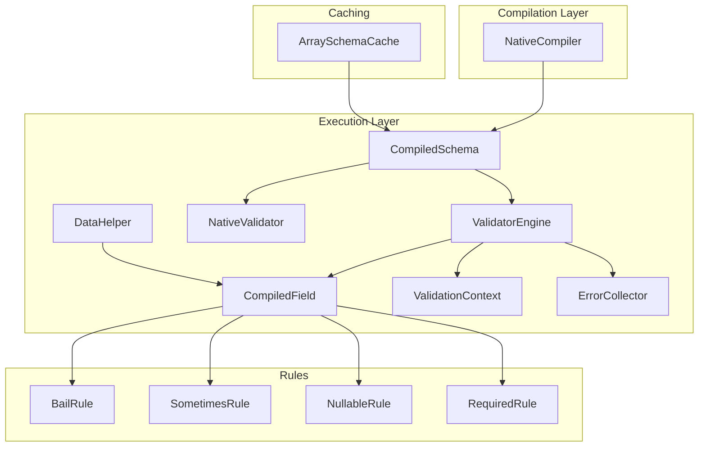
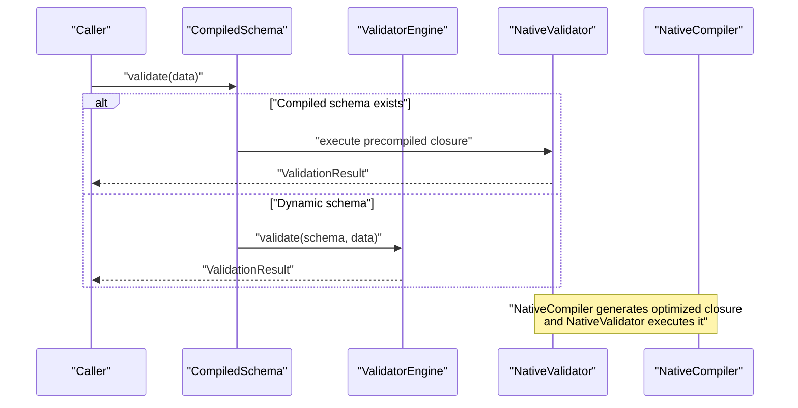
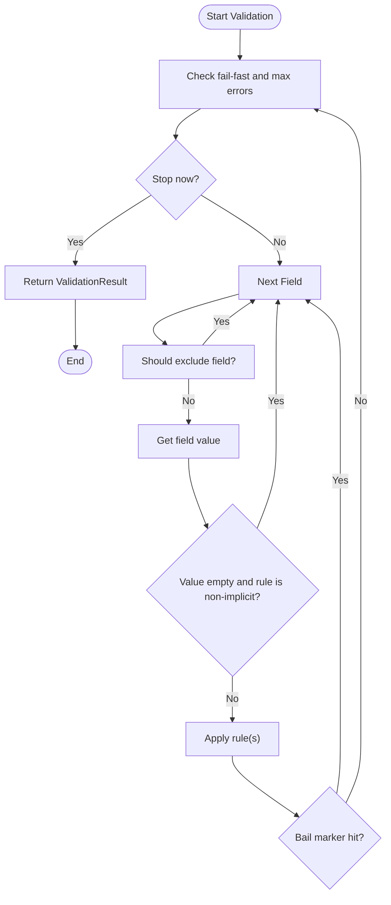
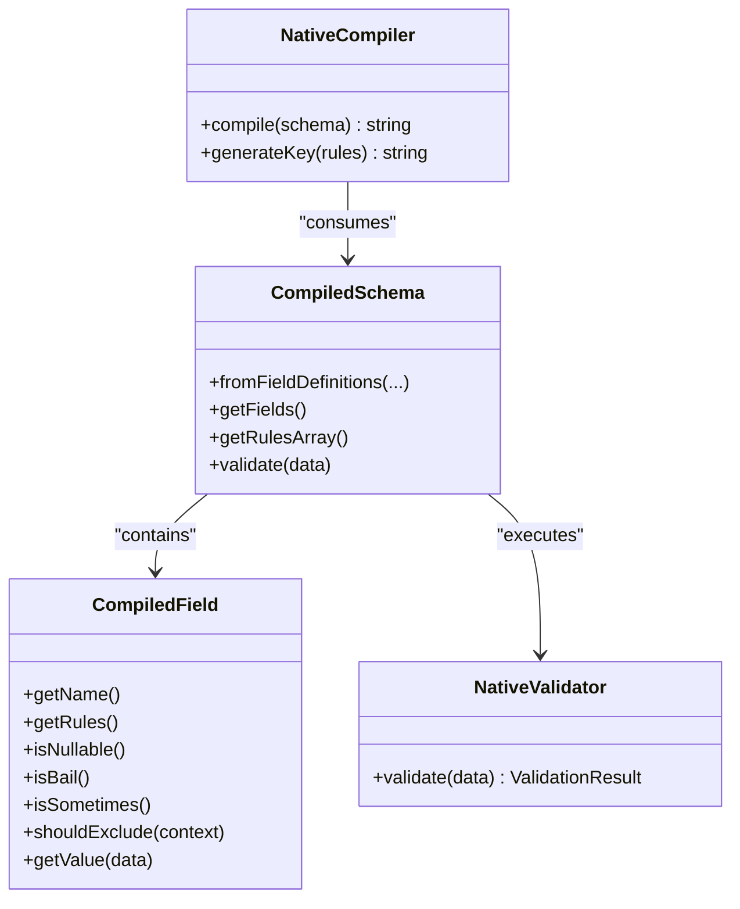
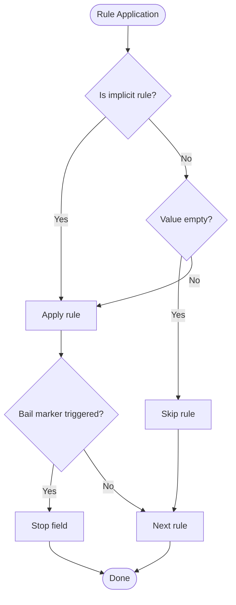
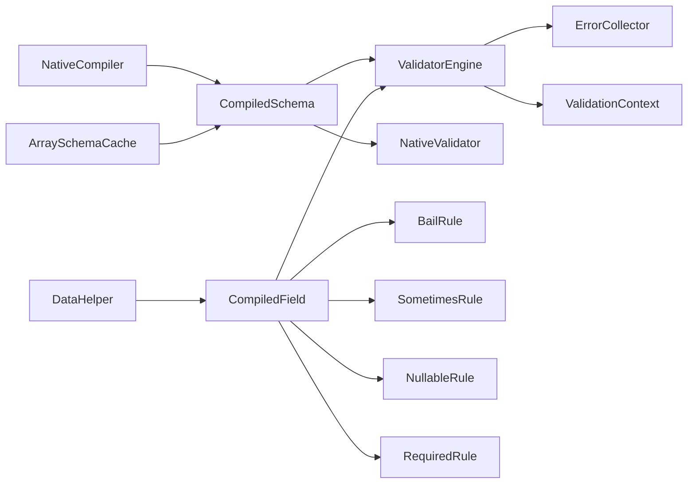

# Performance Optimizations

<cite>
**Referenced Files in This Document**
- [CompiledSchema.php](file://src/Execution/CompiledSchema.php)
- [NativeCompiler.php](file://src/Compilation/NativeCompiler.php)
- [NativeValidator.php](file://src/Execution/NativeValidator.php)
- [ValidatorEngine.php](file://src/Execution/ValidatorEngine.php)
- [CompiledField.php](file://src/Execution/CompiledField.php)
- [ErrorCollector.php](file://src/Execution/ErrorCollector.php)
- [ValidationContext.php](file://src/Execution/ValidationContext.php)
- [DataHelper.php](file://src/Execution/DataHelper.php)
- [ArraySchemaCache.php](file://src/Cache/ArraySchemaCache.php)
- [RequiredRule.php](file://src/Rules/RequiredRule.php)
- [BailRule.php](file://src/Rules/BailRule.php)
- [SometimesRule.php](file://src/Rules/SometimesRule.php)
- [NullableRule.php](file://src/Rules/NullableRule.php)
- [benchmark.php](file://tests/benchmark.php)
- [final_benchmark.php](file://tests/final_benchmark.php)
</cite>

## Table of Contents
1. [Introduction](#introduction)
2. [Project Structure](#project-structure)
3. [Core Components](#core-components)
4. [Architecture Overview](#architecture-overview)
5. [Detailed Component Analysis](#detailed-component-analysis)
6. [Dependency Analysis](#dependency-analysis)
7. [Performance Considerations](#performance-considerations)
8. [Troubleshooting Guide](#troubleshooting-guide)
9. [Conclusion](#conclusion)
10. [Appendices](#appendices)

## Introduction
This document focuses on performance optimization techniques in the validation engine. It explains fail-fast execution strategies, early termination conditions, memory management, and the impact of CompiledSchema optimization on validation speed. It also covers rule application shortcuts, short-circuit evaluation patterns, max errors limiting, implicit rule detection for skipping empty values, and performance characteristics across different validation scenarios. Benchmarking data and best practices for high-throughput workloads are included.

## Project Structure
The validation engine is composed of:
- Execution layer: CompiledSchema, ValidatorEngine, NativeValidator, CompiledField, ValidationContext, ErrorCollector, DataHelper
- Compilation layer: NativeCompiler (generates optimized PHP closures)
- Caching: ArraySchemaCache (in-memory schema caching)
- Rules: Marker and functional rules (e.g., BailRule, SometimesRule, NullableRule, RequiredRule)

**Diagram sources**
- [CompiledSchema.php](file://src/Execution/CompiledSchema.php#L9-L67)
- [CompiledField.php](file://src/Execution/CompiledField.php#L10-L176)
- [ValidatorEngine.php](file://src/Execution/ValidatorEngine.php#L11-L176)
- [NativeCompiler.php](file://src/Compilation/NativeCompiler.php#L17-L309)
- [NativeValidator.php](file://src/Execution/NativeValidator.php#L12-L38)
- [ValidationContext.php](file://src/Execution/ValidationContext.php#L7-L97)
- [ErrorCollector.php](file://src/Execution/ErrorCollector.php#L7-L50)
- [DataHelper.php](file://src/Execution/DataHelper.php#L10-L31)
- [ArraySchemaCache.php](file://src/Cache/ArraySchemaCache.php#L9-L74)
- [BailRule.php](file://src/Rules/BailRule.php#L12-L19)
- [SometimesRule.php](file://src/Rules/SometimesRule.php#L12-L19)
- [NullableRule.php](file://src/Rules/NullableRule.php#L9-L17)
- [RequiredRule.php](file://src/Rules/RequiredRule.php#L10-L28)

**Section sources**
- [CompiledSchema.php](file://src/Execution/CompiledSchema.php#L9-L67)
- [NativeCompiler.php](file://src/Compilation/NativeCompiler.php#L17-L309)
- [ValidatorEngine.php](file://src/Execution/ValidatorEngine.php#L11-L176)
- [CompiledField.php](file://src/Execution/CompiledField.php#L10-L176)
- [NativeValidator.php](file://src/Execution/NativeValidator.php#L12-L38)
- [ValidationContext.php](file://src/Execution/ValidationContext.php#L7-L97)
- [ErrorCollector.php](file://src/Execution/ErrorCollector.php#L7-L50)
- [DataHelper.php](file://src/Execution/DataHelper.php#L10-L31)
- [ArraySchemaCache.php](file://src/Cache/ArraySchemaCache.php#L9-L74)
- [BailRule.php](file://src/Rules/BailRule.php#L12-L19)
- [SometimesRule.php](file://src/Rules/SometimesRule.php#L12-L19)
- [NullableRule.php](file://src/Rules/NullableRule.php#L9-L17)
- [RequiredRule.php](file://src/Rules/RequiredRule.php#L10-L28)

## Core Components
- CompiledSchema: Holds compiled fields and rules array; delegates validation to ValidatorEngine or NativeValidator.
- CompiledField: Encapsulates per-field metadata and rule ordering; supports deduplication and fast-fail reordering.
- ValidatorEngine: Implements fail-fast, max errors limiting, implicit rule detection, bail short-circuiting, and exclusion rules.
- NativeCompiler: Generates optimized PHP closures with inlined rule checks and short-circuit logic.
- NativeValidator: Executes precompiled closures for maximum throughput.
- ValidationContext: Provides shared context (data, errors, optional services) to rules.
- ErrorCollector: Efficiently accumulates errors and tracks counts.
- DataHelper: Safe nested data access for dot notation.
- ArraySchemaCache: In-memory caching of CompiledSchema keyed by compiler version and PHP version.

**Section sources**
- [CompiledSchema.php](file://src/Execution/CompiledSchema.php#L9-L67)
- [CompiledField.php](file://src/Execution/CompiledField.php#L10-L176)
- [ValidatorEngine.php](file://src/Execution/ValidatorEngine.php#L11-L176)
- [NativeCompiler.php](file://src/Compilation/NativeCompiler.php#L17-L309)
- [NativeValidator.php](file://src/Execution/NativeValidator.php#L12-L38)
- [ValidationContext.php](file://src/Execution/ValidationContext.php#L7-L97)
- [ErrorCollector.php](file://src/Execution/ErrorCollector.php#L7-L50)
- [DataHelper.php](file://src/Execution/DataHelper.php#L10-L31)
- [ArraySchemaCache.php](file://src/Cache/ArraySchemaCache.php#L9-L74)

## Architecture Overview
The engine supports two execution modes:
- Dynamic mode via ValidatorEngine: flexible, configurable fail-fast and max errors.
- Compiled mode via NativeCompiler/NativeValidator: high-throughput, inlined rule checks.

**Diagram sources**
- [CompiledSchema.php](file://src/Execution/CompiledSchema.php#L59-L66)
- [ValidatorEngine.php](file://src/Execution/ValidatorEngine.php#L33-L97)
- [NativeValidator.php](file://src/Execution/NativeValidator.php#L27-L37)
- [NativeCompiler.php](file://src/Compilation/NativeCompiler.php#L24-L51)

## Detailed Component Analysis

### Fail-Fast Execution Strategies and Early Termination
- Fail-fast: When enabled, validation stops immediately upon encountering the first error.
- Max errors limiting: Stops processing further fields/rules once the configured error threshold is reached.
- Bail short-circuiting: Within a field, if a bail marker is present and a rule fails, processing stops for that field.
- Exclusion rules: Fields marked excluded are skipped entirely.

**Diagram sources**
- [ValidatorEngine.php](file://src/Execution/ValidatorEngine.php#L148-L159)
- [ValidatorEngine.php](file://src/Execution/ValidatorEngine.php#L76-L94)
- [CompiledField.php](file://src/Execution/CompiledField.php#L148-L161)

**Section sources**
- [ValidatorEngine.php](file://src/Execution/ValidatorEngine.php#L148-L159)
- [ValidatorEngine.php](file://src/Execution/ValidatorEngine.php#L76-L94)
- [CompiledField.php](file://src/Execution/CompiledField.php#L148-L161)

### Memory Management During Validation
- Reuse of shared objects: ValidatorEngine constructs ErrorCollector and ValidationContext once and resets state between runs.
- Minimal allocations: NativeCompiler emits tight loops with local variables and avoids repeated object creation.
- In-place error accumulation: ErrorCollector stores errors in arrays keyed by field, minimizing overhead.

**Section sources**
- [ValidatorEngine.php](file://src/Execution/ValidatorEngine.php#L33-L44)
- [ErrorCollector.php](file://src/Execution/ErrorCollector.php#L17-L25)
- [NativeCompiler.php](file://src/Compilation/NativeCompiler.php#L24-L51)

### CompiledSchema Optimization Impact
- CompiledSchema encapsulates CompiledField instances and a rules array, delegating validation to either ValidatorEngine or NativeValidator.
- NativeCompiler compiles a closure that:
  - Extracts values using efficient getters (direct array access or DataHelper for nested).
  - Applies sometimes/nullable/bail logic via generated control flow.
  - Inlines common rules to reduce function call overhead.
  - Emits bail labels and goto statements for short-circuiting.
- NativeValidator executes the generated closure directly, returning a structured result.

**Diagram sources**
- [CompiledSchema.php](file://src/Execution/CompiledSchema.php#L27-L66)
- [CompiledField.php](file://src/Execution/CompiledField.php#L115-L176)
- [NativeCompiler.php](file://src/Compilation/NativeCompiler.php#L24-L114)
- [NativeValidator.php](file://src/Execution/NativeValidator.php#L27-L37)

**Section sources**
- [CompiledSchema.php](file://src/Execution/CompiledSchema.php#L27-L66)
- [NativeCompiler.php](file://src/Compilation/NativeCompiler.php#L24-L114)
- [NativeValidator.php](file://src/Execution/NativeValidator.php#L27-L37)

### Rule Application Shortcuts and Short-Circuit Evaluation
- Implicit vs non-implicit rules:
  - Non-implicit rules are skipped when the value is empty (null, empty string, empty array).
  - Implicit rules (required-like, accepted-like, prohibited-like, present) handle emptiness internally.
- Compiled inlining:
  - NativeCompiler detects supported rule classes and emits inlined checks for common rules (type checks, min/max, regex, filters, JSON).
  - Non-inlined rules fall back to dynamic dispatch.
- Bail and sometimes:
  - Bail marker triggers early exit from a field’s rule chain.
  - Sometimes marker skips processing if the field is absent from data.

**Diagram sources**
- [ValidatorEngine.php](file://src/Execution/ValidatorEngine.php#L76-L94)
- [ValidatorEngine.php](file://src/Execution/ValidatorEngine.php#L127-L146)
- [NativeCompiler.php](file://src/Compilation/NativeCompiler.php#L131-L172)
- [CompiledField.php](file://src/Execution/CompiledField.php#L72-L113)

**Section sources**
- [ValidatorEngine.php](file://src/Execution/ValidatorEngine.php#L76-L94)
- [ValidatorEngine.php](file://src/Execution/ValidatorEngine.php#L127-L146)
- [NativeCompiler.php](file://src/Compilation/NativeCompiler.php#L131-L172)
- [CompiledField.php](file://src/Execution/CompiledField.php#L72-L113)

### Max Errors Limiting and Early Termination
- ValidatorEngine enforces two early-stop conditions:
  - Fail-fast: stop when any error occurs.
  - Max errors: stop when the total error count reaches the configured limit.
- ErrorCollector tracks counts efficiently and exposes hasErrors/count/all APIs.

**Section sources**
- [ValidatorEngine.php](file://src/Execution/ValidatorEngine.php#L148-L159)
- [ErrorCollector.php](file://src/Execution/ErrorCollector.php#L33-L49)

### Implicit Rule Detection for Skipping Empty Values
- ValidatorEngine determines whether a rule is implicit by checking against a predefined list of implicit rule classes.
- Non-implicit rules are skipped when the value is empty, avoiding unnecessary computation.

**Section sources**
- [ValidatorEngine.php](file://src/Execution/ValidatorEngine.php#L127-L146)
- [RequiredRule.php](file://src/Rules/RequiredRule.php#L10-L28)

### Performance Characteristics Across Scenarios
- Compiled vs dynamic:
  - Compiled mode reduces overhead by eliminating reflection and dynamic dispatch, replacing them with generated PHP code.
  - Dynamic mode offers flexibility and configurability (fail-fast, max errors).
- Nested data access:
  - Direct array access for simple fields; DataHelper for dot notation.
- Rule inlining:
  - Inlined rules minimize function call overhead and improve CPU locality.
- Bail and sometimes:
  - Reduce total work by exiting early from fields and skipping absent values.

**Section sources**
- [NativeCompiler.php](file://src/Compilation/NativeCompiler.php#L116-L129)
- [DataHelper.php](file://src/Execution/DataHelper.php#L15-L30)
- [CompiledField.php](file://src/Execution/CompiledField.php#L163-L175)

## Dependency Analysis

**Diagram sources**
- [NativeCompiler.php](file://src/Compilation/NativeCompiler.php#L17-L309)
- [CompiledSchema.php](file://src/Execution/CompiledSchema.php#L9-L67)
- [ValidatorEngine.php](file://src/Execution/ValidatorEngine.php#L11-L176)
- [NativeValidator.php](file://src/Execution/NativeValidator.php#L12-L38)
- [CompiledField.php](file://src/Execution/CompiledField.php#L10-L176)
- [ErrorCollector.php](file://src/Execution/ErrorCollector.php#L7-L50)
- [ValidationContext.php](file://src/Execution/ValidationContext.php#L7-L97)
- [DataHelper.php](file://src/Execution/DataHelper.php#L10-L31)
- [ArraySchemaCache.php](file://src/Cache/ArraySchemaCache.php#L9-L74)
- [BailRule.php](file://src/Rules/BailRule.php#L12-L19)
- [SometimesRule.php](file://src/Rules/SometimesRule.php#L12-L19)
- [NullableRule.php](file://src/Rules/NullableRule.php#L9-L17)
- [RequiredRule.php](file://src/Rules/RequiredRule.php#L10-L28)

**Section sources**
- [NativeCompiler.php](file://src/Compilation/NativeCompiler.php#L17-L309)
- [CompiledSchema.php](file://src/Execution/CompiledSchema.php#L9-L67)
- [ValidatorEngine.php](file://src/Execution/ValidatorEngine.php#L11-L176)
- [NativeValidator.php](file://src/Execution/NativeValidator.php#L12-L38)
- [CompiledField.php](file://src/Execution/CompiledField.php#L10-L176)
- [ErrorCollector.php](file://src/Execution/ErrorCollector.php#L7-L50)
- [ValidationContext.php](file://src/Execution/ValidationContext.php#L7-L97)
- [DataHelper.php](file://src/Execution/DataHelper.php#L10-L31)
- [ArraySchemaCache.php](file://src/Cache/ArraySchemaCache.php#L9-L74)
- [BailRule.php](file://src/Rules/BailRule.php#L12-L19)
- [SometimesRule.php](file://src/Rules/SometimesRule.php#L12-L19)
- [NullableRule.php](file://src/Rules/NullableRule.php#L9-L17)
- [RequiredRule.php](file://src/Rules/RequiredRule.php#L10-L28)

## Performance Considerations
- Prefer compiled schemas for high-throughput workloads:
  - NativeCompiler generates optimized closures that eliminate reflection and reduce function call overhead.
  - NativeValidator executes the closure directly, minimizing allocations.
- Enable fail-fast when acceptable to cut latency on first error.
- Tune max errors to balance completeness with throughput.
- Use bail strategically to stop expensive rule chains early within a field.
- Leverage sometimes to avoid processing absent fields.
- Use nullable to skip downstream rules when a field is null.
- Cache CompiledSchema using ArraySchemaCache keyed by compiler and PHP version to avoid recompilation.

Benchmarking highlights:
- A baseline benchmark validates 10,000 records and reports throughput.
- A final benchmark compiles a schema, verifies parity, and measures 50,000 validations with high throughput and microsecond average time per validation.

Best practices:
- Favor compiled mode for production hot paths.
- Keep rule sets minimal and ordered; rely on fast-fail reordering.
- Avoid heavy database/password checks in hot paths; inject external validators sparingly.
- Monitor error collector growth and adjust max errors accordingly.

**Section sources**
- [benchmark.php](file://tests/benchmark.php#L12-L54)
- [final_benchmark.php](file://tests/final_benchmark.php#L62-L79)
- [NativeCompiler.php](file://src/Compilation/NativeCompiler.php#L24-L51)
- [NativeValidator.php](file://src/Execution/NativeValidator.php#L27-L37)
- [ValidatorEngine.php](file://src/Execution/ValidatorEngine.php#L148-L159)
- [ArraySchemaCache.php](file://src/Cache/ArraySchemaCache.php#L23-L29)

## Troubleshooting Guide
- Unexpectedly low throughput:
  - Verify compiled mode is active and closures are being executed.
  - Confirm fail-fast and max errors are configured appropriately.
- Excessive memory usage:
  - Ensure ErrorCollector is reused and not accumulating stale data.
  - Review max errors to prevent unbounded error lists.
- Incorrect early exits:
  - Check bail and sometimes markers placement.
  - Validate implicit rule classification for custom rules.
- Slow nested access:
  - Prefer simple fields when possible; confirm dot notation usage is necessary.

**Section sources**
- [ValidatorEngine.php](file://src/Execution/ValidatorEngine.php#L33-L44)
- [ErrorCollector.php](file://src/Execution/ErrorCollector.php#L27-L31)
- [CompiledField.php](file://src/Execution/CompiledField.php#L72-L113)
- [DataHelper.php](file://src/Execution/DataHelper.php#L15-L30)

## Conclusion
The validation engine achieves high performance through a combination of compiled closures, inlined rule checks, and aggressive short-circuiting. Fail-fast and max errors controls enable predictable latency, while implicit rule detection and bail/sometimes/nullable markers reduce unnecessary work. For high-throughput scenarios, prefer compiled schemas, tune configuration, and leverage caching.

## Appendices
- Benchmark scripts demonstrate preparation, parity checks, and throughput measurement for compiled schemas.

**Section sources**
- [benchmark.php](file://tests/benchmark.php#L12-L54)
- [final_benchmark.php](file://tests/final_benchmark.php#L24-L79)