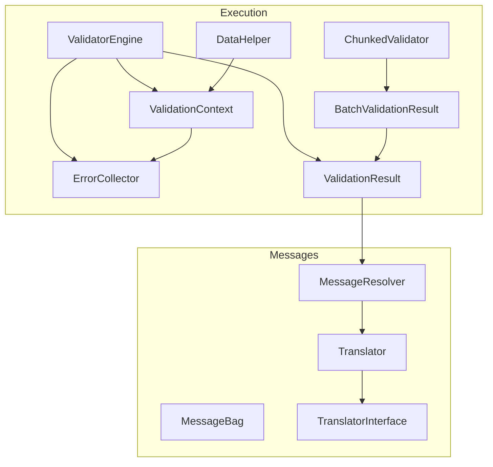
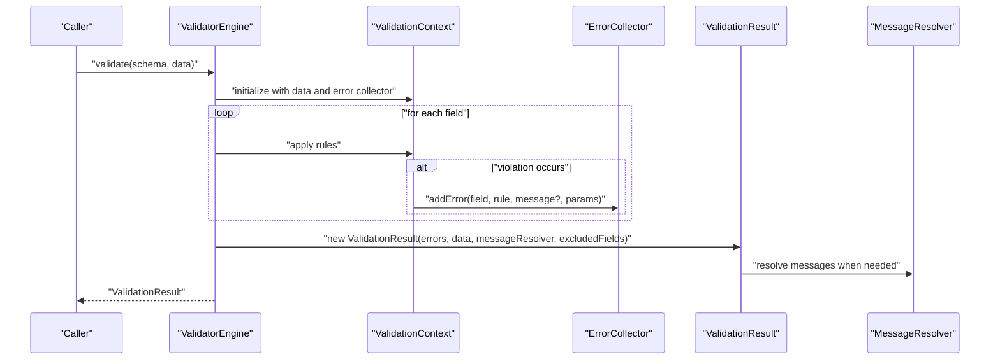
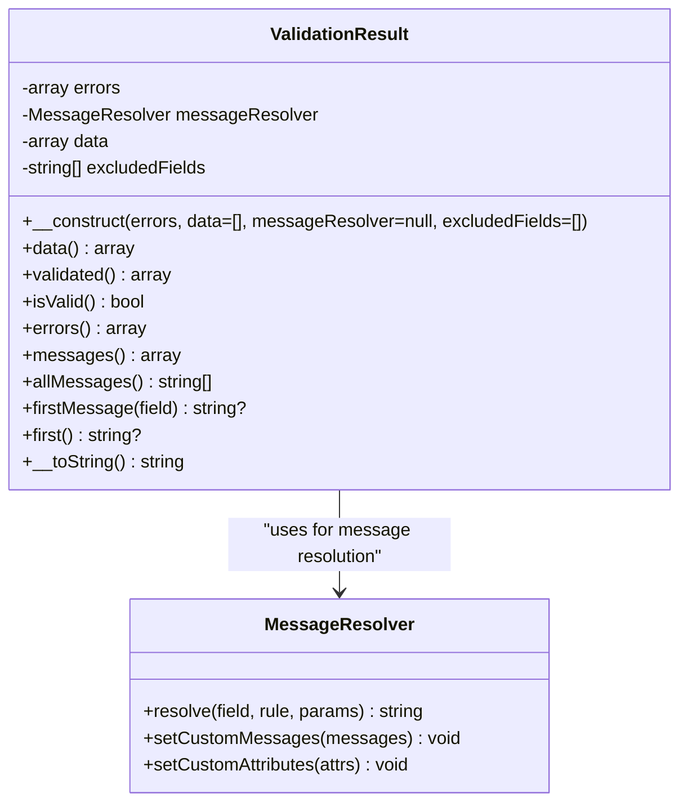
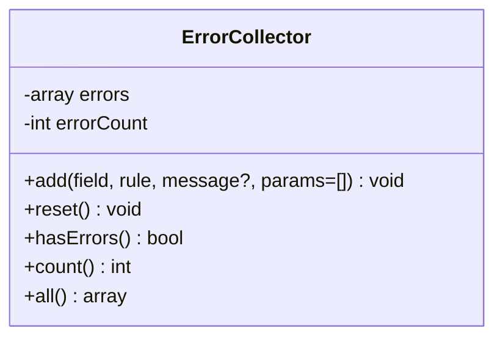
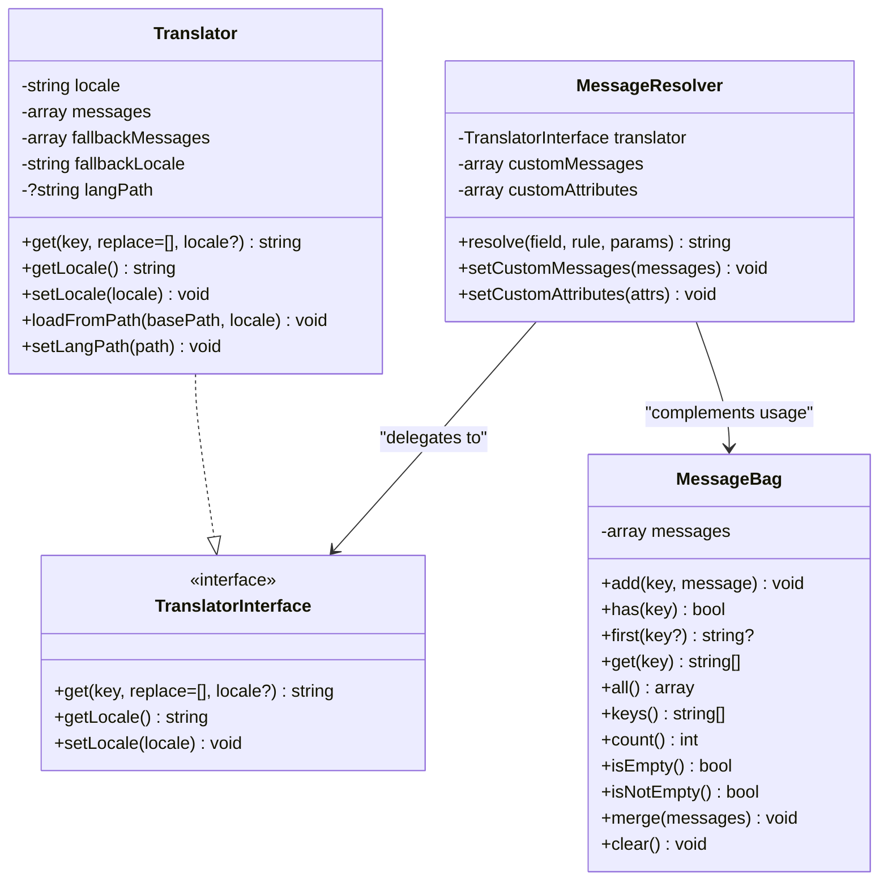
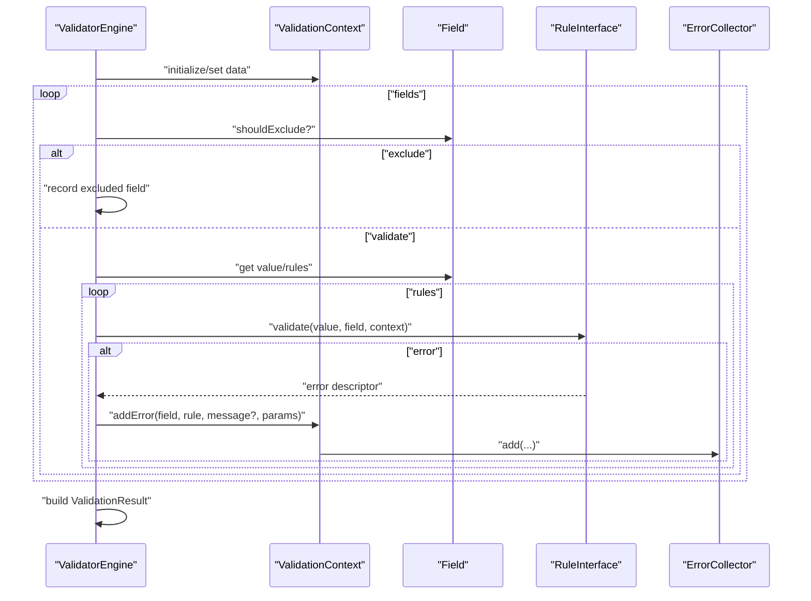
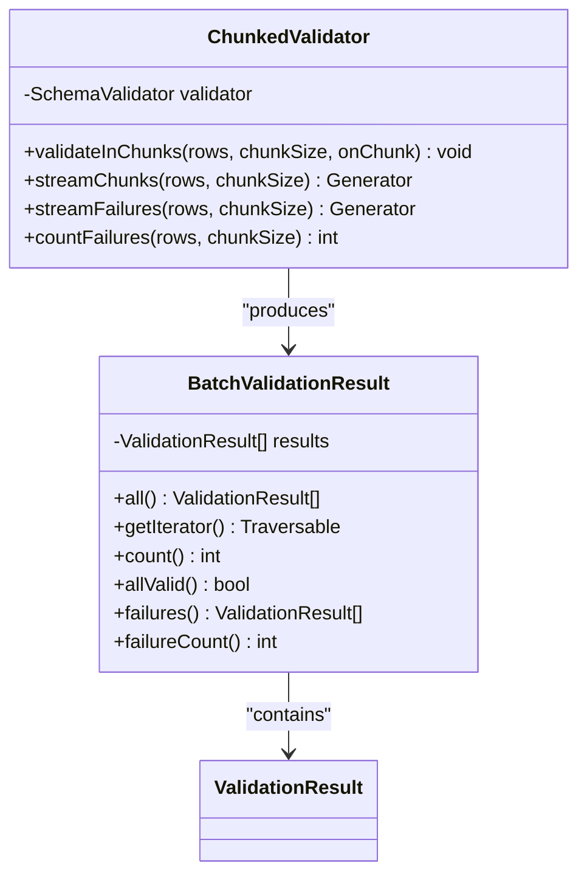
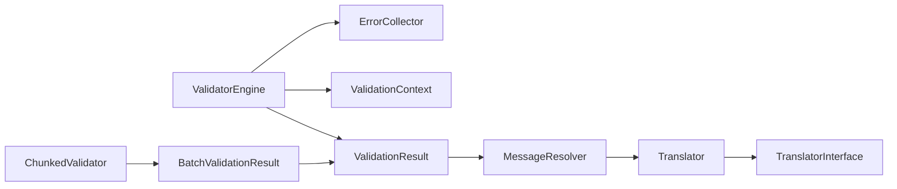

# Result Handling

<cite>
**Referenced Files in This Document**
- [ValidationResult.php](file://src/Execution/ValidationResult.php)
- [ErrorCollector.php](file://src/Execution/ErrorCollector.php)
- [BatchValidationResult.php](file://src/Execution/BatchValidationResult.php)
- [MessageResolver.php](file://src/Messages/MessageResolver.php)
- [MessageBag.php](file://src/Messages/MessageBag.php)
- [Translator.php](file://src/Messages/Translator.php)
- [TranslatorInterface.php](file://src/Messages/TranslatorInterface.php)
- [ValidatorEngine.php](file://src/Execution/ValidatorEngine.php)
- [ValidationContext.php](file://src/Execution/ValidationContext.php)
- [ChunkedValidator.php](file://src/Execution/ChunkedValidator.php)
- [DataHelper.php](file://src/Execution/DataHelper.php)
- [README.md](file://README.md)
</cite>

## Table of Contents
1. [Introduction](#introduction)
2. [Project Structure](#project-structure)
3. [Core Components](#core-components)
4. [Architecture Overview](#architecture-overview)
5. [Detailed Component Analysis](#detailed-component-analysis)
6. [Dependency Analysis](#dependency-analysis)
7. [Performance Considerations](#performance-considerations)
8. [Troubleshooting Guide](#troubleshooting-guide)
9. [Conclusion](#conclusion)

## Introduction
This document explains the validation result handling system, focusing on how validation outcomes are captured, organized, and consumed. It covers the ValidationResult class for representing success/failure states, aggregated errors, processed data, and formatted messages; the ErrorCollector mechanism for efficient aggregation; message resolution and formatting; and integration points with streaming and batch processing for memory efficiency. It also documents filtering, partial results, and performance optimizations.

## Project Structure
The validation result handling spans several modules:
- Execution: core runtime result types and engines
- Messages: message resolution and localization
- Schema and validators: orchestrate validation and produce results

**Diagram sources**
- [ValidatorEngine.php](file://src/Execution/ValidatorEngine.php#L1-L177)
- [ValidationContext.php](file://src/Execution/ValidationContext.php#L1-L98)
- [ErrorCollector.php](file://src/Execution/ErrorCollector.php#L1-L51)
- [ValidationResult.php](file://src/Execution/ValidationResult.php#L1-L142)
- [BatchValidationResult.php](file://src/Execution/BatchValidationResult.php#L1-L92)
- [ChunkedValidator.php](file://src/Execution/ChunkedValidator.php#L1-L154)
- [MessageResolver.php](file://src/Messages/MessageResolver.php#L1-L125)
- [Translator.php](file://src/Messages/Translator.php#L1-L290)
- [TranslatorInterface.php](file://src/Messages/TranslatorInterface.php#L1-L26)
- [MessageBag.php](file://src/Messages/MessageBag.php#L1-L97)
- [DataHelper.php](file://src/Execution/DataHelper.php#L1-L32)

**Section sources**
- [ValidatorEngine.php](file://src/Execution/ValidatorEngine.php#L1-L177)
- [ValidationResult.php](file://src/Execution/ValidationResult.php#L1-L142)
- [ErrorCollector.php](file://src/Execution/ErrorCollector.php#L1-L51)
- [MessageResolver.php](file://src/Messages/MessageResolver.php#L1-L125)
- [Translator.php](file://src/Messages/Translator.php#L1-L290)
- [BatchValidationResult.php](file://src/Execution/BatchValidationResult.php#L1-L92)
- [ChunkedValidator.php](file://src/Execution/ChunkedValidator.php#L1-L154)
- [DataHelper.php](file://src/Execution/DataHelper.php#L1-L32)

## Core Components
- ValidationResult: encapsulates validation outcome, raw errors, processed data, and formatted messages; supports success checks, filtered data, and message retrieval.
- ErrorCollector: aggregates rule violations with field, rule, parameters, and optional pre-resolved messages; tracks counts and exposes reset semantics.
- MessageResolver: resolves human-readable messages from custom or translated sources, replacing placeholders with attributes and parameters.
- MessageBag: a lightweight bag for grouping messages by key, supporting merging, counting, and retrieval.
- Translator and TranslatorInterface: provide locale-aware message lookup and replacement.
- ValidatorEngine: orchestrates validation, applies rules, manages fail-fast and error caps, and produces ValidationResult instances.
- ValidationContext: provides access to input data and error aggregation during validation.
- BatchValidationResult: holds multiple ValidationResult instances and supports streaming iteration and failure filtering.
- ChunkedValidator: processes large datasets in chunks, yielding partial results and failures for memory efficiency.
- DataHelper: utility for safe nested data access via dot notation.

**Section sources**
- [ValidationResult.php](file://src/Execution/ValidationResult.php#L1-L142)
- [ErrorCollector.php](file://src/Execution/ErrorCollector.php#L1-L51)
- [MessageResolver.php](file://src/Messages/MessageResolver.php#L1-L125)
- [MessageBag.php](file://src/Messages/MessageBag.php#L1-L97)
- [Translator.php](file://src/Messages/Translator.php#L1-L290)
- [TranslatorInterface.php](file://src/Messages/TranslatorInterface.php#L1-L26)
- [ValidatorEngine.php](file://src/Execution/ValidatorEngine.php#L1-L177)
- [ValidationContext.php](file://src/Execution/ValidationContext.php#L1-L98)
- [BatchValidationResult.php](file://src/Execution/BatchValidationResult.php#L1-L92)
- [ChunkedValidator.php](file://src/Execution/ChunkedValidator.php#L1-L154)
- [DataHelper.php](file://src/Execution/DataHelper.php#L1-L32)

## Architecture Overview
The system follows a staged flow:
- ValidatorEngine initializes ErrorCollector and ValidationContext.
- Rules are applied to fields; violations are recorded via ValidationContext->addError, which delegates to ErrorCollector.
- After validation, ValidatorEngine constructs ValidationResult with raw errors, input data, message resolver, and excluded fields.
- MessageResolver resolves messages from Translator, optionally using custom messages and attributes.
- BatchValidationResult and ChunkedValidator enable streaming and chunked processing for large datasets.

**Diagram sources**
- [ValidatorEngine.php](file://src/Execution/ValidatorEngine.php#L33-L98)
- [ValidationContext.php](file://src/Execution/ValidationContext.php#L93-L96)
- [ErrorCollector.php](file://src/Execution/ErrorCollector.php#L17-L25)
- [ValidationResult.php](file://src/Execution/ValidationResult.php#L22-L32)
- [MessageResolver.php](file://src/Messages/MessageResolver.php#L27-L52)

## Detailed Component Analysis

### ValidationResult
Responsibilities:
- Capture success/failure state via isValid().
- Store raw errors grouped by field with rule, parameters, and optional message.
- Hold processed input data and excluded fields.
- Provide formatted messages via MessageResolver when messages are null.
- Offer convenience accessors: data(), validated(), errors(), messages(), allMessages(), firstMessage(), first(), and string conversion.

Design highlights:
- Accepts either ErrorCollector or raw error arrays in constructor.
- validated() removes excluded fields from the stored data.
- messages() resolves messages lazily using MessageResolver when needed.
- __toString() prints a concise summary.

**Diagram sources**
- [ValidationResult.php](file://src/Execution/ValidationResult.php#L9-L142)
- [MessageResolver.php](file://src/Messages/MessageResolver.php#L7-L125)

**Section sources**
- [ValidationResult.php](file://src/Execution/ValidationResult.php#L1-L142)

### ErrorCollector
Responsibilities:
- Aggregate violations as arrays keyed by field.
- Track per-violation metadata: rule name, parameters, and optional pre-resolved message.
- Provide count and hasErrors checks.
- Expose all() for consumption by ValidationResult.

Optimization characteristics:
- Minimal allocations; stores only essential violation descriptors.
- Reset() allows reuse across validations.

**Diagram sources**
- [ErrorCollector.php](file://src/Execution/ErrorCollector.php#L7-L51)

**Section sources**
- [ErrorCollector.php](file://src/Execution/ErrorCollector.php#L1-L51)

### MessageResolver and MessageBag
MessageResolver:
- Resolves messages using precedence: field.rule, rule, then translated defaults.
- Supports type-specific messages (e.g., min, max, size, between) when params include a type.
- Replaces placeholders with attribute names and parameter values.

MessageBag:
- Lightweight container for grouping messages by key.
- Supports adding, retrieving, merging, counting, and clearing.

Integration:
- ValidationResult uses MessageResolver to format messages when raw errors lack resolved text.
- MessageResolver relies on TranslatorInterface and Translator for locale-aware lookups.

**Diagram sources**
- [MessageResolver.php](file://src/Messages/MessageResolver.php#L7-L125)
- [TranslatorInterface.php](file://src/Messages/TranslatorInterface.php#L7-L26)
- [Translator.php](file://src/Messages/Translator.php#L7-L290)
- [MessageBag.php](file://src/Messages/MessageBag.php#L7-L97)

**Section sources**
- [MessageResolver.php](file://src/Messages/MessageResolver.php#L1-L125)
- [MessageBag.php](file://src/Messages/MessageBag.php#L1-L97)
- [Translator.php](file://src/Messages/Translator.php#L1-L290)
- [TranslatorInterface.php](file://src/Messages/TranslatorInterface.php#L1-L26)

### ValidatorEngine and ValidationContext
ValidatorEngine:
- Manages fail-fast and max-errors thresholds.
- Iterates fields, applies rules, and records violations.
- Produces ValidationResult with excluded fields and message resolver.

ValidationContext:
- Provides getValue and hasValue helpers for dot-notation access.
- Delegates error recording to ErrorCollector.

**Diagram sources**
- [ValidatorEngine.php](file://src/Execution/ValidatorEngine.php#L33-L98)
- [ValidationContext.php](file://src/Execution/ValidationContext.php#L43-L96)
- [ErrorCollector.php](file://src/Execution/ErrorCollector.php#L17-L25)

**Section sources**
- [ValidatorEngine.php](file://src/Execution/ValidatorEngine.php#L1-L177)
- [ValidationContext.php](file://src/Execution/ValidationContext.php#L1-L98)
- [DataHelper.php](file://src/Execution/DataHelper.php#L1-L32)

### BatchValidationResult and ChunkedValidator
BatchValidationResult:
- Stores a list of ValidationResult instances.
- Supports streaming iteration, counting, checking allValid, filtering failures, and counting failures.

ChunkedValidator:
- Processes large datasets in fixed-size chunks.
- Streams BatchValidationResult or individual failures.
- Counts failures without materializing all results.

**Diagram sources**
- [BatchValidationResult.php](file://src/Execution/BatchValidationResult.php#L17-L92)
- [ChunkedValidator.php](file://src/Execution/ChunkedValidator.php#L16-L154)

**Section sources**
- [BatchValidationResult.php](file://src/Execution/BatchValidationResult.php#L1-L92)
- [ChunkedValidator.php](file://src/Execution/ChunkedValidator.php#L1-L154)

## Dependency Analysis
Key relationships:
- ValidationResult depends on MessageResolver for message formatting.
- ValidatorEngine composes ErrorCollector and ValidationContext; produces ValidationResult.
- MessageResolver depends on TranslatorInterface; Translator implements it.
- BatchValidationResult and ChunkedValidator consume ValidationResult for batch/streaming scenarios.

**Diagram sources**
- [ValidatorEngine.php](file://src/Execution/ValidatorEngine.php#L1-L177)
- [ValidationResult.php](file://src/Execution/ValidationResult.php#L1-L142)
- [MessageResolver.php](file://src/Messages/MessageResolver.php#L1-L125)
- [Translator.php](file://src/Messages/Translator.php#L1-L290)
- [TranslatorInterface.php](file://src/Messages/TranslatorInterface.php#L1-L26)
- [ChunkedValidator.php](file://src/Execution/ChunkedValidator.php#L1-L154)
- [BatchValidationResult.php](file://src/Execution/BatchValidationResult.php#L1-L92)

**Section sources**
- [ValidatorEngine.php](file://src/Execution/ValidatorEngine.php#L1-L177)
- [ValidationResult.php](file://src/Execution/ValidationResult.php#L1-L142)
- [MessageResolver.php](file://src/Messages/MessageResolver.php#L1-L125)
- [Translator.php](file://src/Messages/Translator.php#L1-L290)
- [TranslatorInterface.php](file://src/Messages/TranslatorInterface.php#L1-L26)
- [ChunkedValidator.php](file://src/Execution/ChunkedValidator.php#L1-L154)
- [BatchValidationResult.php](file://src/Execution/BatchValidationResult.php#L1-L92)

## Performance Considerations
- Memory-efficient streaming:
  - Use stream(), each(), and failures() to avoid materializing all results.
  - Use ChunkedValidator to process data in chunks and yield BatchValidationResult or individual failures.
- Early termination:
  - fail-fast mode stops validation upon first error.
  - max-errors threshold halts further validation when the cap is reached.
- Lazy message resolution:
  - ValidationResult.messages() resolves messages only when needed, reducing upfront cost.
- Minimal allocations:
  - ErrorCollector stores compact descriptors; ValidationResult keeps raw data and excludes fields lazily in validated().

Practical guidance:
- Prefer streaming APIs for large datasets to keep memory usage bounded.
- Use firstFailure() to abort early when only the first error matters.
- Use failures() or streamFailures() to report errors without storing successful results.

**Section sources**
- [README.md](file://README.md#L266-L365)
- [ValidatorEngine.php](file://src/Execution/ValidatorEngine.php#L148-L159)
- [ValidationResult.php](file://src/Execution/ValidationResult.php#L77-L96)
- [ChunkedValidator.php](file://src/Execution/ChunkedValidator.php#L63-L110)

## Troubleshooting Guide
Common issues and resolutions:
- No messages shown:
  - Ensure MessageResolver is provided to ValidationResult or that errors include resolved messages.
  - Verify Translator messages are loaded from the configured language path.
- Unexpected success:
  - Check for excluded fields; validated() removes excluded fields from returned data.
  - Confirm fail-fast or max-errors thresholds are not prematurely stopping validation.
- Nested field access:
  - Use ValidationContext.getValue and ValidationContext.hasValue for dot-notation access.
- Batch processing:
  - For very large datasets, use ChunkedValidator to avoid memory spikes.
  - Use failures() to iterate only failing results.

Operational tips:
- Use allValid() to short-circuit processing when all rows must pass.
- Use countFailures() to count failures without buffering all results.

**Section sources**
- [ValidationResult.php](file://src/Execution/ValidationResult.php#L45-L57)
- [ValidationContext.php](file://src/Execution/ValidationContext.php#L43-L73)
- [ValidatorEngine.php](file://src/Execution/ValidatorEngine.php#L148-L159)
- [ChunkedValidator.php](file://src/Execution/ChunkedValidator.php#L118-L127)
- [README.md](file://README.md#L266-L365)

## Conclusion
The validation result handling system provides a robust, memory-efficient pipeline for capturing, organizing, and formatting validation outcomes. ValidationResult centralizes success checks, raw and formatted messages, and processed data. ErrorCollector offers compact, reusable error aggregation. MessageResolver integrates with Translator for localized, parameterized messages. BatchValidationResult and ChunkedValidator enable scalable processing of large datasets through streaming and chunking. Together, these components deliver high performance, flexibility, and ease of integration.