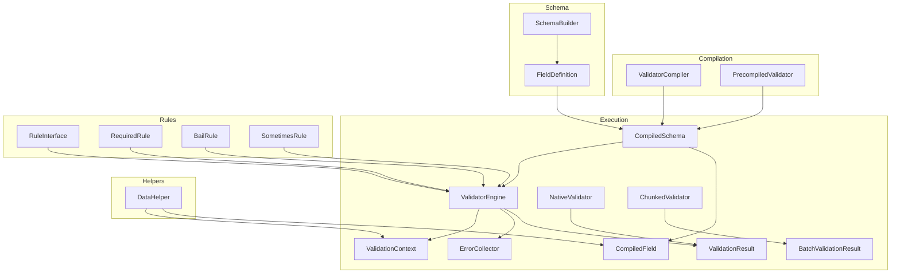
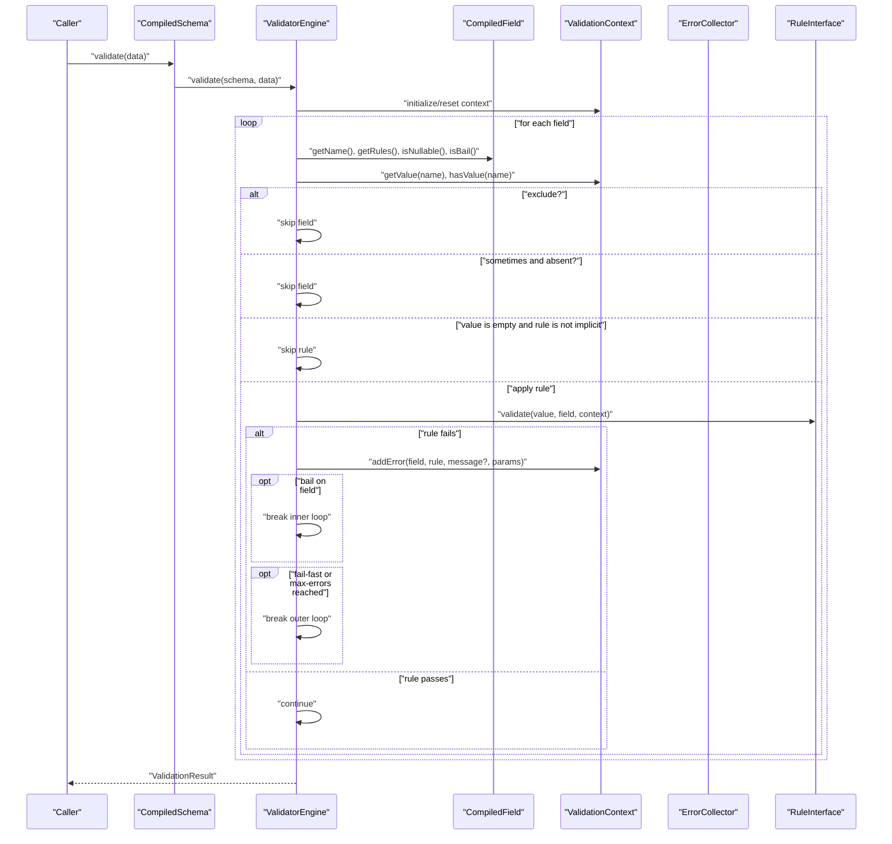
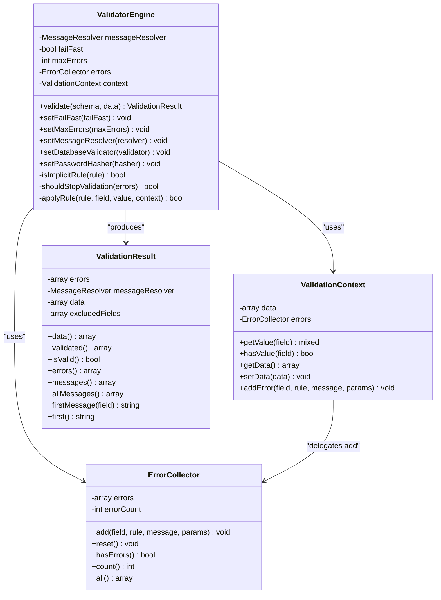
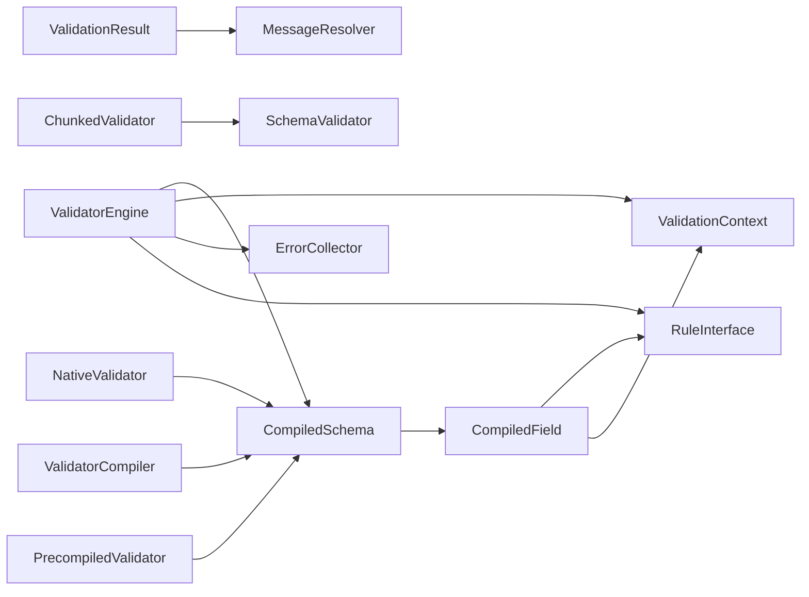

# Validation Engine

<cite>
**Referenced Files in This Document**
- [ValidatorEngine.php](file://src/Execution/ValidatorEngine.php)
- [ValidationContext.php](file://src/Execution/ValidationContext.php)
- [ValidationResult.php](file://src/Execution/ValidationResult.php)
- [ErrorCollector.php](file://src/Execution/ErrorCollector.php)
- [CompiledSchema.php](file://src/Execution/CompiledSchema.php)
- [CompiledField.php](file://src/Execution/CompiledField.php)
- [NativeValidator.php](file://src/Execution/NativeValidator.php)
- [BatchValidationResult.php](file://src/Execution/BatchValidationResult.php)
- [ChunkedValidator.php](file://src/Execution/ChunkedValidator.php)
- [ValidatorCompiler.php](file://src/Compilation/ValidatorCompiler.php)
- [PrecompiledValidator.php](file://src/Compilation/PrecompiledValidator.php)
- [SchemaBuilder.php](file://src/Schema/SchemaBuilder.php)
- [FieldDefinition.php](file://src/Schema/FieldDefinition.php)
- [RuleInterface.php](file://src/Rules/RuleInterface.php)
- [RequiredRule.php](file://src/Rules/RequiredRule.php)
- [BailRule.php](file://src/Rules/BailRule.php)
- [SometimesRule.php](file://src/Rules/SometimesRule.php)
- [DataHelper.php](file://src/Execution/DataHelper.php)
</cite>

## Table of Contents
1. [Introduction](#introduction)
2. [Project Structure](#project-structure)
3. [Core Components](#core-components)
4. [Architecture Overview](#architecture-overview)
5. [Detailed Component Analysis](#detailed-component-analysis)
6. [Dependency Analysis](#dependency-analysis)
7. [Performance Considerations](#performance-considerations)
8. [Troubleshooting Guide](#troubleshooting-guide)
9. [Conclusion](#conclusion)

## Introduction
This document explains the validation engine architecture and operation. It focuses on the ValidatorEngine class responsibilities, the execution pipeline, and performance optimizations. It also documents the ValidationContext role in maintaining execution state, the ValidationResult structure for capturing outcomes, and the ErrorCollector mechanism for aggregating validation failures. Execution strategies for single records, batch processing, and streaming validation are covered, along with memory management, short-circuit evaluation, and error collection patterns. Finally, it details the validation algorithm, performance characteristics, and optimization techniques used in the engine.

## Project Structure
The validation engine is organized around execution-time components (ValidatorEngine, ValidationContext, ValidationResult, ErrorCollector), schema compilation (CompiledSchema, CompiledField), and execution strategies (NativeValidator, BatchValidationResult, ChunkedValidator). Compilation utilities (ValidatorCompiler, PrecompiledValidator) and schema builders (SchemaBuilder, FieldDefinition) prepare and optimize schemas for runtime validation.

**Diagram sources**
- [ValidatorEngine.php](file://src/Execution/ValidatorEngine.php#L11-L177)
- [ValidationContext.php](file://src/Execution/ValidationContext.php#L7-L98)
- [ValidationResult.php](file://src/Execution/ValidationResult.php#L9-L142)
- [ErrorCollector.php](file://src/Execution/ErrorCollector.php#L7-L51)
- [CompiledSchema.php](file://src/Execution/CompiledSchema.php#L9-L68)
- [CompiledField.php](file://src/Execution/CompiledField.php#L10-L177)
- [NativeValidator.php](file://src/Execution/NativeValidator.php#L12-L39)
- [BatchValidationResult.php](file://src/Execution/BatchValidationResult.php#L17-L92)
- [ChunkedValidator.php](file://src/Execution/ChunkedValidator.php#L16-L154)
- [ValidatorCompiler.php](file://src/Compilation/ValidatorCompiler.php#L10-L195)
- [PrecompiledValidator.php](file://src/Compilation/PrecompiledValidator.php#L11-L98)
- [SchemaBuilder.php](file://src/Schema/SchemaBuilder.php#L9-L36)
- [FieldDefinition.php](file://src/Schema/FieldDefinition.php#L9-L658)
- [RuleInterface.php](file://src/Rules/RuleInterface.php#L9-L16)
- [RequiredRule.php](file://src/Rules/RequiredRule.php#L10-L29)
- [BailRule.php](file://src/Rules/BailRule.php#L12-L20)
- [SometimesRule.php](file://src/Rules/SometimesRule.php#L12-L20)
- [DataHelper.php](file://src/Execution/DataHelper.php#L10-L32)

**Section sources**
- [ValidatorEngine.php](file://src/Execution/ValidatorEngine.php#L11-L177)
- [CompiledSchema.php](file://src/Execution/CompiledSchema.php#L9-L68)
- [CompiledField.php](file://src/Execution/CompiledField.php#L10-L177)
- [ValidationContext.php](file://src/Execution/ValidationContext.php#L7-L98)
- [ValidationResult.php](file://src/Execution/ValidationResult.php#L9-L142)
- [ErrorCollector.php](file://src/Execution/ErrorCollector.php#L7-L51)
- [NativeValidator.php](file://src/Execution/NativeValidator.php#L12-L39)
- [BatchValidationResult.php](file://src/Execution/BatchValidationResult.php#L17-L92)
- [ChunkedValidator.php](file://src/Execution/ChunkedValidator.php#L16-L154)
- [ValidatorCompiler.php](file://src/Compilation/ValidatorCompiler.php#L10-L195)
- [PrecompiledValidator.php](file://src/Compilation/PrecompiledValidator.php#L11-L98)
- [SchemaBuilder.php](file://src/Schema/SchemaBuilder.php#L9-L36)
- [FieldDefinition.php](file://src/Schema/FieldDefinition.php#L9-L658)
- [RuleInterface.php](file://src/Rules/RuleInterface.php#L9-L16)
- [RequiredRule.php](file://src/Rules/RequiredRule.php#L10-L29)
- [BailRule.php](file://src/Rules/BailRule.php#L12-L20)
- [SometimesRule.php](file://src/Rules/SometimesRule.php#L12-L20)
- [DataHelper.php](file://src/Execution/DataHelper.php#L10-L32)

## Core Components
- ValidatorEngine: Orchestrates validation over a CompiledSchema, manages execution state via ValidationContext, aggregates errors via ErrorCollector, and produces ValidationResult. Supports fail-fast and capped error collection.
- ValidationContext: Provides access to input data, nested field access, presence checks, and error aggregation hooks. Carries optional external services (database validator, password hasher).
- ValidationResult: Encapsulates validation outcome, supports accessing raw errors, formatted messages, first messages, and validated data (excluding excluded fields).
- ErrorCollector: Accumulates structured errors keyed by field with rule identifiers, parameters, and optional messages, with counts and reset capability.
- CompiledSchema and CompiledField: Schema representation derived from FieldDefinition with compiled rules, nested field support, exclusion rules, and optimized rule ordering.
- NativeValidator: Executes a precompiled PHP closure for maximum performance, returning a ValidationResult.
- BatchValidationResult: Holds a list of ValidationResult instances with streaming iteration, counting, filtering failures, and checking global validity.
- ChunkedValidator: Processes large datasets in memory-efficient chunks, supporting callbacks, streaming results, and streaming only failures.

**Section sources**
- [ValidatorEngine.php](file://src/Execution/ValidatorEngine.php#L11-L177)
- [ValidationContext.php](file://src/Execution/ValidationContext.php#L7-L98)
- [ValidationResult.php](file://src/Execution/ValidationResult.php#L9-L142)
- [ErrorCollector.php](file://src/Execution/ErrorCollector.php#L7-L51)
- [CompiledSchema.php](file://src/Execution/CompiledSchema.php#L9-L68)
- [CompiledField.php](file://src/Execution/CompiledField.php#L10-L177)
- [NativeValidator.php](file://src/Execution/NativeValidator.php#L12-L39)
- [BatchValidationResult.php](file://src/Execution/BatchValidationResult.php#L17-L92)
- [ChunkedValidator.php](file://src/Execution/ChunkedValidator.php#L16-L154)

## Architecture Overview
The engine validates data against a compiled schema. CompiledSchema delegates to ValidatorEngine, which iterates fields, applies rules, and short-circuits according to bail, empty-value semantics, and fail-fast/max-errors thresholds. Results are returned as ValidationResult, optionally enriched with localized messages.

**Diagram sources**
- [CompiledSchema.php](file://src/Execution/CompiledSchema.php#L59-L66)
- [ValidatorEngine.php](file://src/Execution/ValidatorEngine.php#L33-L98)
- [CompiledField.php](file://src/Execution/CompiledField.php#L120-L177)
- [ValidationContext.php](file://src/Execution/ValidationContext.php#L43-L96)
- [RuleInterface.php](file://src/Rules/RuleInterface.php#L9-L16)

## Detailed Component Analysis

### ValidatorEngine
Responsibilities:
- Initialize or reuse ValidationContext and ErrorCollector per validation invocation.
- Iterate fields from CompiledSchema, applying CompiledField rules with appropriate skip conditions.
- Short-circuit on bail, fail-fast, or max-errors thresholds.
- Aggregate rule failures via ValidationContext into ErrorCollector.
- Produce ValidationResult with errors, raw data, excluded fields, and optional message resolution.

Execution pipeline highlights:
- Field exclusion: CompiledField determines exclusions; fields marked excluded are skipped and recorded.
- Conditional skipping: "sometimes" rules skip absent fields; non-implicit rules skip empty values.
- Implicit rules: Required-like rules run even on empty values.
- Fail-fast and max-errors: Early termination when thresholds are met.
- Rule application: Each rule returns a failure descriptor or null; failures are recorded.

Performance optimizations:
- Deduplication and reordering of marker rules (Bail, Required, Nullable) to minimize overhead.
- Early exits on bail and thresholds reduce unnecessary work.
- Reuse of shared ValidationContext and ErrorCollector across invocations reduces allocations.

Short-circuit evaluation:
- Bail per field stops further rule application for that field.
- Fail-fast stops field iteration when any error is encountered.
- Max-errors threshold halts iteration once the cap is reached.

Error collection patterns:
- Failure descriptors carry rule identity and parameters; messages are resolved later by ValidationResult using MessageResolver.

**Section sources**
- [ValidatorEngine.php](file://src/Execution/ValidatorEngine.php#L33-L98)
- [ValidatorEngine.php](file://src/Execution/ValidatorEngine.php#L127-L177)
- [CompiledField.php](file://src/Execution/CompiledField.php#L50-L113)

#### Class Diagram: Engine and Core Types

**Diagram sources**
- [ValidatorEngine.php](file://src/Execution/ValidatorEngine.php#L11-L177)
- [ValidationContext.php](file://src/Execution/ValidationContext.php#L7-L98)
- [ValidationResult.php](file://src/Execution/ValidationResult.php#L9-L142)
- [ErrorCollector.php](file://src/Execution/ErrorCollector.php#L7-L51)

### ValidationContext
Role:
- Central data access for nested fields using dot notation.
- Presence checks for fields (including nested).
- Delegation of error recording to ErrorCollector.

Nested access:
- getValue supports "parent.child" notation up to two levels.
- hasValue mirrors getValue for existence checks.

**Section sources**
- [ValidationContext.php](file://src/Execution/ValidationContext.php#L43-L96)
- [DataHelper.php](file://src/Execution/DataHelper.php#L15-L30)

### ValidationResult
Structure and responsibilities:
- Captures raw errors keyed by field with rule, params, and optional message.
- Provides methods to access validated data (including excluded fields), validated subset (excluding excluded fields), and formatted messages.
- Resolves messages via MessageResolver when messages are not pre-populated.

Behavior:
- validated() removes excluded fields from the original data.
- messages() resolves missing messages using MessageResolver.
- firstMessage() and first() provide convenient accessors.

**Section sources**
- [ValidationResult.php](file://src/Execution/ValidationResult.php#L22-L142)

### ErrorCollector
Mechanism:
- Stores errors as arrays with rule, params, and message.
- Tracks total error count for efficient threshold checks.
- Reset clears accumulated errors and count.

**Section sources**
- [ErrorCollector.php](file://src/Execution/ErrorCollector.php#L17-L51)

### CompiledSchema and CompiledField
CompiledSchema:
- Wraps a list of CompiledField and exposes getFields() and validate(data).
- Validates via injected or lazily created ValidatorEngine.

CompiledField:
- Converts FieldDefinition rules into CompiledField with optimized ordering and deduplication.
- Detects marker rules (Bail, Required, Nullable) and flags for fast-path logic.
- Supports exclusion rules and nested field access.

Optimization:
- Rule reordering places bail, required, and nullable markers early to enable short-circuiting.
- Deduplication avoids redundant marker rules.

**Section sources**
- [CompiledSchema.php](file://src/Execution/CompiledSchema.php#L27-L66)
- [CompiledField.php](file://src/Execution/CompiledField.php#L29-L177)

### NativeValidator
Execution strategy:
- Accepts a precompiled PHP closure and returns ValidationResult.
- Uses MessageResolver for message resolution when needed.

Use case:
- High-throughput scenarios where schema compilation and rule instantiation are minimized.

**Section sources**
- [NativeValidator.php](file://src/Execution/NativeValidator.php#L18-L39)

### BatchValidationResult
Execution strategy:
- Holds a list of ValidationResult.
- Implements IteratorAggregate for streaming iteration.
- Provides allValid(), failures(), and failureCount() for batch analysis.

**Section sources**
- [BatchValidationResult.php](file://src/Execution/BatchValidationResult.php#L17-L92)

### ChunkedValidator
Execution strategy:
- Processes large datasets in chunks to control memory usage.
- Supports callbacks per chunk, streaming chunks, and streaming only failures.
- Counts failures without materializing all results.

Memory management:
- Buffers fixed-size chunks and processes them individually.
- Streams results to avoid retaining entire result sets.

**Section sources**
- [ChunkedValidator.php](file://src/Execution/ChunkedValidator.php#L34-L154)

### Compilation and Schema Builders
ValidatorCompiler:
- Compiles and caches schemas, supports native code generation and legacy precompiled storage.
- Writes atomic files and supports clearing caches.

PrecompiledValidator:
- Wraps CompiledSchema and Identifier for persisted validators.
- Provides save/load helpers.

SchemaBuilder and FieldDefinition:
- Fluent DSL to define fields and rules.
- FieldDefinition compiles to CompiledField with rule deduplication and ordering.

**Section sources**
- [ValidatorCompiler.php](file://src/Compilation/ValidatorCompiler.php#L33-L195)
- [PrecompiledValidator.php](file://src/Compilation/PrecompiledValidator.php#L32-L98)
- [SchemaBuilder.php](file://src/Schema/SchemaBuilder.php#L31-L35)
- [FieldDefinition.php](file://src/Schema/FieldDefinition.php#L115-L118)

## Dependency Analysis
Key dependencies and relationships:
- ValidatorEngine depends on CompiledSchema, ValidationContext, ErrorCollector, and RuleInterface implementations.
- CompiledSchema depends on CompiledField and ValidatorEngine for validation delegation.
- CompiledField depends on RuleInterface and ValidationContext for exclusion and nested access.
- ValidationResult depends on MessageResolver for message resolution.
- NativeValidator depends on CompiledSchema for precompiled closures.
- ChunkedValidator depends on SchemaValidator for batch validation.

**Diagram sources**
- [ValidatorEngine.php](file://src/Execution/ValidatorEngine.php#L11-L177)
- [CompiledSchema.php](file://src/Execution/CompiledSchema.php#L9-L68)
- [CompiledField.php](file://src/Execution/CompiledField.php#L10-L177)
- [RuleInterface.php](file://src/Rules/RuleInterface.php#L9-L16)
- [NativeValidator.php](file://src/Execution/NativeValidator.php#L12-L39)
- [ChunkedValidator.php](file://src/Execution/ChunkedValidator.php#L16-L154)
- [ValidatorCompiler.php](file://src/Compilation/ValidatorCompiler.php#L10-L195)
- [PrecompiledValidator.php](file://src/Compilation/PrecompiledValidator.php#L11-L98)

**Section sources**
- [ValidatorEngine.php](file://src/Execution/ValidatorEngine.php#L11-L177)
- [CompiledSchema.php](file://src/Execution/CompiledSchema.php#L9-L68)
- [CompiledField.php](file://src/Execution/CompiledField.php#L10-L177)
- [RuleInterface.php](file://src/Rules/RuleInterface.php#L9-L16)
- [NativeValidator.php](file://src/Execution/NativeValidator.php#L12-L39)
- [ChunkedValidator.php](file://src/Execution/ChunkedValidator.php#L16-L154)
- [ValidatorCompiler.php](file://src/Compilation/ValidatorCompiler.php#L10-L195)
- [PrecompiledValidator.php](file://src/Compilation/PrecompiledValidator.php#L11-L98)

## Performance Considerations
- Rule ordering and deduplication: CompiledField reorders marker rules (bail, required, nullable) to enable early exits and avoid redundant checks.
- Short-circuiting: Bail per field, fail-fast mode, and max-errors thresholds prevent unnecessary rule evaluations.
- Nested access optimization: ValidationContext and DataHelper use simple dot notation to access nested fields efficiently.
- Memory efficiency: ChunkedValidator processes data in fixed-size buffers to limit peak memory usage.
- Precompilation: ValidatorCompiler writes native PHP code and supports legacy precompiled schemas for reduced overhead.
- Closure-based execution: NativeValidator executes a precompiled closure for minimal interpreter overhead.

[No sources needed since this section provides general guidance]

## Troubleshooting Guide
Common issues and diagnostics:
- No errors captured despite failures: Verify fail-fast and max-errors settings; confirm that implicit rules are applied on empty values.
- Excluded fields still present in validated data: Ensure exclusion rules are properly configured in FieldDefinition and CompiledField.
- Messages not resolved: Confirm MessageResolver is provided to ValidationResult or set via ValidatorEngine.
- Streaming failures: Use ChunkedValidator::streamFailures to iterate only invalid results with indices preserved.

**Section sources**
- [ValidatorEngine.php](file://src/Execution/ValidatorEngine.php#L148-L177)
- [ValidationResult.php](file://src/Execution/ValidationResult.php#L77-L96)
- [ChunkedValidator.php](file://src/Execution/ChunkedValidator.php#L92-L154)

## Conclusion
The validation engine combines a compiled schema model with a high-performance execution pipeline. ValidatorEngine orchestrates field-level validation, applies rules with precise short-circuiting, and aggregates outcomes via ValidationResult. ValidationContext centralizes data access and error recording, while ErrorCollector provides efficient accumulation. CompiledField optimizes rule ordering and deduplication, and ChunkedValidator enables scalable processing of large datasets. NativeValidator and ValidatorCompiler further enhance throughput and reduce latency. Together, these components deliver a robust, extensible, and performant validation framework.